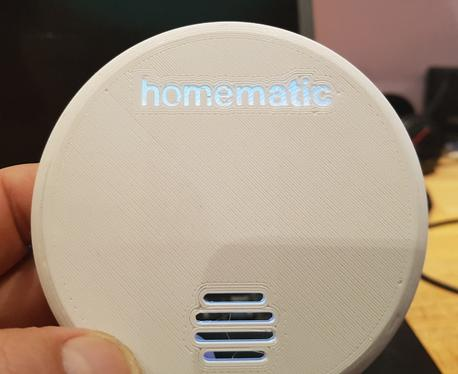

## Gehäuse / 3D Druck

- Gehäuse von [Jan](https://www.thingiverse.com/Schmelzerboy)
  - [HM-WDS40-TH-I](https://www.thingiverse.com/thing:3184336)
  - [Platinenhalter](https://www.thingiverse.com/thing:3158997)
  - [HM-SEC-MDIR](https://www.thingiverse.com/thing:3227731)
  - [HB-UNI-SenAct-4-4](https://www.thingiverse.com/thing:3327164)
- Gehäuse von [Christoph S.](https://www.thingiverse.com/ChristophStr)
  - [HB-UNI-SENS-BATT-Case](https://www.thingiverse.com/thing:3028730) (Schiebedeckel)
  - [HB-UNI-SENS-BATT Platine](https://www.thingiverse.com/thing:3239446) (verschraubbarer Deckel)
  - [HB-UNI-SEN-BATT snap in V2](https://www.thingiverse.com/thing:3540481) (snap Deckel)
- Gehäuse von [Hermi](https://www.thingiverse.com/hermi_le)
  - [optionale Teile für HB-UNI-Sen-WEA](https://www.thingiverse.com/thing:3173141)
  - [Homematic Lichtsensor HM-SEN-LI-O](https://www.thingiverse.com/thing:3196116)
- Gehäuse von [Basti](https://www.thingiverse.com/Buddinski88/about)
  - [HB-UNI-SEN-BATT](https://www.thingiverse.com/thing:3279647)
- Gehäuse von [Stefan](https://www.thingiverse.com/Hasenpups/about)  
  - [Ultrasonic Sensor V2](https://www.thingiverse.com/thing:2975998)
  - [Temperature sensor](https://www.thingiverse.com/thing:2972598)
  - [Ultrasonic Sensor](https://www.thingiverse.com/thing:2896543)
