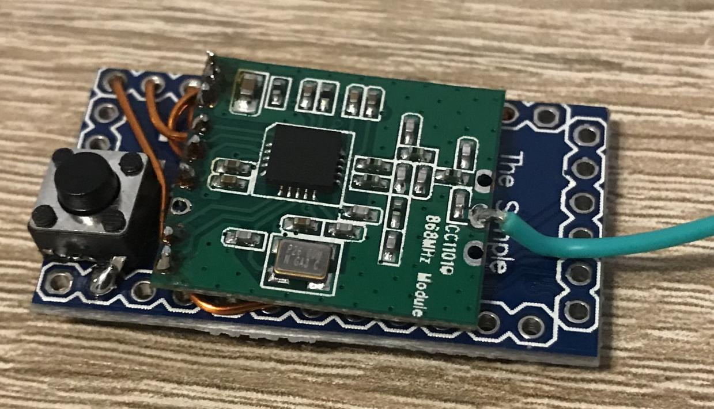

# Hardware

## Microcontroller

Als Microcontroller kommt meistens der Arduini Pro Mini zum Einsatz.

Die AskSinPP Lib unterstützt zudem folgende Kontroller: 
* ATMega328P
* ATMega32
* ATMega644
* ATMega1284
* STM32F1

::: warning
Es gibt verschiedene Ausführungen des Arduino Pro Mini.  
Es ist darauf zu achten, dass man eine Version mit `ATmega328P` und `3,3V / 8Mhz` verwendet.
:::

## Funkmodul

Als Funkmodul wird ein CC1101 868Mhz verwendet.  

Das Modul wird über den [SPI Bus](https://de.wikipedia.org/wiki/Serial_Peripheral_Interface) 
an den Mikrocontroller angeschlossen.  
Da das [CC1101](http://www.ti.com/lit/ds/symlink/cc1101.pdf) 
mit einer Betriebsspannung von 1,8V bis 3,9V arbeitet, kann es direkt an 3,3V (VCC) Arduino betrieben werden. Für Kontroller
mit höherer Arbeitsspannung ist ein [Pegelwandler](https://de.wikipedia.org/wiki/Pegelumsetzer) nötig.

::: tip
Anstatt der mitgelieferten Spiralantenne empfiehlt sich ein Draht mit **8,3cm** Länge.  
Dieser sollte nach Möglichkeit mit Abstand zu den elektronischen Bauteilen verlegt werden.
:::

## Verdrahtung

Hier dargestellt die allgemeingültige Verdrahtung des Pro Mini mit dem CC1101 Funkmodul.  
Dieser Aufbau ist für alle AskSinPP Projekte mit Arduino Pro Mini gültig.  

Um die Komponente z.B. in den Anlern-Modus zu versetzen wird ein ein Config-Taster verbaut 
welcher an `PIN 8` und `GND` angeschlossen wird.  

Zusätzlich kann/sollte eine Status-LED verbaut werden. 
Im Sketch ist zu diesem Zweck entweder eine `StatusLed` oder `DualStatusLed` definiert.  
Beispiel Dual LED: `typedef DualStatusLed<LED2_PIN,LED1_PIN> LedType;`  
Beispiel Single LED: `typedef StatusLed<LED_PIN> LedType;`  
Der Anschluss-PIN der LED ergibt sich aus der Definition im Sketch:
`#define LED_PIN 4`
Die LED(s) werden über einen 330 Ohm Vorwiderstand mit dem jeweiligen Arduino-PIN verbunden.

## Stromversorgung

### Netzteil

Wird der Arduino über ein Netzteil (oder > 2x 1,5V Batterien) betrieben ist die Spannung für die Wahl des Pins der Einspeisung entscheidend:

* Für eine Spannung zwischen 4V und 12V wird der `RAW` Pin verwendet da der Arduino Pro Mini 
  einen Spannungsregler hat.  
* Für eine Spannung von 3.3V wird `VCC` benutzt.
* Bei höheren Spannungen muss diese über einen Festspannungsregler oder Step-Down Modul heruntergesetzt werden.

::: warning
Es gibt einige Versionen des Pro Mini deren Spannungsregler keine 12V aushalten.  
Hier sollte auf jeden Fall der verbaute LDO kontrolliert werden. 
Er ist auf dem Bild zur Verdrahtung mit einem roten X markiert.
:::

### Batteriebetrieb

Der Anschluss der Batterien (2x 1,5V) erfolgt an `VCC` und `GND`.

Da bei Batteriebetrieb mit 2 x 1,5V der Spannungsregler (LDO) nicht benötigt wird und auch die Power LED sowie die LED_BUILTIN nur unnötig Strom verbrauchen, können diese Bauteile (X) ganz unproblematisch entfernt werden.

::: danger
Fällt die Batteriespannung zu weit ab kann es zu einem Dauersender / Babbling Idiot kommen.  
Erklärung und Lösung **[HIER](/Grundlagen/FAQ/babbling_idiot.html)**.
:::

### Stromverbrauch

Informationen zum Stromverbrauch findet ihr [hier](https://github.com/TomMajor/AskSinPP_Examples/tree/master/Info/Ruhestrom).

## Aufbau

Mithilfe von Kupferlackdraht kann das Funkmodul platzspared unter dem Arduino Pro Mini angeschlossen werden.

Von der Community gibt es mittlerweile verschiedene [Platinen](/Platinen/) und [Gehäuse](/Gehaeuse/).

## Einkaufsliste

|  |  |  |  |
|--|--|--|--|
| Arduino Pro Mini 3.3V ATMega328P | [eBay de](https://www.ebay.de/itm/Pro-Mini-3-3V-8Mhz-Arduino-komp-Board-Stromsparend/253093645576) | [AliExpress](https://de.aliexpress.com/item/Free-Shipping-1pcs-pro-mini-atmega328-Pro-Mini-328-Mini-ATMEGA328-3-3V-8MHz-for-Arduino/32342672626.html) | [Amazon](https://www.amazon.de/Entwicklerboard-Mikrocontroller-Christians-Technik-Shop/dp/B018Y2JGDC) |
| CC1101 Funkmodul | [eBay de](https://www.ebay.de/itm/CC1101-868-MHz-Wireless-Funk-Modul-Transciever-FHEM-CUL-Arduino-Raspberry-Pi/253070164822) | [AliExpress](https://de.aliexpress.com/item/CC1101-868-mhz-Modul-FHEM-CUL-Transceiver-Wireless-F-r-Raspberry-Pi-Z07-Drop-schiff/32859345379.html) | [Amazon](https://www.amazon.de/ILS-CC1101-868MHz-Transceiver-Wake-Radio/dp/B0769D91H2) |
| FTDI Adapter | [eBay de](https://www.ebay.de/itm/FT232RL-3-3V-5-5V-FTDI-USB-to-TTL-Serial-Adapter-Module-Arduino-Mini-Port/222998080320) | [AliExpress](https://de.aliexpress.com/item/High-Quality-FT232RL-FT232-FTDI-USB-3-3V-5-5V-to-TTL-Serial-Adapter-Module-Mini/32826575637.html) | [Amazon](https://www.amazon.de/AZDelivery-Adapter-FT232RL-Serial-gratis/dp/B01N9RZK6I) |
| ISP Adapter | [eBay de](https://www.ebay.de/itm/USBASP-USBISP-AVR-51-Programmer-Adapter-mit-10-Pin-Kabel-ATMega-ATTiny-ATMEGA128/153318188378) | [AliExpress](https://de.aliexpress.com/item/1LOT-New-USBASP-USBISP-AVR-Programmer-USB-ISP-USB-ASP-ATMEGA8-ATMEGA128-Support-Win7-64/32724669918.html) | [Amazon](https://www.amazon.de/USBasp-Programmiergerät-inkl-Programmer-Arduino/dp/B01CPZ52MI/) | 

Meistens braucht man auch noch (5mm) LEDs, Widerstände und Kurzhubtaster. Zum Aufbau von Prototypen sind zudem ein Steckbrett und Jumperwire recht nützlich.
Wer etwas mehr basteln möchte ist mit dem einen oder anderen Sortimentkasten gut bedient. Es gibt auch Starterkits mit diveresen Teilen, einfach mal
etwas stöbern ;)

Weiterhin ist zu beachten, dass das CC1101 Modul einen Lochabstand von 2.0mm anstatt der üblichen 2.54mm hat. Will man diesen auf eine Platine setzen
sollte man also die passenden Stiftleisten mit RM 2.0 mitbestellen.
