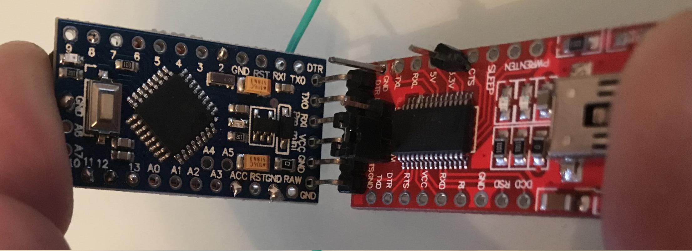

# Software / Flashen

Die Software für den Microcontroller wird bei Arduino als _Sketch_ bezeichnet.  
Der USB FTDI Adapter ist die Verbindung zwischen Microcontroller und PC.


## Sketch download und anpassen

Es gibt mittlerweile viele fertige [Sketche](/Sketche/) die je nach Aktor oder Sensor verwendet werden können.  
Als Beispiel wird hier der `HM-RC-P1` Paniktaster genommen.

Der komplette Sketch ist [HM-RC-P1.ino](https://github.com/pa-pa/AskSinPP/blob/master/examples/HM-RC-P1/HM-RC-P1.ino).

**Achtung**: Ein _"Seite speichern unter"_ der Github-URL lädt die HTML-Version herunter und nicht direkt den Source-Code.
Dieser kann über den Button `Raw` aufgerufen werden: [HM-RC-P1.ino im Raw-Format](https://raw.githubusercontent.com/pa-pa/AskSinPP/master/examples/HM-LC-Bl1-FM/HM-LC-Bl1-FM.ino) Zudem wird nicht empfohlen _Notepad_ oder gar Word zum editieren zu verwenden sondern einen _echten_ Editor wie VSCode, Sublime, Atom, Notepad++, Vim, Emacs usw.

### IO-Konfiguration
```cpp
// Arduino pin for the config button
#define CONFIG_BUTTON_PIN 8
// Arduino pins for the buttons
// A0 == PIN 14
#define BTN1_PIN 14
```

Hier sieht man die Button Belegung und kann diese entsprechend anpassen.  
Für das Beispiel des Paniktasters schließen wir also den Config-Button an `GPIO-8` und `GND` sowie einen weiteren Taster an `GPIO-14` (bzw `A0`) und `GND` an.

### Device-Konfiguration

Der DeviceInfo Block identifiziert das neue Device:
```cpp
// define all device properties
const struct DeviceInfo PROGMEM devinfo = {
    {0x12,0x09,0x01},       // Device ID
    "JPLRCP2001",           // Device Serial
    {0x00,0x1a},            // Device Model
    0x11,                   // Firmware Version
    as::DeviceType::Remote, // Device Type
    {0x00,0x00}             // Info Bytes
};
```

::: warning
Jedes Gerät in einer HomeMatic Umgebung hat 2 eindeutige Identifikationsmerkmale:

* die 10-stellige Seriennummer (wird in der WebUI in der Spalte Seriennummer in Einstellungen->Geräte angezeigt)
* die 3-Byte Geräteadresse (wird in einer Konfigurationsdatei im Dateisystem gespeichert)

Beide dürfen in einer HomeMatic-Installation nur **1x vergeben** werden.  
Ausschlaggebend für die Funk-Kommunikation ist die Geräte-Adresse.
::: 

Die Geräteadresse (im Sketch als `Device ID` bezeichnet) lautet in diesem Fall `0x12,0x09,0x01`.  
Die Seriennummer (im Sketch als `Device Serial` bezeichnet) lautet in diesem Fall `JPLRCP2001`.

Soll ein weiterer, auf diesen Sketch basierender HM-RC-P1 ins HomeMatic System integriert werden, verwendet man (- so mache ich es zumindest-) am besten eine fortlaufende Numerierung. 0x12, 0x09, 0x02 / JPLRCP2002.

Wichtig: Die Seriennummer muss immer 10-stellig sein! Sie darf Buchstaben und Zahlen enthalten.


## Anschluss des FTDI Adapters

Um die Schaltung sehr kompakt zu halten, verzichtet man auf das Anlöten eines Steckverbinders.
Es reicht aus, wenn man die Pins des FTDI Adapters durch die Lötbohrungen steckt und während des Flash-Vorgangs verkantet.

::: warning
Der FTDI muss auf 3,3V gejumpert sein da das CC1101 Funkmodul mit 5V beschädigt werden könnte.
:::



| PIN Arduino | PIN FTDI |                      |
|-------------|----------|----------------------|
| DTR         | DTR      | Data Terminal Ready  |
| RX          | TX       | Datentransfer        |
| TX          | RX       | Datentransfer        |
| VCC         | VCC      | Spannung             |
|             | CTS      | Wird nicht verwendet |
| GND         | GND      | Masse                |


## PlatformIO

PlatformIO gibt es als vollständige [Entwicklungsumgebung](https://platformio.org/platformio-ide) (IDE) und als [Command-Line-Interface](https://platformio.org/install/cli) (CLI). Wer nicht tiefer in die Programmierung einsteigen möchte ist mit der CLI-Version ausreichend bedient.

Die nötigen Bibliotheken können über den [Library Manager](https://docs.platformio.org/en/latest/librarymanager/)
bequem installiert werden. Er enthält neben den gebräuchlichen EnableInterrupt und Low-Power auch AskSinPP.

Die Konfiguration des Boards kann über das Interface eingestellt werden und wird in der `platformio.ini` im
Projekt-Verzeichnis gespeichert. Diese Datei kann man sich also auch schnell selbst erstellen:

```ini
[platformio]
src_dir = .

[env:pro8MHzatmega328]
platform = atmelavr
framework = arduino
board = pro8MHzatmega328
monitor_speed = 57600

lib_deps =
  AskSinPP
  EnableInterrupt
  Low-Power
```

Einige Projekte bringen bereits eine `platformio.ini` mit und man kann mit `platformio run -t upload` den Code 
kompilieren und direkt flashen ohne weitere Einstellungen vornehmen zu müssen.

Manchmal kommt es vor, dass PlatformIO versucht ein falsches USB-Gerät anzusprechen. Hier kann mit `platformio device list`
der Pfad des FTDI ermittelt werden. Dieser Pfad wird als Argument bei `run` übergeben. 
Bsp.: `platformio run -t upload --upload-port /dev/ttyUSB0`


## Arduino IDE

Die [Arduino IDE](https://www.arduino.cc/en/Main/Software) ist die gebräuchlichste
PC Software für den Umgang mit dem Arduino.

### Bibliothek einbinden

Damit die im Sketch verwendeten Bibliotheken zur Verfügung stehen, müssen diese eingebunden werden:
* AskSinPP
* EnableInterrupt
* Low-Power

Die AskSinPP Bibliothek kann als [ZIP](https://github.com/pa-pa/AskSinPP/archive/master.zip) 
heruntergeladen werden.
Anschließend geht man in der Arduino IDE auf `Sketch > Bibliothek einbinden > .ZIP-Bibliothek hinzufügen` 
und wählt die ZIP-Datei aus.

EnableInterrupt und Low-Power wird über `Sketch > Bibliothek einbinden > Bibliotheken verwalten`
gesucht und installiert.

### Board einstellen

* Board: `Arduino Pro or Pro Mini`
* Prozessor: `ATmega328P (3.3V, 8 MHz)`
* Port: COM-Port des FTDI Adapters 


## Flashen

Sind die Werte angepasst, kann der Programmcode kompiliert und an den Mikrocontroller 
übertragen werden. In der Arduino IDE heißt dieser Vorgang `Sketch hochladen` 
und bei PlatformIO `upload`.

Unter Device-Model wird ein zweistelliger Hexwert verwendet. Dieser Wert kann mehrfach vorkommen.
Durch diesen Wert wird das Format der Kommunikation vom und zum Gerät beschrieben. Weitere
von diesem Wert abhängigen Informationen sind im WebGUI sichtbar. So wird das Geräte-Icon
und die Darstellung der vom Gerät übertragenen Werte über die Device-Model referenziert.

Für die HM-Geräte und 1:1 Nachbauten sind die Device-Model in der CCU vorhanden. Für eigene
Geräte (Homebrew) werden sie z.B. über Addons hinzugefügt.

Im Beispiel ist das Device-Model `{0x00,0x1a}`. Über die Liste [RF-Types](/rftypes/) findet man, dass dieses
Device-Model `0x001A` der FunkPankiHandsender HM-RC-P1 ist, also ein Original HM-Gerät
und damit Icon und Beschreibung der Darstellung in der CCU schon vorhanden sind.

Das Feld Firmware beinhaltet einen HEX-Wert, der in der Web-GUI als zwei Ziffeern angezeigt wird.
Aus `0x11` wird dann "Firmware Version 1.1". Wenn auf die CCU eine höhere Firmware eingespielt wurde kann diese bei OTA-fähigen Geräten dann upgedatet werden.

In der über das Device-Model referenzierten Konfiguration kann auch eine von der Firmwareversion
abhängige Funktionalität enthalten sein, um etwa Varianten ab einer bestimmten Version zu ermöglichen.

Der Device-Type beschreibt eine Klasse an Geräten. So können etwa Taster mit unterschiedlicher Anzahl
an Tasten (und damit unterschiedlichem Device-Model) an anderen Stellen wieder gemeinschaftlich
behandelt werden.

Und letzlich gibt des noch die zweistellige HEX-Angabe Device-Info, wo weitere Details des Gerätes
beschrieben werden.


## Serieller Monitor

Der Arduino verfügt über eine Debug-Ausgabe die vom PC über den `seriellen Monitor`
abgerufen werden kann:
* Arduino IDE: Menü > Werkzeuge > serieller Monitor
* PlatformIO CLI: `platformio device monitor`

Aus dem Sketch kann man die verwendete Baudrate ablesen:

```cpp
void setup () {
  DINIT(57600,ASKSIN_PLUS_PLUS_IDENTIFIER);
  sdev.init(hal);
```

Hier also **57600 Baud**. Diese muss beim Verbindungsaufbau übereinstimmen, damit man
nicht nur wirre Zeichen erhält. Es ist zu empfehlen nach jedem Flashvorgang einen Blick auf 
die Ausgaben zu werfen.

```ini
# Version
AskSin++ V4.1.0 (Aug 25 2019 00:08:04)
# Speicherbereich für Peerings und deren Parameter
Address Space: 32 - 870
# Funkmodul Init und Version
CC init1
CC Version: 14
# Device ist gebootet
 - ready
# Device-ID und Serial (wird nicht immer ausgegeben)
ID: 120901  Serial: JPLRCP2001
# Funkverkehr:  <- ausgehend;  -> eingehend
<- 0F 01 86 10 0108F2 000000 06 01 00 00 00 00  - 7528
<- 0F 02 86 10 0108F2 000000 06 02 00 00 00 00  - 7626
```

Weiteres zum [Debugging](/Grundlagen/FAQ/Debugging.html) in den FAQ.

## OTA (Firmware-Updates)

Geräte mit AskSin++ können über die CCU sowie über FHEM mit neuer Software bespielt werden. 
Das funktioniert wie bei gewöhnlichen HomeMatic Geräten über die "Geräte-Firmware"-Übersicht. 

::: warning
OTA-Updates über die CCU dürfen nur bei eigenen Gerätedefinitionen gemacht werden, nicht bei Geräten,
die offiziell existieren.  
* ein unabsichtliches Flashen von echten HomeMatic-Geräten mit der AskSin++-Firmware wird diese **unbrauchbar** machen
* viele offizielle Geräte haben nicht die nötigen Parameter und Einstellungen in der Gerätedefinition für OTA-Updates oder nutzen andere Mikrocontroller
::: 

### Bootloader erstellen

Um die Geräte per OTA-Update mit Software versorgen zu können, ist ein spezieller Bootloader nötig, der auf die Geräte aufgespielt werden muss. 
Das kann bei den üblichen Arduino Pro Minis leider nicht über die serielle Schnittstelle (FTDI) erfolgen, sondern muss mit einem AVR ISP-Programmer gemacht werden.
Durch das Installieren des OTA-Bootloaders wird auch der Arduino-Bootloader ersetzt, was zur Folge hat, dass eine Programmierung der Arduinos nur noch per ISP (und natürlich per OTA) möglich ist.  

Damit die Firmware nicht für jedes Gerät individuell gebaut werden muss, verschieben sich die Geräteinformationen (Seriennummer, Geräteadresse) in den Bootloader. 
Der Bootloader wird also "personalisiert" für jedes Gerät erstellt und geflasht. Die Firmware kann dann auf alle (baugleichen) Sensoren über die CCU übertragen werden.  

Im Sketch muss das "`USE_OTA_BOOTLOADER`" einkommentiert werden. Dieses sorgt dafür, dass die Firmware die Geräteinformationen aus dem Bootloader liest:
```cpp
// define this to read the device id, serial and device type from bootloader section
#define USE_OTA_BOOTLOADER
```

  
Mit dieser Änderung wird jetzt eine neue Firmware gebaut und wir benötigen das resultierende .hex-File.  
In der Arduino IDE kann die Firmware über Sketch->Kompilierte Binärdatei exportieren gespeichert werden.  
Bei PlatformIO findet sich diese in `Projektordner/.pio/build/pro8MHzatmega328/firmware.hex`. 

Nun benötigen wir den Bootloader selbst:  
Dieser ist im AskSin++-Git enthalten und kann von uns entweder per `git clone https://github.com/pa-pa/AskSinPP` oder als [.zip Download](https://github.com/pa-pa/AskSinPP/archive/master.zip) runtergeladen werden. Im Ordner `bootloader/avr/` befindet sich die `makeota.html`.   
Diese Datei kann mit einem Webbrowser geöffnet werden und erstellt uns einen Bootloader mit den gewünschten Parametern. 


* **MCU Type** bleibt auf ATmega328 (für die normalen Arduino ProMini)
* **Device Model** ist der Geräte-Typ, also z.B. FA01 
* **HM ID** ist die Geräteadresse (3 Bytes), z.B. 210001
* **HM Serial** ist die Seriennummer, z.B. ASKS210001
* **Config string** kann zusätzliche Konfigurationseinstellungen für die Firmware speichern, kann auf 0 gelassen werden. 

Unter **Firmware** wird dann unsere .hex-Datei mit der gewünschten Firmware hochgeladen. 
Nach einem Klick auf "Create Bootloader" bekommen wir dann eine .hex-Datei mit der HM Serial als Namen heruntergeladen.  
Diese Datei enthält den Bootloader, die Konfiguration sowie unsere Firmware und kann so 1:1 auf den AVR geflashed werden. 

### Bootloader flashen

Die Firmware kann nun auf den AVR geflashed werden. Dazu können verschiedene Tools genutzt werden. 

Über die Konsole erfolgt das Flashen folgendermaßen: 
```bash
avrdude -p m328p -c stk500v2 -P /dev/ttyUSB0 -U lfuse:w:0xE2:m -U hfuse:w:0xD0:m
avrdude -p m328p -c stk500v2 -P /dev/ttyUSB0 -V -U flash:w:ASKS21001.hex
```
Die Parameter -c (Programmieradaptertyp) und -P (Port) müssen entsprechend für den genutzten AVR ISP-Programmer abgeändert werden. 
Die Fuses nutzen den internen 8 MHz RC-Oszillator, deaktivieren die Brown-Out Erkennung, deaktivieren das Löschen des EEPROM beim Flashen und konfigurieren den Resetvektor des Bootloaders.

Nach dem Flashen funktioniert das Gerät wie gewohnt und kann an die CCU angelernt werden. 

### Firmware für CCU verpacken

Um nun eine neue Firmware zu übertragen, wird wieder eine .hex-Datei mit der neuen Firmware erstellt.  
Hierbei ist darauf zu achten, dass der "Firmware Version"-Parameter im DeviceInfo struct auf die neue Firmwareversion aktualisiert wird:
```cpp
    0x12,                   // Firmware Version
```
0x12 ist die Version 1.2, 0x34 wäre Version 3.4.  

Das Tool prepota.sh im Bootloader-Ordner kann nun die .hex-Datei in eine .eq3-Datei umwandeln.  
Hierzu wird auf der Konsole das Script prepota.sh genutzt: 
```bash
./prepota.sh neueFirmwareVersion1.2.hex
```
Unter Windows kann dies entweder im Windows 10 Subsystem for Linux oder über Cygwin (bash, sed) erfolgen. Unter Linux und Mac sollten alle erforderlichen Abhängigkeiten bereits vorhanden sein. 
Wenn der Download des AskSin++-Quelltextes als .zip-Datei erfolgt ist, kann es evtl. nötig sein, die Datei als Ausführbar zu markieren. 
Das kann mit `chmod +x prepota.sh` erledigt werden.
Das Tool ist relativ langsam, Laufzeiten von 30 Sekunden können durchaus auftreten. 

Ein Firmware-Update für die CCU besteht aus 3 Dateien: 
* firmware_aktuellesDatum.eq3
* changelog.txt
* info

Diese 3 Dateien werden als .tar.gz-Archiv verpackt. 

Unter Windows lässt sich das .tar.gz-Archiv mit dem Tool 7-Zip erstellen.  
Die Datei info (ohne Dateiendung!) enthält folgende Informationen: 
```
TypeCode=64001
Name=HB-Sen-Env-I
CCUFirmwareVersionMin=2.27.0
CCU3FirmwareVersionMin=3.27.0
FirmwareVersion=1.2
```
* TypeCode ist die Device Model ID (in diesem Beispiel 0xFA01) allerdings in [dezimaler Schreibweise](https://www.google.com/search?q=0xFA01+in+decimal).  
* Name ist der genaue Name (auf Groß- und Kleinschreibung achten!) aus der .xml-Gerätedefinition.  
* CCU und CCU3FirmwareVersionMin ist die minimale Version der CCU-Firmware, die benötigt wird.  
* FirmwareVersion ist die Version der Firmware, die in diesem Ordner enthalten ist.   

Die Datei sollte mit Unix-Zeichenenden (LF, \n) gespeichert werden.  
Die changelog.txt enthält natürlichen Text mit Informationen über diese Firmware-Version. 

Die fertige .tar.gz-Datei mit der Firmware muss folgendermaßen aussehen:   


### OTA-Update starten

Ein Firmware-Update kann wie üblich über die CCU gestartet werden. 
Nach dem Klick auf "Update" beim entsprechenden Gerät wird zunächst eine Fehlermeldung auftreten. 
Das Update wurde dennoch vorgemerkt. Durch einen Druck auf den Gerätetaster am entsprechenden Gerät wird das Update dann gestartet. 