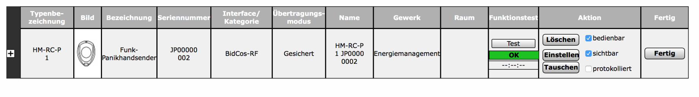
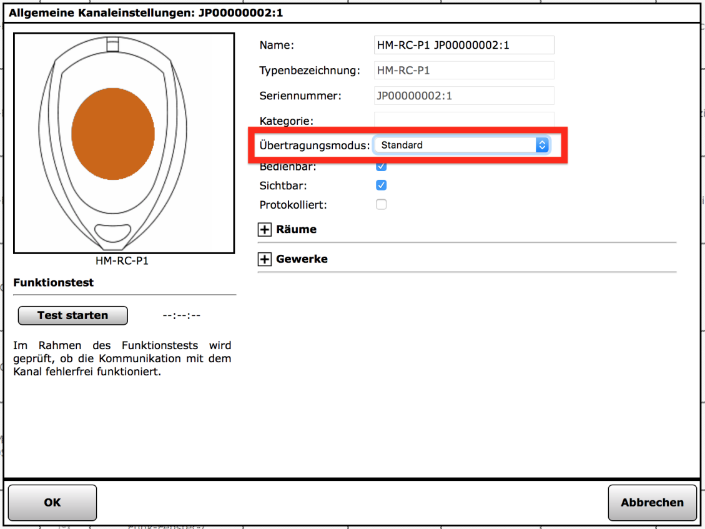

# Anlernen an die CCU

## Standard Komponenten

Zuerst bringt man wie gewohnt die CCU in den Anlernmodus.

Je nachdem ob im Sketch ein `ConfigButton` oder `ConfigToggleButton` verwendet wird, kann die neue
HomeMatic Komponente per kurzem (ConfigButton) oder langem (ConfigToggleButton) Tastendruck in den Anlernmodus versetzt werden.
In unserem Bespiel reicht also ein **kurzer** Tastendruck. Die Status-LED blinkt und 
signalisiert die Anlern-Bereitschaft bzw. die Datenübertragung.

Der Paniktaster wird nach kurzer Zeit im Posteingang angezeigt.

Zuletzt ist es **wichtig**, dass man den Übertragungsmodus auf `Standard` stellt da
im Sketch keine `AES` Verschlüsselung aktiviert ist.

## HomeBrew Komponenten

HomeBrew Komponenten sind Aktoren und Sensoren die es so in der HomeMatic-Welt noch nicht gibt.
Damit die CCU mit diesen neuen Komponenten umgehen kann, muss entsprechende Logik per Addon nachinstalliert werden.

* [JP-HB-Devices-addon](https://github.com/jp112sdl/JP-HB-Devices-addon)  
  Support für `HB-UNI-...` und `HB-LC-...` Devices von Jerome
  
* [HB-UNI-Sensor1 Addon](https://github.com/TomMajor/AskSinPP_Examples/tree/master/HB-UNI-Sensor1/CCU_RM)  
  Support für die Unterstützung des [HB-UNI-Sensor1](https://github.com/TomMajor/AskSinPP_Examples/tree/master/HB-UNI-Sensor1) von Tom 
 