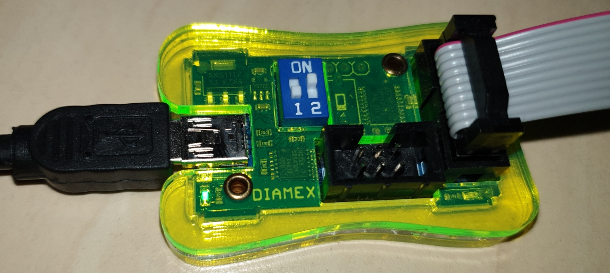
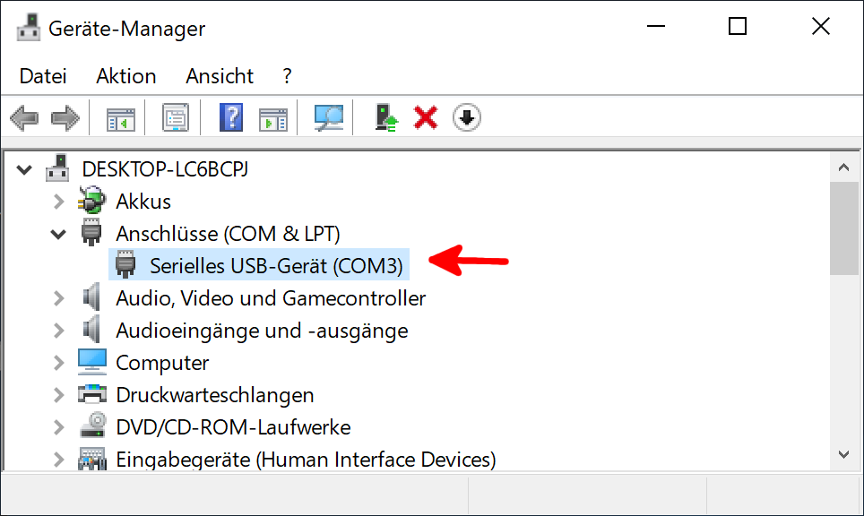

# In-System-Programming (ISP)

Grundsätzlich wird ein ATMega Mikrocontroller über das [_In-System-Programming_ Interface](https://de.wikipedia.org/wiki/In-System-Programmierung), kurz ISP, programmiert. Zudem dient die ISP-Schnittstelle dazu Konfiguartionsparameter (["Fuse-Bits"](https://de.wikipedia.org/wiki/Fuse-Bit)) zu setzen.

Als bevorzugter ISP-Programmer hat sich der [Diamex Programmer](https://www.diamex.de/dxshop/USB-ISP-Programmer-fuer-Atmel-AVR-Rev2) etabliert. 
Alternativ lässt sich auch ein [Arduino UNO als ISP](https://www.arduino.cc/en/Tutorial/ArduinoISP) verwenden oder der kostengünstige 
[USBASP-Clone](https://www.ebay.de/itm/USBASP-AVR-Programmer-Adapter-Downloader-10-Pin-Kabel-ATTiny-USBISP/181667298888). Allerdings lässt sich in beiden Fällen nur die Stromversorgung auf 3.3V Stellen. Die SPI-Pegel haben weiterhin 5V wodurch ein ggf. schon verbautes CC1101 Modul Schaden nehmen kann.


Die ISP-Schnittstelle des ATMega ist die SPI-Schnittstelle.

**Zusätzlich** gibt es die **serielle UART-Schnittstelle** die über einen FTDI, CH340 oder CP2102 _USB-serial-converter_ angesprochen wird.
Hierüber kann man _eigentlich_ keine Software flashen, sondern nur die _Serielle-Console_ aufrufen. Da viele Boards (wie der _Arduino Pro-Mini_)
mit einem Bootloader vorkonfiguriert sind, der das Flashen von Sketches über UART ermöglicht, benötigt man keinen ISP-Programmer um die Software aufzuspielen. Dies ist für _nackte_ Chips meist nicht der Fall, weshalb zuerst über ISP ein Bootloader geflasht werden kann (sofern man über UART später die Software aufspielen will).

* **ISP**: Software flashen; Fuse-Bits setzen
* **UART**: Serieller-Monitor; Software flashen (nur mit entsprechendem Bootloader)


## Anschluss des ISP

Die Spannung des Diamex wird über DIP-Schalter gesetzt, siehe [Manual](https://www.diamex.de/dxshop/USB-ISP-Programmer-fuer-Atmel-AVR-Rev2) unter Download (1: off; 2: on).



USBasp kann sowohl 5V als auch 3.3V - ! jedoch nur am Vcc !, hier sollte zuerst der Jumper auf die richtige Spannung gesetzt werden.


::: warning
USBasp setzt per Jumper nur VCC auf 3.3V, das SPI Interface läuft weiterhin mit 5V.
Es empfiehlt sich daher die Fuse-Bits zu programmieren bevor weitere Hardware oder das CC1101 an den Arduino SPI-Bus angeschlossen ist. **Deshalb ist ein Diamex-Programmer einem USBasp vorzuziehen!**
::: 

Der ISP ist 1:1 mit 6 Leitungen an den Pro Mini zu verbinden bzw. nach Angabe des Pin-Outs bei dem jeweiligen Projekt.

| Pro Mini | ISP |
|----|----|
| VCC | VCC |
| GND  | GND |
| RESET | RESET |
| 11 | MOSI |
| 12 | MISO |
| 13 | SCK |


Es gibt auch ISPs mit nur 6 PINS:


## avrdude

[avrdude](http://savannah.nongnu.org/projects/avrdude/) ist ein Commandline-Tool zur Manipulation von ROM und EEPROM der AVR-Mikrocontroller. Es ist für Windows, MacOS und Linux verfügbar und unterstützt verschiedene ISP-Programmer. 

Eine Alternative bietet das _schwergewichtige_ [Atmel Studio](https://www.microchip.com/mplab/avr-support/atmel-studio-7).

Für avrdude gibt es verschiedene GUI-Tools wie z. B. [avrdudess](https://blog.zakkemble.net/avrdudess-a-gui-for-avrdude/).

Je nach ISP und Betriebssystem sind etwaige Treiber zu installieren. USBasp benötigt einen [speziellen USB-Treiber "libusb"](http://zadig.akeo.ie). Diamex Windows-Treiber sind als Download auf der [Hersteller-Seite](https://www.diamex.de/dxshop/USB-ISP-Programmer-fuer-Atmel-AVR-Rev2) verfügbar

avrdude befindet sich bei **installierter Arduino IDE und Boardunterstützung _Arduino AVR Boards_** 
- in Windows:
  - `C:\Users\<Benutzer>\AppData\Local\Arduino15\packages\arduino\tools\avrdude\6.3.0-arduino14\bin\`
- auf dem Mac:
  - `~/Library/Arduino15/packages/arduino/tools/avrdude/6.3.0-arduino14/bin/`
- bei Linux:
  - `~/.arduino15/packages/arduino/tools/avrdude/6.3.0-arduino14/bin/`
  - Alternativ gibt es das avrdude auch in den meisten Repos und kann als globale Binary installiert werden (`apt-get install avrdude`)

_(Der Ordner `6.3.0-arduino14` kann je nach Version abweichen.)_

Natürlich müssen die jeweiligen avrdude-Optionen an die verwendete Umgebung angepasst werden:

* **Port (`-P`)**  
  Unter Windows wird hier ein COMxx Device verwendet, z. B. `-P COM11`. Im Gerätemanager kann die Nummer nachgelesen werden.  
  Unter Linux oder Mac wird ein Device unter /dev/ angelegt, z. B. `-P /dev/ttyACM0` oder `-P /dev/ttyUSB0`, der Befehl `dmesg` gibt Aufschluss, nachdem der ISP am USB-Port angeschlossen wurde.
  
  
* **ISP-Programmer (`-c`)**  
  Für einen Diamex: `-c stk500v2`  
  Für einen USBasp: `-c usbasp`
  
* **Controller (`-p`)**  
  Für den ATMega 328P: `-p m328p`

Weitere Parameter können dem [avrdude Manual](https://www.nongnu.org/avrdude/user-manual/avrdude_4.html#Option-Descriptions) entnommen werden.

Zuletzt wird mit `-U` die auszuführende _Memory-Operation_ angegeben, als z. B. Fuse-Bits setzen oder HEX-File flashen. Es sind mehrere -U Argumente pro Aufruf möglich.
Allgemeiner Syntax: `-U memtype:op:filename[:format]`. 

::: warning
Die Parameter-Argumente dürfen keine Leerzeichen enthalten. z. B. wäre `-U flash:w:C:\Users\Max Mustermann` ungültig da Leerzeichen sowie ein zusätzlicher Doppelpunkt enthalten ist.
:::

Siehe auch:
* [avrdude - Mikrocontroller.net](https://www.mikrocontroller.net/articles/AVRDUDE)
* [avrdude Manual](https://www.nongnu.org/avrdude/user-manual/avrdude.html)
* [avrdudes (GUI für avrdude)](https://github.com/zkemble/AVRDUDESS)
* [Fuse Calculator](http://www.engbedded.com/fusecalc/)

### Fuse-Bits setzen

Beispiel Fuse-Bits setzen: `-U lfuse:w:0xE2:m -U hfuse:w:0xD2:m -U efuse:w:0xFF:m -U lock:w:0xFF:m`  

Memtype gibt hier die Low-/High-/Extended- und Lock-Fuses an. Der `w`-Paramter steht für _write_, gefolgt von dem zu setzendem Wert. `m` aktiviert den _immediate mode_ und besagt, dass _filename_ keine Datei ist, sondern der Wert direkt angegeben wurde. Nach dem setzen der Fuse-Bits können wir diese mit der _verify_-Operation `v` überprüfen, also z. B. `-U lfuse:v:0xE2:m`.

Ein vollständiger Aufruf könnte also wiefolgt aussehen:

```bash
# Fuses setzen
avrdude -p m328p -P /dev/ttyACM3 -c stk500v2 -U lfuse:w:0xE2:m -U hfuse:w:0xD2:m -U efuse:w:0xFF:m -U lock:w:0xFF:m

# Fuses prüfen
avrdude -p m328p -P /dev/ttyACM3 -c stk500v2 -U lfuse:v:0xE2:m -U hfuse:v:0xD2:m -U efuse:v:0xFF:m -U lock:v:0xFF:m
```

### Sketch (Bootloader) flashen

Beispiel HEX-File flashen, hier der [Bootloader](https://raw.githubusercontent.com/pa-pa/AskSinPP/master/bootloader/avr/ATmegaBOOT_168_atmega328_pro_8MHz.hex)
der es ermöglicht Software über die UART Schnittstelle zu flashen. Da hier eine **Datei** geflasht wird ist darauf zu achten, dass der avrdude-Aufruf
aus dem gleichen Verzeichnis erfolgt, in dem auch die Datei liegt. Im Beispiel wird ein Diamex verwendet welcher auf /dev/ttyACM3 erkannt wurde und ein ATMega 328P.

```bash
# Schreiben des Arudino Bootloaders
avrdude -p m328p -P /dev/ttyACM3 -c stk500v2 -V -U flash:w:ATmegaBOOT_168_atmega328_pro_8MHz.hex

# Bootloader verifizieren
avrdude -p m328p -P /dev/ttyACM3 -c stk500v2 -U flash:v:ATmegaBOOT_168_atmega328_pro_8MHz.hex
```


## Problembehandlung

`avrdude: stk500_getsync(): not in sync: resp=0x00`  
` avrdude: stk500_recv(): programmer is not responding`

* **Parameter prüfen (-p, -P, -c, ...)**
* **Anschluss / Verkabelung überprüfen!!!**
* Trennen und erneut verbinden des ISP
* Trennen und erneut verbinden der AVR Stromversorgung (sofern nicht über ISP)
* Für gewisse Programmer kann auch die Bitclock angepasst werden (z. B. `-B 10`)
