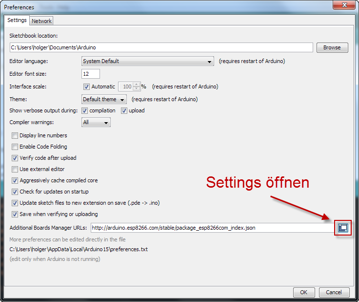
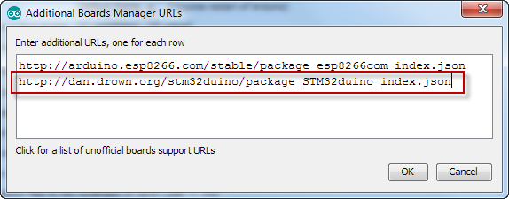
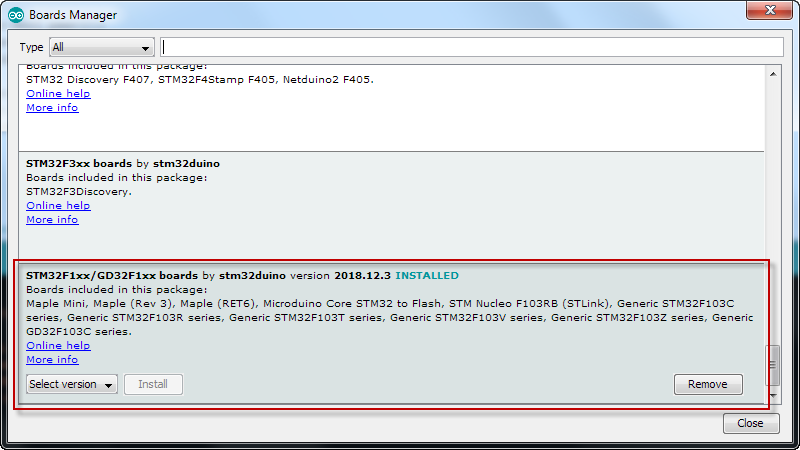
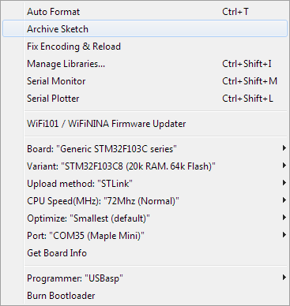
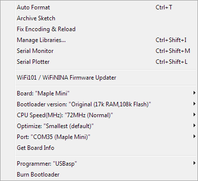

# STM32

## Benötigte Hardware

Zum Flashen benutzt man am besten einen [ST-Link](https://www.mouser.de/ProductDetail/STMicroelectronics/ST-LINK-V2).
Es geht auch ein [günstiger Clone aus Fernost](https://de.aliexpress.com/item/1-Satz-ST-LINK-Stlink-ST-Link-V2-Mini-STM8-STM32-Simulator-Download-Programmierer-Programmierung-Mit/32866866559.html).

## Einrichtung Arduino IDE

Damit für den STM32 übersetzt werden kann, muss das entsprechende Board-Package in der Arduino IDE installiert werden.
Dazu muss in den Einstellungen die folgende URL http://dan.drown.org/stm32duino/package_STM32duino_index.json 
als zusätzliches Board eingetragen werden.

Anschließend kann im Board-Manager die STM32F103 Unterstützung installiert werden.

## Getestete Boards

### [Blue Pill](https://wiki.stm32duino.com/index.php?title=Blue_Pill)

Das Blue Pill wird am besten mit dem ST-Link geflasht. Dazu sind folgende Einstellungen zu verwenden.

### [Maple Mini](https://wiki.stm32duino.com/index.php?title=Maple_Mini)

Das Maple Mini ist normalerweise mit einem Bootloader ausgestattet, der mittels USB eingebunden wird.
Hierzu sind die entsprechenden [Treiber für Windows](https://wiki.stm32duino.com/index.php?title=Windows_driver_installation) zu installieren.
Er kann dann wie ein "normaler" Arduino direkt über den USB-Anschluß mit Software bestückt werden.

