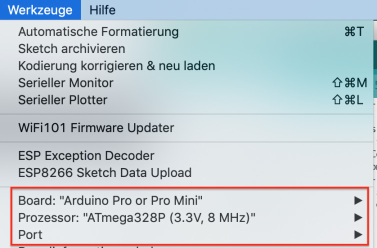
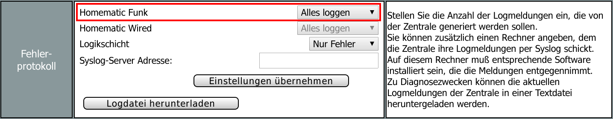

# Debugging / Fehlersuche

Sollte es einmal klemmen und die aufgebaute Schaltung nicht funktionieren, 
ist es immer von Vorteil, strukturiert nach dem Fehler zu suchen.


## Einstellungen in der Arduino IDE
  - **Board:** Arduino Pro or Pro Mini
  - **Prozessor:** ATmega328P (3.3V, 8MHz)
  - **Port:** _hier den seriellen Port vom FTDI-Adapter auswählen_
 



## Serieller Monitor
  Wichtig und aufschlussreich sind die seriellen Debugmeldungen, die vom Mikrocontroller ausgegeben werden. Um sich diese anzeigen zu lassen, ist der "serielle Monitor" zu öffnen. _(Arduino IDE: Menü -> Werkzeuge -> serieller Monitor)_<br/>
  Dabei muss ggf. noch die Baudrate (unten rechts im Fenster) auf **57600** Baud eingestellt werden.<br/>
  
  - Fehlerfreies Starten eines AskSinPP Device:
  ```
  AskSinPP V3.1.1 (Nov  7 2018 18:15:23)
  Address Space: 32 - 902
  CC init1
  CC Version: 04
  - ready
  ```
  ggf. erscheint nach einem Reset, neuem Sketch (erstmaliger Inbetriebnahme) zwischendring noch:
  ```
  CAFEFAC4
  Init Storage: CAFE85D5
  ```

  Wenn diese Meldungen so erscheinen, ist schon mal das Funkmodul **korrekt** initialisiert worden.
  
  - Gibt es Probleme mit der Kommunikation mit dem Funkmodul:
  ```
  CC init1
  Error at 00 expected: 2E read: 00
  Error at 02 expected: 06 read: 00
   ...
  Error at 3E expected: 03 read: 00
  CC Version: 00
  Error at 3E expected: C0 read: 00
  - ready
   ```
   Dann unbedingt nochmals die Verdrahtung überprüfen.
  
  
  Weitere Ausgaben im seriellen Monitor:
  
  | Meldung | Beschreibung |
  | ------------- |-------------|
  | <- ... | gesendetes Telegramm |
  | -> ... | empfangenes, an das Gerät gerichtetes Telegramm |
  | ignore ... | empfangenes, nicht an das Geräte gerichtetes Telegramm |


## CCU Log

In der CCU unter Einstellungen > Systemsteuerung > Zentralen-Wartung kann das Fehlerprotokoll auf _Alles loggen_ gestellt werden
um den Funkverkehr im Syslog zu sehen.
 

 
Man kann die Logdatei über die WebUI herunterladen.  
Um sie auf der Shell einzusehen loggt man sich mit ssh (bzw. Putty für Windows) auf der CCU ein.
Die Logdatei befindet sich in `/var/log/messages`. Mit dem Befehl `less /var/log/messages` zeigt man die ganze Datei an.
Mit `tail -f /var/log/messages` werden die letzten paar Zeile dargestellt, neue Meldungen werden sofort unten angefügt.


## Doppelte Device ID oder Serial

Es ist sicherzustellen, dass jedes HomeMatic Gerät eine eigene `Device ID` und `Device Serial` besitzt!  
Siehe auch [Sketch anpassen und flashen](/Grundlagen/02_software.html#sketch-anpassen-und-flashen).