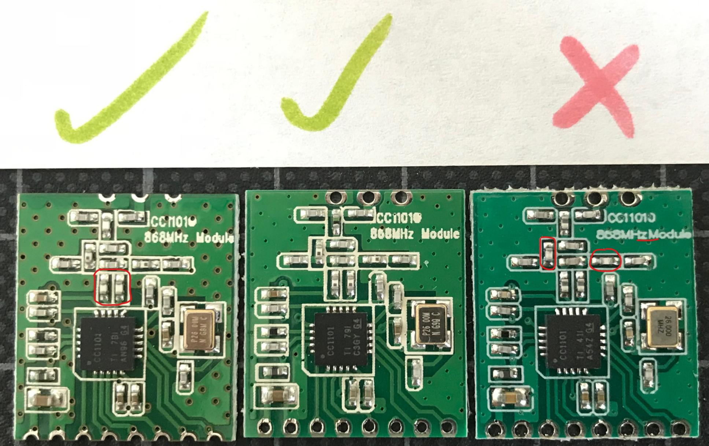

# Fehlerhafte CC1101 Module

Es sind CC1101 Module im Umlauf die auf einer leicht verschobenen Frequenz senden.  
Dies führt zu sehr schlechte RSSI Werten. Meist kann der Aktor gar nicht erst angelernt werden.

Näheres ist im [FHEM-Forum Thread](https://forum.fhem.de/index.php/topic,91740.0.html) erläutert.




## Ermittlung der CC1101 Frequenz

Viele Module kann man durch eine _kleine_ Verschiebung der Frequenz zur Funktion bewegen. Dazu gibt es einen
[FreqTest.ino](https://github.com/pa-pa/AskSinPP/blob/master/examples/FreqTest/FreqTest.ino) Sketch.

Der Testsketch versucht ausgehend von der Standardfrequenz ein gültiges Paket zu empfangen. Wenn nichts empfangen wurde, wird die Frequenz geändert und es wird wieder versucht. Dabei wird jeweils versucht den Bereich oberhalb und unterhalb der Standardfrequenz zu erweitern. Wenn irgendwo ein Paket empfangen wurde, wird von dort ausgehend die obere und untere Grenze ermittelt. Am Schluss wird die Frequenz, die in der Mitte zwischen oberer und unterer Grenze liegt, in den vorher ungenutzten Bereich des EEPROM geschrieben.

Die Funkpartner sollten tendenziell weiter weg vom FreqTest-Device sein. 

Der Testsketch verhält sich im Standardfall **passiv**. Das bedeutet, dass nur versucht wird, Pakete zu empfangen. Wurde nach einer Minute (einstellbar durch `SCANTIME`) nichts empfangen, wird die Frequenz gewechselt. Um sicher zu stellen, dass auch Nachrichten empfangen werden können, sollte während des Scans irgendein Gerät geschaltet werden.

Durch Setzen des `ACTIVE_PING`-defines kann der aktive Modus eingeschaltet werden. Dann sendet der Sketch jede Sekunde eine Statusmessage. Hierzu sind sind die `PING_FROM` und `PING_TO` IDs entsprechend der eigenen Umgebung anzupassen. `PING_FROM` sollte ein gepairtes Gerät sein - z.B. Steckdose. `PING_TO` ist die Zentrale/FHEM/CCU. Das Scannen sollte jetzt viel schneller gehen, da eine Antwort von der Zentrale angefordert wird.

Über folgendes **CCU-Script** (Programme & Zentralverknüpfungen > Skript testen) können die PING-Adressen ermittelt werden:

```java
! Folgend muss die Seriennummer angepasst werden.
! Es sollte ein nicht batteriebetriebenen Gerätes gewählt werden.
string serial = "OEQ1234567";

string ccu;
string device;
string stderr;
system.Exec("grep BidCoS-Address /etc/config/ids | awk -F '= ?' -v format='%x\n' '{printf(format,$2)}'", &ccu, &stderr);
WriteLine(stderr);
system.Exec("grep '^<device serial' /etc/config/rfd/" + serial + ".dev | sed 's/.*address=.0x\([0-9A-F]*\). .*/\1/'", &device, &stderr);
WriteLine(stderr);
WriteLine("PING_FROM(0x" + device.Substr(0,2) + ",0x" + device.Substr(2,2) + ",0x" + device.Substr(4,2) + ");" );
WriteLine("PING_TO(0x" + ccu.Substr(0,2) + ",0x" + ccu.Substr(2,2) + ",0x" + ccu.Substr(4,2) + ");" );
```

Sind nun die ID der CCU und eines Geräts bekannt kann der Sketch angepasst werden. Das Kommentarzeichen
vor `#define ACTIVE_PING` wird entfernt und die `PING_FROM` sowie `PING_TO` Werte angepasst:

```cpp
#define ACTIVE_PING
HMID PING_FROM(0x12,0x34,0x56);      // from address for status message e.g. switch
HMID PING_TO(0x99,0x66,0x99);        // to address for status message / central / CCU
```

Nun wird der Sketch geflasht und der Scanvorgang im seriellen Monitor verfolgt:

```text {25}
AskSin++ V3.1.7 (Mar 20 2019 15:34:55)
CC init1
CC Version: 04
 - ready
Start searching ...
Freq 0x21656A: 671067.  1/74
Search for upper bound
Freq 0x21657A: 671067.  1/72
Freq 0x21658A: 671067.  1/73
Freq 0x21659A: 671067.  1/72
Freq 0x2165AA: 671067.  1/74
Freq 0x2165BA: 671067.  1/72
Freq 0x2165CA: 671067.  1/74
Freq 0x2165DA: 60FE1F.  1/86
Freq 0x2165EA: 671067.  1/75
Freq 0x2165FA: 671067.  1/75
Freq 0x21660A: 671067.  1/73
Freq 0x21661A: 671067.  1/73
Freq 0x21662A: 671067.  1/73
Freq 0x21663A:   0/0
Search for lower bound
Freq 0x21655A:   0/0

Done: 0x21656A - 0x21662A
Calculated Freq: 0x2165CA
Store into config area: 65CA
```

Wie man in der Ausgabe sieht, ist nun die neue Frequenz `0x2165CA` im EEPROM gespeichert.

Man kann den Scanvorgang wiederholt laufen lassen um das Ergebnis zu verifizieren. Hierzu einfach den Arduino über den Reset-Button neu starten.

Wird nun der eigentlich Sketch geflasht, wird beim Start das EEPROM ausgelesen und die ermittelte Frequenz - gespeichert was auch im Monitor ersichtlich ist:

```text {8}
AskSin++ V3.1.7 (Mar 20 2019 17:43:23)
Address Space: 32 - 1650
00000000
Init Storage: CAFE6963
CC init1
CC Version: 04
 - ready
Config Freq: 0x2165CA
ID: 010808  Serial: PsiDimDW08
```

## Frequenzanpassung per Sketch

Alternativ kann die (ggf. per FreqTest.ino) ermittelte Frequenz im Sketch gesetzt werden. Dazu kann der `setup()`-Block 
angepasst werden. Es ist darauf zu achten, dass die Anpassung nach dem `init(hal)` eingefügt werden da `init()` 
die Standardfrequenz setzt.


```cpp {10-14}
void setup () {
  DINIT(57600,ASKSIN_PLUS_PLUS_IDENTIFIER);
  if( sdev.init(hal,DIMMER1_PIN,DIMMER2_PIN) ) {
    // first init - setup connection between button and first channel
    sdev.channel(1).peer(cfgBtn.peer());
  }
  // Init the hw button
  buttonISR(cfgBtn,CONFIG_BUTTON_PIN);

  // Set frequency for CC1101
  hal.radio.initReg(CC1101_FREQ2, 0x21);
  hal.radio.initReg(CC1101_FREQ1, 0x65);
  hal.radio.initReg(CC1101_FREQ0, 0xCA);

  sdev.initDone();

  // Output ID and Serial in serial console
  DDEVINFO(sdev);
}
``` 

## Weitere Lösungen

* [Tausch der Kondensatoren gegen 12pF](https://forum.fhem.de/index.php/topic,91740.msg872505.html#msg872505)
* [CC1101_Frequenz XLS](https://github.com/TomMajor/SmartHome/tree/master/Info/CC1101_Frequenz) hilft bei der Berechnung des Hexwerts aus der Freq.


## HB-CC1101-Testbench

Meist werden die CC1101-Module über die SMD-Kontakte verlötet und sind im Fehlerfall nur schwer wieder zu entfernen.
Um dem Problem zu entgehen wurde im homematic-forum.de die HB-CC1101-Testbench vorgestellt.
Vereinfacht ausgedrückt ist es damit möglich, sowohl den Ruhestrohm zu testen, als auch einen FreqTest durchzuführen und um evtl. Fehlfunktionen noch vor dem Einbau feststellen zu können.

* [Vorstellung HC-CC1101-Testbench](https://homematic-forum.de/forum/viewtopic.php?f=76&t=54701)
* [Verbessertes Klemmstück zum Aufsockeln des Moduls](https://homematic-forum.de/forum/viewtopic.php?f=76&t=54701&start=40#p560242)
