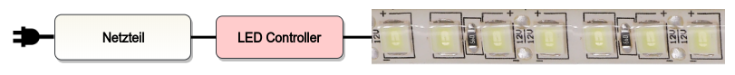

# LED-Dimmer Grundlagen

Leuchtdioden haben eine erhebliche Verbreitung erreicht und verbrauchen vergleichsweise wenig Energie.
Sie werden in verschiedenster Form in Lampen verbaut, doch stellt sich oft die Frage, wie man damit
im Kontext des SmartHome umgehen soll. Dieser Artikel soll einige Grundlagen und Verständnis schaffen.

Aus elektrotechnischer Sicht wird die Lektüre auf
[ElectronicsTutorials](https://www.electronics-tutorials.ws/de/dioden/leuchtdiode.html) 
und [Mikrocontroller.net](https://www.mikrocontroller.net/articles/LED) nahegelegt!

tldr;
* Der Strom kann durch eine LED nur in eine Richtung fließen. Es muss also auf die Polung geachtet werden.
* Der Innenwiderstand sinkt bei höherer Spannung, die [Kennlinie](https://de.wikipedia.org/wiki/Leuchtdiode#/media/Datei:Ledwhitecharcurp.png) ist nicht-linear
  => Strombegrenzung nötig (meist durch Vorwiderstand gelöst)
* Die Lichtintensität wird maßgeblich über den Strom bestimmt, nicht über die Spannung.
* Es gelten die Regeln der Reihen- / Parallelschaltung:
  * Reihenschaltung: Addierung der Spannungen der LEDs
  * Parallelschaltung: Addierung des Stroms der LEDs
* Leistung [Watt] = Spannung [Volt] * Strom [Ampere]

Achtung: Parallelschaltung von LEDs ohne Vorwiderstand ist nicht zu empfehlen. Durch leichte Unterschiede 
im Produktionsprozess und damit in der Kennlinie könnte eine LED (mit gleicher Durchlassspannung) auf der Kennlinie *davonlaufen* und durch zu hohen Strom zerstört werden. Da mit steigender Temperatur die Durchlassspannung sinkt verstärkt sich dieser Effekt. 

Eine LED benötigt eine gewisse Leistung die in Watt angegeben ist,
diese setzt sich aus der benötigten Spannung und dem Strom zusammen, also `P = U * I`
oder als Einheiten ausgedrückt `[W] = [V] * [A]`.

## Konstantspannung

Wird eine Spannungsquelle (Netzteil) mit konstanter Spannung (z.B. 12 V) eingesetzt 
muss also der Strom, der durch die LED fließt, begrenzt werden. Dies erfolt über
den Einbau eines Vorwiderstands. LED-Stripes haben diese Widerstände eingebaut
sofern in ihrer Spezifikation ein Spannung angegeben ist wie z.B. 12 V oder 24 V.

Abgekürzt oft durch CV (Constant-Voltage).

## Konstantstrom

Wird eine Konstanstromquelle (KSQ) eingesetzt, liefert diese einen definierten Strom
von beispielsweise 350 mA, wobei sich die Spannung an die benötigte Leistung anpasst.
In diesem Fall werden die LEDs ohne Vorwiderstand betrieben, da der Stromfluss vom
Netzteil geregelt wird. Sie werden auch LED-Treiber genannt.

Netzteile welche als KSQ arbeiten erkennt man oft daran, dass als Output
ein fester Strom und ein variabler Spannungsberiech angegeben sind. Beispielsweise
`20-32 V`, `350 mA`.

KSQ kommen oft bei LED-Panels, Einbauspots und Power-LEDs zum Einsatz.

Abgekürzt oft durch CC (Constant-Current).

## Dimmen von LEDs

Um die Helligkeit von LEDs zu regeln sind zwei Verfahren gebräuchlich: Strombegrenzung und Pulsweitenmodulation. 

### Strombegrenzung

Bei der Strombegrenzung wird der Strom, der durch die LED fließt, nach unten geregelt wodurch
die Leistung abnimmt und die LED dunkler wird.

### Pulsweitenmodulation

Bei [PWM](https://de.wikipedia.org/wiki/Pulsdauermodulation) wird die LED in sehr kurzen
Zeitabständen ein- und ausgeschaltet, wodurch sich kurze Hell- und Dunkelphasen ergeben.
Die Trägheit des menschlichen Auges kann diese kurzen Wechsel nicht erfassen
und interpretiert nur die durchschnittliche Helligkeit.

PWM kommt meist bei Betrieb mit konstanter Spannung zum Einsatz, wie z.B. bei LED-Stripes.

## Dimmer

Die Frage ist nun, wie entweder der Strom begrenzt werden kann oder die LED
gepulst wird. Im Feld haben sich verschiedenste Varianten etabliert.

### Controller

LED-Controller werden auf der Niedervolt-Seite, also nach dem Netzteil verschaltet.
Meistens wird PWM eingesetzt, es gibt aber auch viele Spannungsquellen mit integriertem
Controller wie zum Beispiel Netzteile mit DIM, DALI oder DMX Eingang welche das Dimmen übernehmen.

### Phasenschnitt

Phasenabschnittsdimmer bzw. Phasenanschnittsdimmer wurden zum Dimmen von herkömmlichen
Glühlampen und Halogenlampen benutzt. Der Einsatz bei LED-Leuchtmitteln ist nur bedingt
zu empfehlen da die Funktion von der Kompatibilität des Netzteils abhängt. 
Oft versucht die interne Schaltung des LED-Leuchtmittels gegenzusteuern. Im Endeffekt 
bleibt das die Helligkeit über einen großen Dimmbereich nahezu gleich, und sinkt dann 
rasch ab oder geht in Blinken oder Blitzen über.

### DALI

Das [Digital Addressable Lighting Interface](https://de.wikipedia.org/wiki/Digital_Addressable_Lighting_Interface),
 kurz DALI, ist ein Protokoll zur Steuerung von Lichttechnik. 

### DMX

[DMX](https://de.wikipedia.org/wiki/DMX_(Lichttechnik)) ist ebenfalls ein Protokoll zur Steuerung von Lichttechnik.

## Beispiele

### 3m LED-Stripe

Angenommen wir haben einen einfarbigen LED-Stripe mit den Spezifikationen von `24V` und `14,4W` pro Meter.

Aus den `24V` ist zu erkennen, dass es sich hier um eine konstante Spannung handelt und der Strombedarf
von der Länge (also der Anzahl der parallel-geschalteten LEDs) abhängt.

Der Leistungsbedarf ist also `14,4W/m * 3m = 43,2W` und demnach `43,2W / 24V = 1.8A`. 

Ein passendes Netzteil wäre hierfür beispielsweise das Meanwell LPV-60-24 mit `24V` und `2,5A` da man
immer rund 10% mehr Leistung einplanen sollte. Zudem verbraucht der LED-Controller auch eine geringe Leistung.

Bei der Auswahl des LED-Controllers ist nun auf die maximale Eingangsspannung sowie den Strom zu achten.  
Aus dem Datenblatt des HM-LC-Dim1-PWM-CV ist die maximale Schaltleistung von `60W` zu entnehmen sowie
die Spannungsfestigkeit von `24V`, demnach wäre dieser Controller für den Betrieb der 3m LED-Stripe geeignet.

An dieser Stelle sei darauf hingewiesen, dass bei langen LED-Stripes die Versorgung öfters eingespeist werden
sollte (z.B. am Anfang und am Ende), weil die dünnen flexiblem Leiterbahnen des Stripes einen vergleichsweise 
hohen Widerstand haben und an ihnen zu viel Spannung abfällt.

### Deckenspots

Viele LED-Deckenspots oder auch Panels werden mit externem Netzteil geliefert, welches durch
eine eigene Beschaltung ersetzt werden kann. In diesem Beispiel entnehmen wir den technischen Daten:
`700mA` sowie `7W`. Zudem ist auf dem Netzteil eine Ausgansspannung von `7-15V` angegeben, wodurch
klar wird, dass es sich hier um einen Konstantstrom-Betrieb handelt.

Ein mögliches Netzteil wäre das Meanwell LCM-40. Der Ausgangsstrom kann über DIP-Schalter
eingestellt werden und zudem kann es über einen PWM Eingang gedimmt werden. Aus dem Datenblatt
geht zudem hervor, dass bei einem Strom von `700mA` maximal `57V` geliefert werden, wodurch 5
Deckensponts **in Reihe** versorgt werden können.

## FAQ

### Hoher Einschaltstrom

Durch das kapazitive Verhalten von LED-Leuchtmitteln können beim Einschalten hohe Stromspitzen enstehen was z.B. zum 
Festkleben von Relais führen kann. Für dieses Problem gibt es Einschaltstrombegrenzer (ESB) oder Nulldurchgangsschalter.

### LED leuchtet bei 0%

Wird eine _schwaches_ LED-Leuchtmittel hinter einem Phasendimmer betrieben, dann kann es vorkommen, dass selbst bei 0% Dimmung die LED weiterhin leuchtet / glimmt. Ein Grundlastelement kann hier abhilfe schaffen. Siehe [LED Grundlastelement: Funktionsweise und Anschluss](https://ledtipps.net/grundlastelement/) Artikel von LEDTipps.

Ist der LED-Controller **hinter** dem Netzteil verbaut, dann liegt ein anderes Problem vor und ein Grundlastelement bietet keine Lösung.

