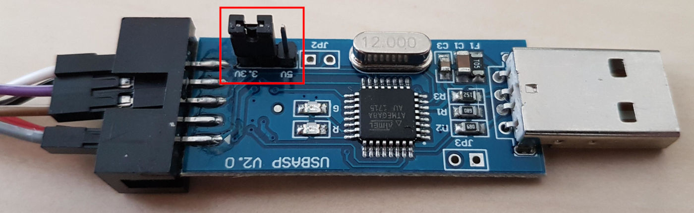
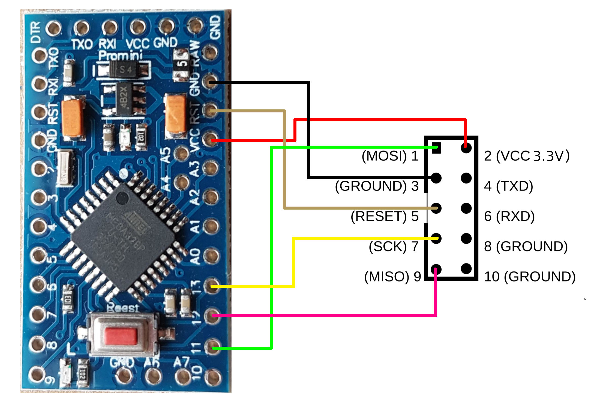
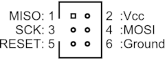
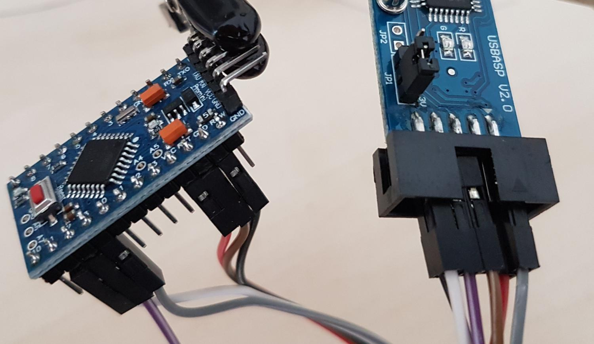
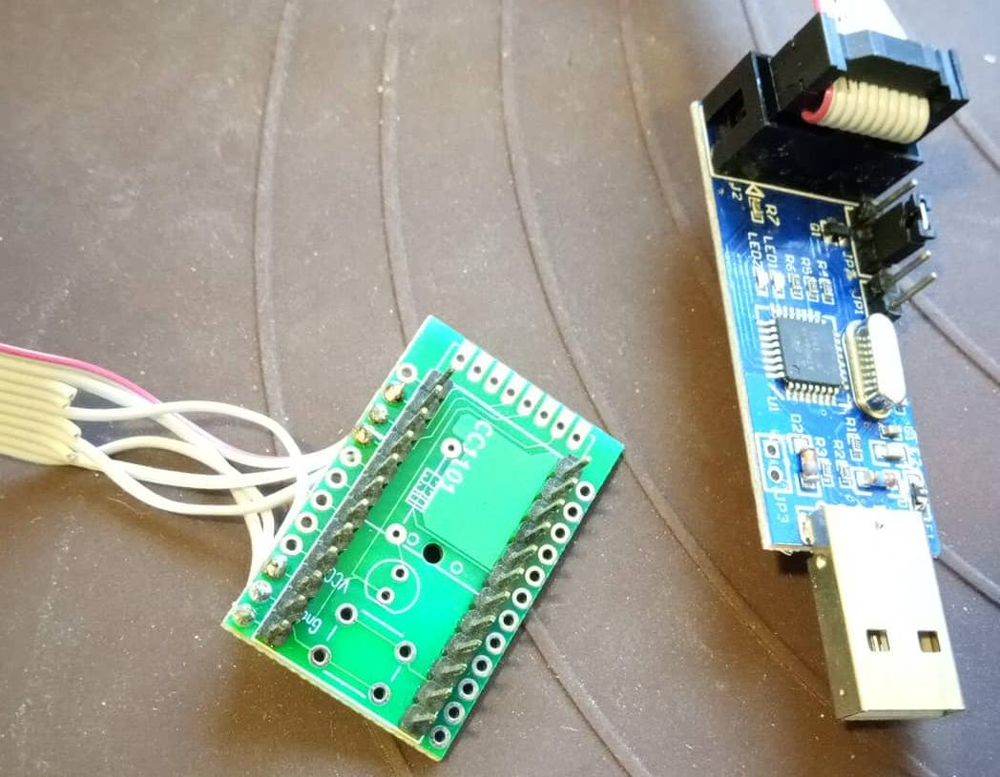

# Dauersender / Babbling Idiot

Abschaltung oder Dauersender/-störer trotz fast voller Batterien

Um die garantierten Spezifikationen des ATMega328P einzuhalten, ist ab Werk die so genannte 
[Brown-Out-Detection (BOD)](https://www.mikrocontroller.net/articles/Brownout) bei **2.7V** aktiviert. 
Sinkt die Eingangsspannung unter diesen Wert, fällt der µC in einen RESET-Zustand. 
Das _kann_ ungewollte Nebenfolgen haben 
(siehe ["Babbling Idiot"](https://github.com/TomMajor/AskSinPP_Examples/tree/master/Info/Babbling%20Idiot%20Protection))!
Weiterhin werden die Batterien dadurch auch nur sehr ineffektiv genutzt.

Bei der BOD handelt es sich um ein sogenanntes ["Fuse-Bit"](https://de.wikipedia.org/wiki/Fuse-Bit).

Fuse-Bits können nur mithilfe eines ISP (In-System-Programmer) 
(z.B. [USBASP](https://www.ebay.de/i/232496093834) oder 
[Diamex Programmer](https://www.diamex.de/dxshop/USB-ISP-Programmer-fuer-Atmel-AVR-Rev2)) 
verändert werden. Es lässt sich auch ein 
[Arduino UNO als ISP](https://www.arduino.cc/en/Tutorial/ArduinoISP) verwenden!


## Anschluss des ISP

USBasp kann sowohl 5V als auch 3.3V - ! jedoch nur am Vcc !, hier sollte zuerst der Jumper auf die richtige Spannung gesetzt werden.

::: warning
USBasp setzen per Jumper nur Vcc auf 3.3V, das SPI Interface läuft weiterhin mit 5V.
Es empfiehlt sich daher die Fuse-Bits zu programmieren bevor weitere Hardware oder das CC1101 an den Arduino angeschlossen ist.
::: 



Der ISP ist 1:1 mit 6 Leitungen an den Pro Mini zu verbinden:

| Pro Mini | ISP |
|----|----|
| VCC | VCC |
| GND  | GND |
| RESET | RESET |
| 11 | MOSI |
| 12 | MISO |
| 13 | SCK |



Es gibt auch ISPs mit nur 6 PINS:





Die [HB-Mini](https://github.com/ronnythomas/HB-Mini) von Ronny eignet sich auch gut als Hilfsmittel.
Hier kann man den Arduino etwas verkantet _drauflegen_ für den Flashvorgang.




## avrdude

Das Setzen der Fuse-Bits erfolgt mit dem Tool `avrdude`.
Es befindet sich bei installierter **Arduino IDE** und Boardunterstützung **Arduino AVR Boards** 
- in Windows:
  - `C:\Users\<Benutzer>\AppData\Local\Arduino15\packages\arduino\tools\avrdude\6.3.0-arduino14\bin\`
- auf dem Mac:
  - `~/Library/Arduino15/packages/arduino/tools/avrdude/6.3.0-arduino14/bin/`
- bei Linux:
  - `~/.arduino15/packages/arduino/tools/avrdude/6.3.0-arduino14/bin/`
  - Alternativ gibt es das avrdude auch in den meisten Repos und kann als globale Binary installiert werden (`apt-get install avrdude`)

_(Der Ordner `6.3.0-arduino14` kann je nach Version abweichen.)_

Der Aufruf erfolgt dann bei Verwendung des USBasp in der Eingabeaufforderung/Kommandozeile mit:
```bash
<Pfadangabe>/avrdude -v -pm328p -cusbasp -Ulfuse:w:0xFF:m -Uhfuse:w:0xD2:m -Uefuse:w:0xFF:m
```

_(USBasp benötigt einen [speziellen USB-Treiber "libusb"](http://zadig.akeo.ie)!)_

Bei Verwendung eines Diamex oder Arduino UNO as ISP sieht der Aufruf so aus _(com11 ggf. ändern!)_:
```bash
<Pfadangabe>/avrdude -v -pm328p -P com11 -c stk500v1 -b 19200 -Ulfuse:w:0xFF:m -Uhfuse:w:0xD2:m -Uefuse:w:0xFF:m
```

Siehe auch: [USBASP AVR Programmer User Guide](http://eecs.oregonstate.edu/education/docs/ece375/USBASP-UG.pdf)


Zum Schluss muss die Ausgabe kontrolliert werden. Folgende Zeilen erscheint zum Schluss der Ausgabe
wenn alles erfolgreich war:

```
avrdude: safemode: Fuses OK (E:FF, H:D2, L:FF)

avrdude done.   Thank you.
```

Falls nicht ist die Ausgabe auf Fehlermeldungen zu kontrollieren.  
Die Version `avrdude -v` sollte mindestens 6.3 sein!
