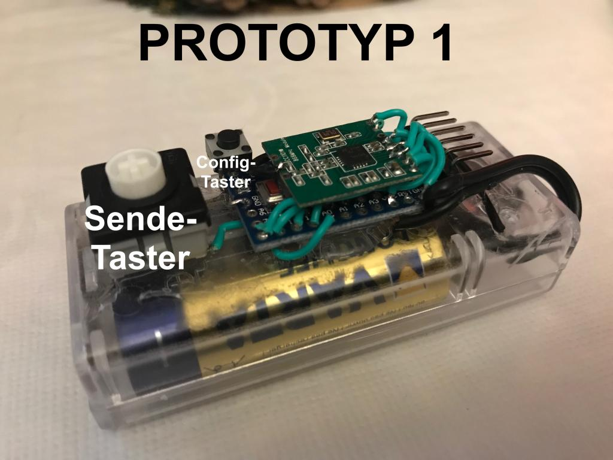

# Grundlagen

Mit einem Arduino (oder [AskSinPP kompatiblen Microcontroller](https://github.com/pa-pa/AskSinPP#asksin)),
einem **CC1101 868Mhz Funkmodul** und der **AskSinPP** Bibliothek lassen sich viele HomeMatic Sensoren und Aktoren
sehr preiswert nachbauen. Weiter ist es möglich, eigene neue Sensoren und Aktoren zu kreieren.

Mittlerweile existieren neben verschiedenen _Sketches_ (die Sofware für die Microkontroller) auch diverse
Platinen und Gehäuse.

