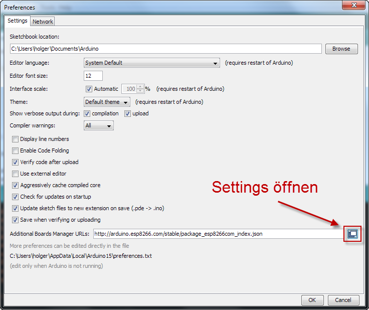
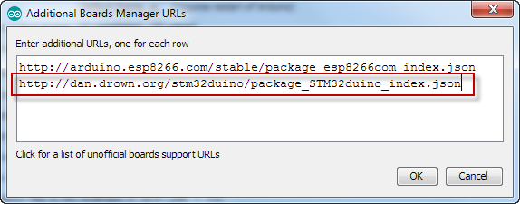
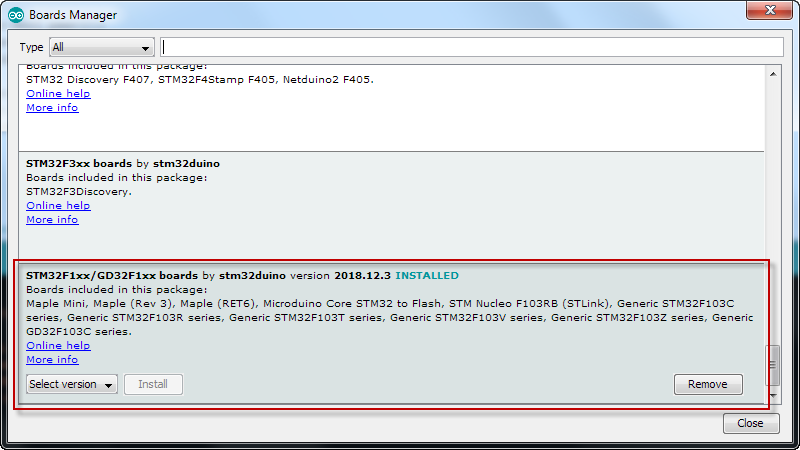
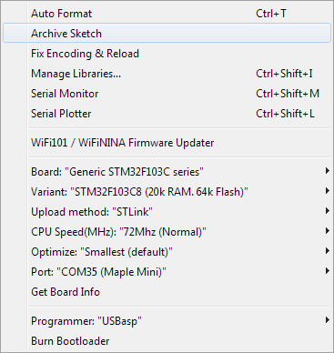
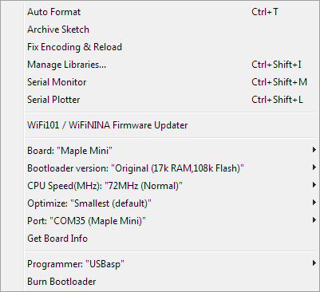
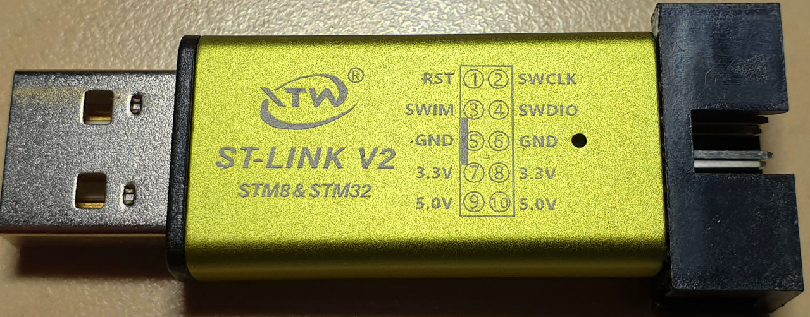
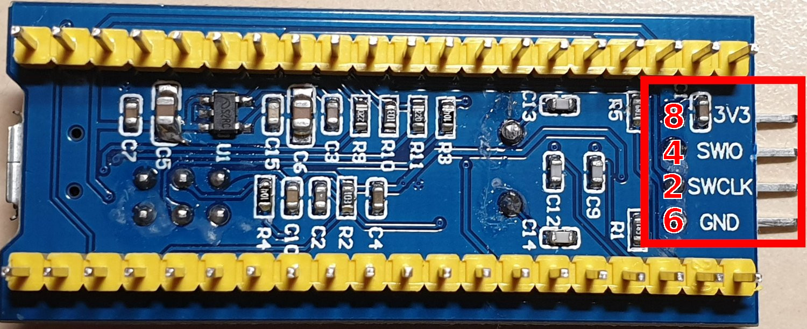
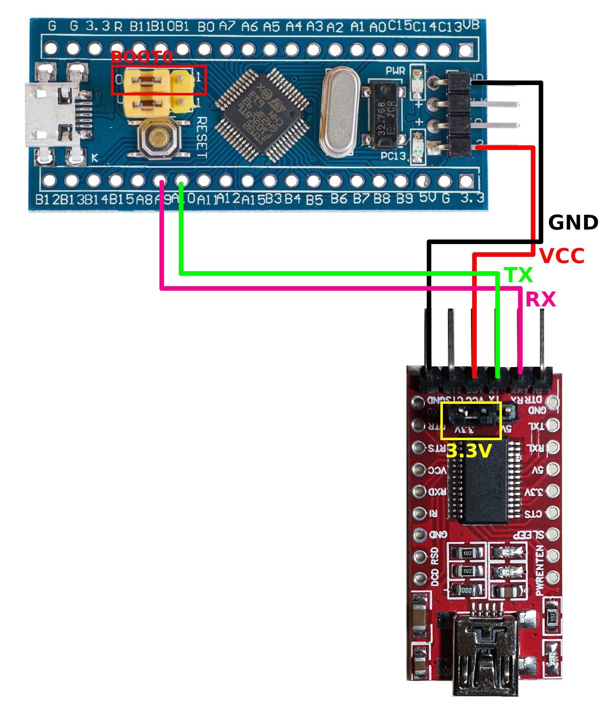
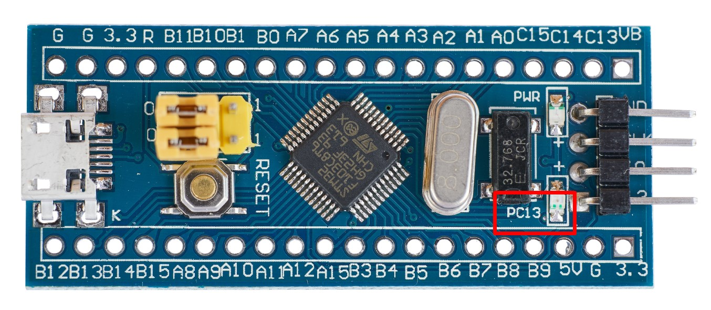
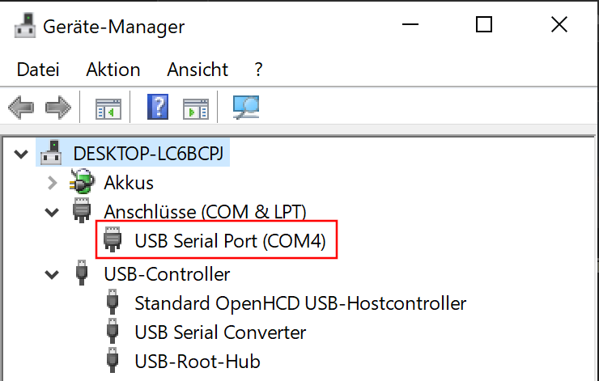

# Flashen

Es gibt verschiedene Wege und Programmer um den STM32 mit Software zu flashen:

* ST-Link/V2: Offizieller STM32 Programmer. Keine Serial-Monitor Unterstützung. Zuverlässigste Methode.
* UART (FTDI)
* Integrierter UART über MicroUSB Anschluss: Extra Bootloader beim Blue-Pill nötig.


## Arduino IDE

Damit für den STM32 übersetzt werden kann, muss das entsprechende Board-Package in der Arduino IDE installiert werden.
Dazu muss in den Einstellungen die folgende URL:  
`http://dan.drown.org/stm32duino/package_STM32duino_index.json`   
als zusätzliches Board eingetragen werden.




Anschließend kann im Board-Manager die STM32F103 Unterstützung installiert werden.



Tipp: Arduino-IDE nicht über den Windows App-Store installieren, da es hier zu Rechteproblemen
mit Java kommen kann (_Zugriff verweigert_ beim Upload).

### Blue Pill

Der Blue Pill wird ohne Bootloader ausgeliefert. Dazu sind folgende Einstellungen zu verwenden.



Die _Upload method_ wird je nach Programmer gewählt:

* ST-Link: `STLink`
* FTDI: `Serial`
* USB-Bootloader: `STM32duino Bootloader`

### Maple Mini

Das Maple Mini ist normalerweise mit einem Bootloader ausgestattet, der mittels USB eingebunden wird.
Die entsprechenden Treiber sind in
[Arduino_STM32](https://github.com/rogerclarkmelbourne/Arduino_STM32/archive/master.zip) enthalten
und können über das Script `drivers/win/install_drivers.bat` installiert wrden.

Er kann dann wie ein "normaler" Arduino direkt über den USB-Anschluß mit Software bestückt werden.
Als Upload-Method wird `STM32duino Bootloader` gewählt. 




## PlatformIO

```ini
# platformio.ini Blue-Pill
[platformio]
src_dir = .

[env]
platform = ststm32
board = genericSTM32F103C8
framework = arduino
monitor_speed = 57600
lib_deps =
  AskSinPP

[env:stlink]
upload_protocol = stlink

[env:dfu]
upload_protocol = dfu
```

```bash
# Upload using ST-Link protocol
pio run -t upload -e stlink

# Upload using dfu protocol (FTDI / USB-Bootloader)
pio run -t upload -e dfu

# Serial Monitor
pio device monitor
``` 


## Programmer

### ST-Link/V2

Der [ST-Link](https://www.mouser.de/ProductDetail/STMicroelectronics/ST-LINK-V2?qs=sGAEpiMZZMsUcx5t7XFI3RIxq36q1BfC)
ist der offizielle Programmieradapter von ST.

Es geht auch ein [günstiger Clone aus Fernost](https://de.aliexpress.com/item/1-Satz-ST-LINK-Stlink-ST-Link-V2-Mini-STM8-STM32-Simulator-Download-Programmierer-Programmierung-Mit/32866866559.html).

Der Programmieradapter wird entsprechend der PIN-Beschriftung an den STM32 angeschlossen. Ist keine Aufschrift vorhanden muss das Datenblatt konsultiert werden. **Das Pinout der Adapter kann unterschiedlich sein.**





Der `BOOT0` Jumper muss zum Flashen auf `1` gesteckt werden.


### FTDI

Der STM32 kann direkt über FTDI geflasht werden. Eine Anleitung zur Integration in die Arduino IDE
wurde auf Heise veröffentlicht:
[Keine bittere Pille - die Blue Pill mit ARM Cortex M3](https://www.heise.de/developer/artikel/Keine-bittere-Pille-die-Blue-Pill-mit-ARM-Cortex-M3-4009580.html).

Als Upload-Method wird in der Arduino-IDE `Serial` verwendet.

Der `BOOT0` Jumper muss zum Flashen auf `1` gesteckt werden.

### Anschluss



Der FTDI muss auf 3.3V gejumpert sein!

| STM32    | FTDI     |
|----------|----------|
| VCC 3.3V | VCC      |
| GND      | GND      |
| A9       | RX       |
| A10      | TX       |

Um den Flashvorgang durchführen zu können muss der STM32 in den Programmiermodus versetzt werden.
Dies geschieht durch den Jumper `BOOT0` der auf die Position `1` gesteckt wird. Soll nach dem Flashen
der Sketch geladen werden wird BOOT0 wieder zurück auf 0 gesteckt. 


## USB Bootloader

Das Blue-Pill Board besitzt einen Micro-USB Stecker der den Controller zunächst nur mit
Strom versorgen kann. Mit einem USB-Bootloader kann man darüber allerdings auch direkt
Sketches flashen und den seriellen Monitor öffnen.

Zuerst sucht man sich den passenden STM32duino Bootloader unter 
[https://github.com/rogerclarkmelbourne/STM32duino-bootloader/tree/master/binaries](https://github.com/rogerclarkmelbourne/STM32duino-bootloader/tree/master/binaries). 

Für den STM32F103C8 eignet sich der `generic_boot20`, die genaue Variante wird über das LED-Pinout ermittelt:



Hier also `P13` und damit [generic_boot20_pc13.bin](https://github.com/rogerclarkmelbourne/STM32duino-bootloader/raw/master/binaries/generic_boot20_pc13.bin).

:::warning
Auf Github den `Download` Button nutzen, kein "Ziel speichern unter" oder ähnliches sonst wird nur die _HTML-Vorschau_ heruntergeladen, nicht aber das eigentliche Bootloader-Hex-File.
:::

Nun kann der Bootloader z.B. mit `stm32flash` über einen FTDI Adapter aufgespielt werden.

Der `BOOT0` Jumper muss zum Flashen auf `1` gesteckt werden.

<tabs>
<tab title="Windows">

Ggf. muss der [FTDI Treiber](https://www.ftdichip.com/Drivers/D2XX.htm) installiert werden
sofern im Geräte-Manager kein COM-Port vorhanden.

Für den USB-Betrieb muss ein entsprechender Treiber installiert werden. Er ist im
[Arduino_STM32](https://github.com/rogerclarkmelbourne/Arduino_STM32/archive/master.zip) enthalten
und kommt mit einem Install Script `drivers/win/install_drivers.bat`.



* **Variante 1: stm32flash**

    Unter Windows kann mit [stm32flash](https://sourceforge.net/projects/stm32flash/files/) auf der Kommandozeile
    geflasht werden. Am besten kopiert man den Bootloader mit in das stm32flash Verzeichnis. 
    Der COM-Port wird im Geräte-Manager abgelesen und angepasst (im Beispiel `COM4`). 
    
    Sollte es zu einem _Failed to init device_ kommen, kann ein Drücken der RESET Taste auf dem STM32 helfen.
    
    ```text
    C:\Users\psi\Downloads\stm32flash-0.5-win64>stm32flash.exe -w generic_boot20_pc13.bin COM4
    stm32flash 0.5
    
    http://stm32flash.sourceforge.net/
    
    Using Parser : Raw BINARY
    Interface serial_w32: 57600 8E1
    Version      : 0x22
    Option 1     : 0x00
    Option 2     : 0x00
    Device ID    : 0x0410 (STM32F10xxx Medium-density)
    - RAM        : 20KiB  (512b reserved by bootloader)
    - Flash      : 128KiB (size first sector: 4x1024)
    - Option RAM : 16b
    - System RAM : 2KiB
    Write to memory
    Erasing memory
    Wrote address 0x08005294 (100.00%) Done.
    ```

* **Variante 2: FLASHER-STM32**

    Der [STM32 Flash loader demonstrator](https://www.st.com/en/development-tools/flasher-stm32.html) 
    ist ein Windows Programm zum flashen des STM32 über USART.

    Donny Fan hat hierzu eine (englische) Anleitung in seinem Blog veröffentlicht: 
    [USB Serial for Blue Pill (STM32) with PlatformIO](https://donneyfan.com/blog/usb-serial-for-blue-pill-stm32-with-platformio).
    
Nach dem Flashen wird der Jumper `BOOT0` wieder auf `0` gesteckt und der STM32 über seine Micro-USB Buchse angeschlossen.
Jetzt wird der Geräte-Manager überprüft, es sollte ein neues _"Maple Serial (COMx)"_ vorhanden sein.

In der Arduino IDE wird als Upload-Method `STM32duino Bootloader` gewählt. 
    
</tab>
<tab title="MacOS">

**_TODO..._**

Geht wahrscheinlich auch über stm32flash, Contributions welcome ;)

</tab>
<tab title="Linux">

Unter Linux kann der Bootloader mit [stm32flash](https://sourceforge.net/p/stm32flash/wiki/Home/)
 aufgespielt werden. ttyUSB0 ist ggf. durch das Device des FTDI zu ersetzen (dmesg).

```text
$ stm32flash -w generic_boot20_pc13.bin /dev/ttyUSB0
stm32flash 0.5

http://stm32flash.sourceforge.net/

Using Parser : Raw BINARY
Interface serial_posix: 57600 8E1
Version      : 0x22
Option 1     : 0x00
Option 2     : 0x00
Device ID    : 0x0410 (STM32F10xxx Medium-density)
- RAM        : 20KiB  (512b reserved by bootloader)
- Flash      : 128KiB (size first sector: 4x1024)
- Option RAM : 16b
- System RAM : 2KiB
Write to memory
Erasing memory
Wrote address 0x08005294 (100.00%) Done.
```

</tab>
</tabs>


