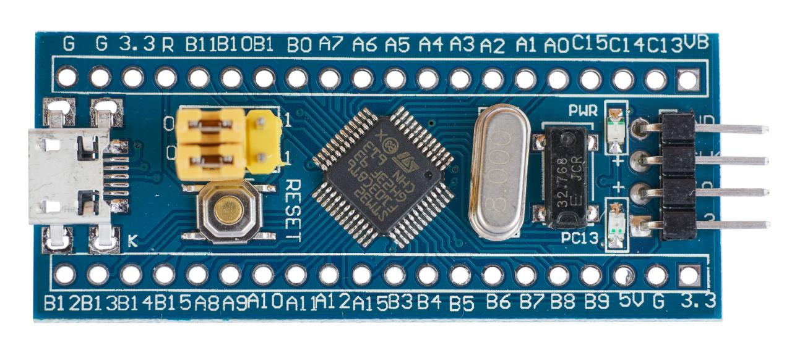
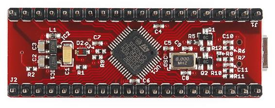

# STM32

STM32 ist eine Mikrocontroller-Familie von ST mit einer 32-Bit ARM Cortex-M0/M3/M4 CPU.

Der STM32 besitzt kein EEPROM für die persistente Speicherung von Daten weshalb auf einen
externes IC zurückgegriffen werden muss.
 

## Getestete Boards

Den STM32 gibt es von ST in vielen verschiedenen Varianten.

AskSin++ enthält Support für `STM32F1` und es wurden folgenden Boards getestet:

### Blue Pill
STM32F103C8T6 alias [Blue Pill](https://www.heise.de/developer/artikel/Keine-bittere-Pille-die-Blue-Pill-mit-ARM-Cortex-M3-4009580.html)

### Maple Mini

STM32F103CBT6 alias [Maple Mini](https://www.heise.de/developer/artikel/Maple-Mini-ein-weiteres-STM32F103-Board-4010625.html)

