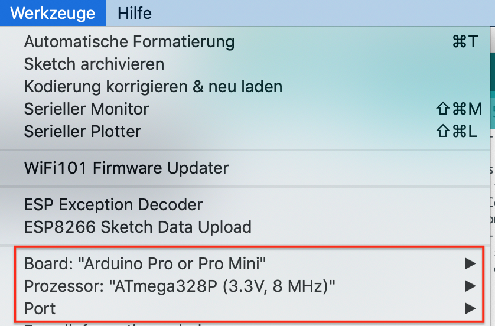

[Startseite](https://github.com/jp112sdl/AskSinPPCollection/blob/master/README.md)
## :books: FAQ / häufige Fehler :beginner:

### Einstellungen in der Arduino IDE
  - **Board:** Arduino Pro or Pro Mini
  - **Prozessor:** ATmega328P (3.3V, 8MHz)
  - **Port:** _hier den seriellen Port vom FTDI-Adapter auswählen_
  
  
### Verwendung mehrerer Geräte desselben Typs - Vergabe von Seriennummern
  Jedes Gerät in einer HomeMatic Umgebung hat 2 eindeutige Identifikationsmerkmale:
  - die 10-stellige Seriennummer (wird in der WebUI in der Spalte `Seriennummer` in Einstellungen->Geräte angezeigt)
  - die 3-Byte Geräteadresse (wird in einer Konfigurationsdatei im Dateisystem gespeichert)
  
  Beide dürfen in einer HomeMatic-Installation nur **1x vergeben** werden.<br>
  _Ausschlaggebend für die Funk-Kommunikation ist die Geräte-Adresse._
  
  Beispiel [HM-LC-Sw2-FM](https://github.com/jp112sdl/Beispiel_AskSinPP/blob/master/examples/HM-LC-Sw2-FM/HM-LC-Sw2-FM.ino):
  ```
  const struct DeviceInfo PROGMEM devinfo = {
    {0x12, 0x09, 0x00},     // Device ID
    "JPLCSw2001",           // Device Serial
    {0x00, 0x09},           // Device Model
    0x24,                   // Firmware Version
    as::DeviceType::Switch, // Device Type
    {0x01, 0x00}            // Info Bytes
  };
```
  
  Die Geräteadresse _(im Sketch als "Device ID" bezeichnet)_ lautet in diesem Fall `0x12, 0x09, 0x00`.<br>
  Die Seriennummer _(im Sketch als "Device Serial" bezeichnet)_ lautet in diesem Fall `JPLCSw2001`.<br>
  
  Soll ein weiterer, auf diesen Sketch basierender HM-LC-Sw2-FM ins HomeMatic System integriert werden, verwendet man (- so mache ich es zumindest-) am besten eine fortlaufende Numerierung. `0x12, 0x09, 0x01` / `JPLCSw2002`.<br>
  
  **Wichtig: Die Seriennummer muss immer 10-stellig sein! Sie darf Buchstaben und Zahlen enthalten.**

### Debugging

  Sollte es einmal klemmen und die aufgebaute Schaltung nicht funktionieren, ist es immer von Vorteil, strukturiert nach dem Fehler zu suchen.<br/>
  Wichtig und aufschlussreich sind die seriellen Debugmeldungen, die vom Mikrocontroller ausgegeben werden. Um sich diese anzeigen zu lassen, ist der "serielle Monitor" zu öffnen. _(Arduino IDE: Menü -> Werkzeuge -> serieller Monitor)_<br/>
  Dabei muss ggf. noch die Baudrate (unten rechts im Fenster) auf **57600** Baud eingestellt werden.<br/>
  
  (korrektes) Starten eines AskSinPP Device:
  ```
  AskSin++ V3.1.1 (Nov  7 2018 18:15:23)
  Address Space: 32 - 902
  CC init1
  CC Version: 04
  - ready
  ```
  ggf. erscheint nach einem Reset, neuem Sketch (erstmaliger Inbetriebnahme) zwischendring noch:
  ```
  CAFEFAC4
  Init Storage: CAFE85D5
  ```

  Wenn diese Meldungen so erscheinen, ist schon mal das Funkmodul **korrekt** initialisiert worden.
  
  Gibt es Probleme mit der Kommunikation mit dem Funkmodul:
  ```
  CC init1
  Error at 00 expected: 2E read: 00
  Error at 02 expected: 06 read: 00
   ...
  Error at 3E expected: 03 read: 00
  CC Version: 00
  Error at 3E expected: C0 read: 00
  - ready
   ```
   Dann unbedingt nochmals die Verdrahtung überprüfen.
  
  
  Weitere Ausgaben im seriellen Monitor:
  
  | Meldung | Beschreibung |
  | ------------- |-------------|
  | <- ... | gesendetes Telegramm |
  | -> ... | empfangenes, an das Gerät gerichtetes Telegramm |
  | ignore ... | empfangenes, nicht an das Geräte gerichtetes Telegramm |
  
  _to be continued_

### Standard vs. gesicherte Übertragung
  - HM-Sec-... Geräte haben nach dem Anlernen in der WebUI standardmäßig die "gesicherte Übertragung" aktiviert. Diese muss auf "Standard" umgestellt werden _(sofern man im Sketch kein [AES](https://github.com/pa-pa/AskSinPP#enable-aes-support) implementiert hat)_.
  - klassisches Beispiel: falls bei einem Fenster- oder Drehgriffkontakt der Status nicht übertragen/angezeigt wird, ist dies zuerst zu prüfen
