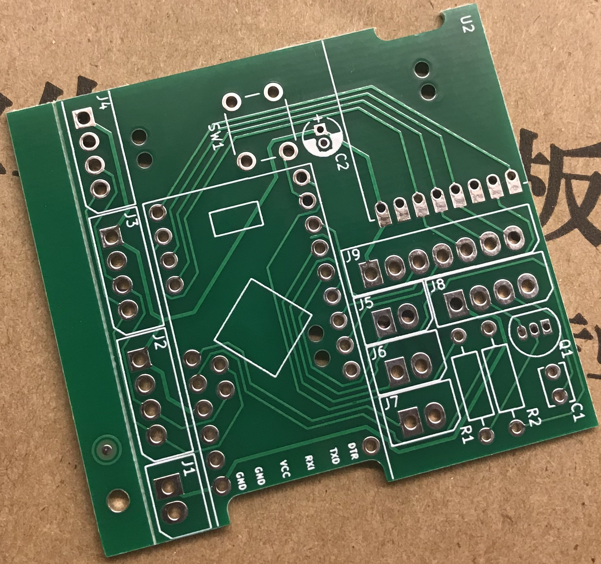

[Startseite](https://github.com/jp112sdl/AskSinPPCollection/blob/master/README.md)
## Hardware / Platinen

- Platine(n) von [pa-pa](https://github.com/pa-pa) 
  - [HMSensor-Platine](https://github.com/pa-pa/HMSensor)

- Platine(n) von [Alex](https://github.com/alexreinert)
  - [HB-UNI-644 (Rev. 2)](https://github.com/alexreinert/PCB#hb-uni-644-rev-2) 
  - [HB-UNI-SEN-BATT](https://github.com/alexreinert/PCB#hb-uni-sen-batt) 
  - [HB-UNI-SEN-PCB](https://github.com/alexreinert/PCB#hb-uni-sen-pcb) 
  - [HB-UNI-SEN-WEA](https://github.com/alexreinert/PCB#hb-uni-sen-wea) (Platine für die [Wetterstation](https://github.com/jp112sdl/HB-UNI-Sen-WEA/tree/master))

- Platine(n) von [Tom](https://github.com/TomMajor)
  - [PLHT Sensor](https://github.com/TomMajor/AskSinPP_Examples/tree/master/PCB/Sensor_PLHT) (Druck-, Helligkeit-, Feuchte-, Temperatursensor)

- Platine(n) von [Marco](https://github.com/stan23)
  - [Gosund SP1](https://github.com/stan23/HM-ES-PMSw1-Pl_GosundSP1) Controllerplatine zum Umbau auf HM-ES-PMSw1-Pl
  - [HM-LC-Bl1-FM](https://github.com/stan23/HM-LC-Bl1-FM-DC) Rollladenaktor für Gleichstrommotoren
  - [OBI WiFi Zwischenstecker](https://github.com/stan23/HM-LC-Sw1-Pl-DN-R1_OBI) Controllerplatine zum Umbau auf HM-LC-Sw1-Pl-DN-R1
  
- Platine(n) von [Ronny](https://github.com/ronnythomas) _(Nicht OpenSource! Bei Bedarf, bitte den Urheber bei [Facebook](https://www.facebook.com/ronny.thomas.83) direkt anschreiben)_
  - [HB-Micro](https://github.com/ronnythomas/HB-Micro)
  - [HB-Mini](https://github.com/ronnythomas/HB-Mini)
  - [HM-MOD-Re-8](https://github.com/ronnythomas/HM-MOD-Re-8)
  - [HB-UNI](https://github.com/ronnythomas/HB-UNI)
  - [HB-UNI-Bat](https://github.com/ronnythomas/HB-UNI-Bat)
  - [HB-UNI-230V](https://github.com/ronnythomas/HB-UNI-230V)
  - [HB-UNI-SenAct-4-4](https://github.com/ronnythomas/HB-UNI-SenAct-4-4)
  - [HM-LC-Sw1-PCB-12V](https://github.com/ronnythomas/HM-LC-Sw1-PCB-12V)
  - [HM-LC-Sw1-PCB-230V](https://github.com/ronnythomas/HM-LC-Sw1-PCB-230V)
  - [HM-LC-Sw1-PCB-230V-TR](https://github.com/ronnythomas/HM-LC-Sw1-PCB-230V-TR)
  - [HM-LC-Sw2-230V](https://github.com/ronnythomas/HM-LC-Sw2-230V)
  - [HM-LC-Sw2-12V](https://github.com/ronnythomas/HM-LC-Sw2-12V)
  - [HM-LC-Dim1PWM-12-24V](https://github.com/ronnythomas/HM-LC-Dim1PWM-12-24V)

- Platine(n) von "Gelegenheitsbastler" aus dem HM-Forum _(Nicht OpenSource! Bei Bedarf, bitte den Urheber im [HomeMatic-Forum](https://homematic-forum.de/forum/ucp.php?i=pm&mode=compose&u=20394) direkt anschreiben)_
  - [Nachbau HM-Geräte mit AVR und AskSinPP - Platine 1](https://homematic-forum.de/forum/viewtopic.php?f=76&t=43162)
  - [Nachbau HM-Geräte mit AVR und AskSinPP - Platine 2](https://homematic-forum.de/forum/viewtopic.php?f=76&t=43243)
  - [Nachbau HM-Geräte mit AVR und AskSinPP - Platine 3](https://homematic-forum.de/forum/viewtopic.php?f=76&t=43247)
  - [Nachbau HM-Geräte mit AVR und AskSinPP - Platine 4](https://homematic-forum.de/forum/viewtopic.php?f=76&t=43274)
  - [Umbau Sonoff 4CH zu HM-LC-SW4-SM](https://homematic-forum.de/forum/viewtopic.php?f=76&t=43718)
  - [Umbau Sonoff S20 auf HM-LC-Sw1-Pl-DN-R1](https://homematic-forum.de/forum/viewtopic.php?f=76&t=44258)
