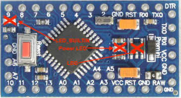

[Startseite](https://github.com/jp112sdl/AskSinPPCollection/blob/master/README.md)
## Informationen und Hinweise zum Arduino Pro Mini / ATMega328P

Der bei den AskSinPP Projekten am häufigsten eingesetzte und verwendete Mikrocontroller ist der [ATMega328P](http://ww1.microchip.com/downloads/en/DeviceDoc/ATmega48A-PA-88A-PA-168A-PA-328-P-DS-DS40002061A.pdf). 
Man bekommt ihn auf einer kleinen Platine aus Fernost als [Arduino Pro Mini](https://de.aliexpress.com/item/Free-Shipping-1pcs-pro-mini-atmega328-Pro-Mini-328-Mini-ATMEGA328-3-3V-8MHz-for-Arduino/32340942669.html) für sehr wenig Geld. 
Er wird in verschiedenen Varianten angeboten - wobei beim Kauf darauf geachtet werden sollte, **unbedingt** die Version **"3.3V / 8MHz"** zu verwenden, denn:
  - je geringer die Taktrate, desto zuverlässigerer ist der Betrieb bei sinkender Spannung (wichtig bei Batteriebetrieb!)
  - automatische Erzeugung der 3.3V Spannung für das CC1101 Funkmodul (z.B. bei 5V Netzteilbetrieb mit Speisung am RAW-Pin) durch eingebauten Spannungregler
  
  
### Besonderheiten des Arduino Pro Mini

Im Laufe der Zeit bin ich auf 2 "Stolperfallen" beim Pro Mini gestoßen. 
- :one: :warning: hoher Stromverbrauch bei Batteriebetrieb :battery: durch ungenutzte Bauteile  
    Da bei Batteriebetrieb mit 2 x 1,5V der Spannungsregler _(LDO)_ nicht benötigt wird und auch die Power LED sowie die LED_BUILTIN nur unnötig Strom verbrauchen, können diese Bauteile (:x:) ganz unproblematisch entfernt werden. 
  

- :two: :warning: Abschaltung oder Dauersender/-störer trotz fast voller Batterien :battery:  
  Um die garantierten Spezifikationen des ATMega328P einzuhalten, ist ab Werk die so genannte [Brown-Out-Detection (BOD)](https://www.mikrocontroller.net/articles/Brownout) bei **2.7V** aktiviert. Sinkt die Eingangsspannung unter diesen Wert, fällt der µC in einen RESET-Zustand. Das _kann_ ungewollte Nebenfolgen haben (siehe ["Babbling Idiot"](https://github.com/TomMajor/AskSinPP_Examples/tree/master/Info/Babbling%20Idiot%20Protection))! 
  Bei der BOD handelt es sich um ein sogenanntes ["Fuse-Bit"](https://de.wikipedia.org/wiki/Fuse-Bit). 
  Fuse-Bits können nur mithilfe eines ISP (In-System-Programmer) (z.B. [USBasp](https://www.ebay.de/i/232496093834) oder [Diamex Programmer](https://www.diamex.de/dxshop/USB-ISP-Programmer-fuer-Atmel-AVR-Rev2)) verändert werden. Es lässt sich auch ein [Arduino UNO als ISP](https://www.arduino.cc/en/Tutorial/ArduinoISP) verwenden! 
  Der ISP ist 1:1 mit 6 Leitungen an den Pro Mini zu verbinden:
  
  | Pro Mini | ISP |
  |----|----|
  | VCC | VCC |
  | GND  | GND |
  | RESET | RESET |
  | 11 | MOSI |
  | 12 | MISO |
  | 13 | SCK |

  Das Setzen der Fuse-Bits mittels USBasp erfolgt dann in der Eingabeaufforderung/Kommandozeile mit: 
  `avrdude -v -pm328p -cusbasp -Ulfuse:w:0xFF:m -Uhfuse:w:0xD2:m -Uefuse:w:0xFF:m` 
  _(USBasp benötigt einen [speziellen USB-Treiber "libusb"](http://zadig.akeo.ie)!)_ 
  Bei Verwendung eines Diamex oder Arduino UNO as ISP sieht der Aufruf so aus _(com11 ggf. ändern!)_: 
  `avrdude -v -pm328p -P com11 -c stk500v1 -b 19200 -Ulfuse:w:0xFF:m -Uhfuse:w:0xD2:m -Uefuse:w:0xFF:m`  
  Das Tool `avrdude` befindet sich bei installierter **Arduino IDE** und Boardunterstützung **Arduino AVR Boards** 
  - in Windows:
    - `C:\Users\<Benutzer>\AppData\Local\Arduino15\packages\arduino\tools\avrdude\6.3.0-arduino14\bin\avrdude`
  - auf dem Mac:
    - `~/Library/Arduino15/packages/arduino/tools/avrdude/6.3.0-arduino14/bin`
  - bei Linux:
    - `~/.arduino15/packages/arduino/tools/avrdude/6.3.0-arduino14/bin/avrdude`
  
  _(Der Ordner `6.3.0-arduino14` kann je nach Version abweichen.)_
