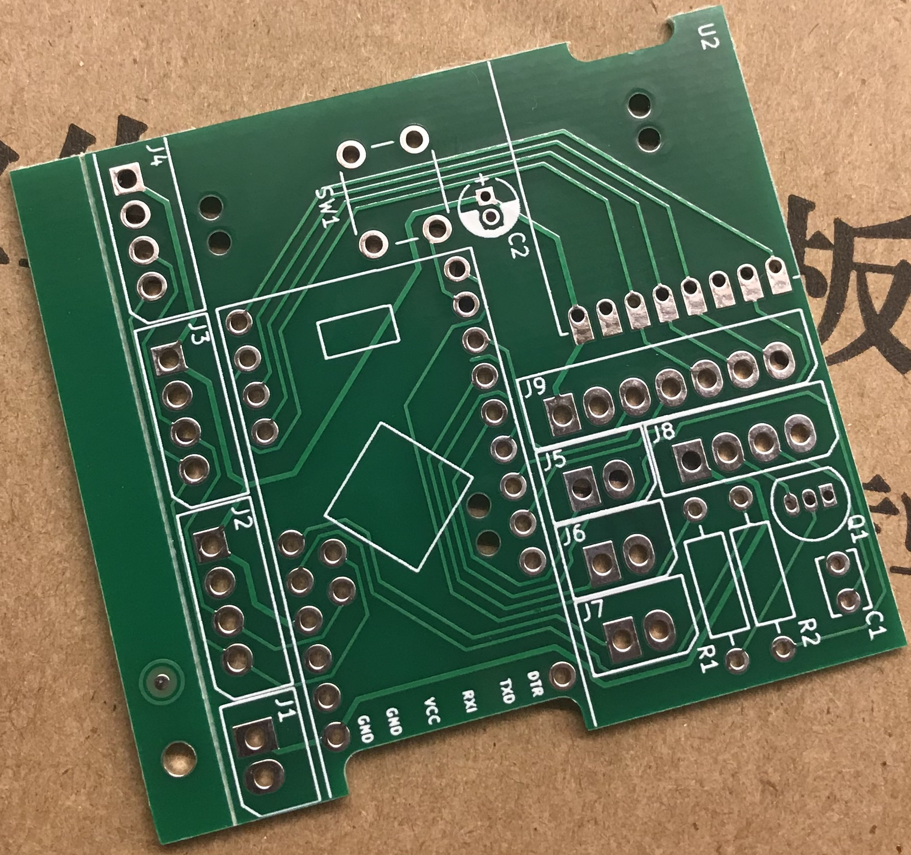

# Platinen

Mittlerweile gibt es von vielen fleißigen Leuten Platinen (<abbr title="Printed Circuit Board">PCB</abbr>) für die Umsetzung der verschiedensten Projekten. Hier eine (sicherlich unvollständige) Liste von verfügbaren PCBs nach Autor. 

::: tip
Hat man Bedarf an einer Platine finden sich im Forum oft Maker, welche Restbestände nahezu zum Selbstkostenpreis abgeben.
Am besten man fragt in den jeweiligen Projekt-Threads nach. Die Autoren haben auch oft noch welche vorrätig.

Da die meisten PCBs OpenSource sind können sie auch bei PCB-Herstellern [in Fertigung gegeben](#pcbs-fertigen-lassen) werden.
:::

_Wer noch weitere Platinen kennt oder selbst erstellt hat möge [diese Seite vervollständigen](https://github.com/AskSinPP/asksinpp.de/edit/master/Platinen/README.md)!_

## PCB-Autoren

### [pa-pa](https://github.com/pa-pa)
  - [HMSensor-Platine](https://github.com/pa-pa/HMSensor)
  - [STM32Dimmer](https://github.com/pa-pa/STM32Dimmer) 5-Kanal PWM LED Dimmer mit STM32

### [Alex](https://github.com/alexreinert)
  - [HB-UNI-644 (Rev. 2)](https://github.com/alexreinert/PCB#hb-uni-644-rev-2) 
  - [HB-UNI-SEN-BATT](https://github.com/alexreinert/PCB#hb-uni-sen-batt)
  - [HB-UNI-SEN-PCB](https://github.com/alexreinert/PCB#hb-uni-sen-pcb) 
  - [HB-UNI-SEN-WEA](https://github.com/alexreinert/PCB#hb-uni-sen-wea) (Platine für die [Wetterstation](https://github.com/jp112sdl/HB-UNI-Sen-WEA/tree/master))

### [Tom](https://github.com/TomMajor)
  - [HB-UNI-Sensor1](https://github.com/TomMajor/SmartHome/tree/master/HB-UNI-Sensor1#platine): Druck-, Helligkeit-, Feuchte-, Temperatursensor
  - [HB-SEN-LJet](https://github.com/TomMajor/SmartHome/tree/master/HB-SEN-LJet#platine): Kopplung der Projet LevelJET Ultraschall-Füllstandsanzeige mit HomeMatic
  - [HB-UNI-Sensor-Heizung](https://github.com/TomMajor/SmartHome/tree/master/HB-UNI-Sensor-Heizung#platine): Schwellwertschalter, der bei Unter- und Überschreitung eines bestimmten Sensorwertes möglichst zeitnah ein Telegramm an die Zentrale sendet
  - [HB-CC1101-Testbench](https://github.com/TomMajor/SmartHome/tree/master/HB-CC1101-Testbench#platine): Testbench für CC1101 Frequenztests
  - [tmStamp](https://github.com/TomMajor/SmartHome/tree/master/PCB/tmStamp): kleine AskSinPP Universalplatine basierend auf Arduino Pro Mini

### [Marco](https://github.com/stan23)
  - [Gosund SP1](https://github.com/stan23/HM-ES-PMSw1-Pl_GosundSP1) Controllerplatine zum Umbau auf HM-ES-PMSw1-Pl
  - [HM-LC-Bl1-FM](https://github.com/stan23/HM-LC-Bl1-FM-DC) Rollladenaktor für Gleichstrommotoren
  - [OBI WiFi Zwischenstecker](https://github.com/stan23/HM-LC-Sw1-Pl-DN-R1_OBI) Controllerplatine zum Umbau auf HM-LC-Sw1-Pl-DN-R1
  - [AskSinAnalyzer](https://github.com/stan23/myPCBs) PCB für den [AskSinAnalyzer](https://github.com/jp112sdl/AskSinAnalyzer)
  - [HB-UNI-Sen-CAP-MOIST-T](https://github.com/stan23/myPCBs/tree/master/HB-UNI-Sen-CAP-MOIST-T) Platine für [Jérômes Feuchtigkeitssensor](https://github.com/jp112sdl/HB-UNI-Sen-CAP-MOIST)
  - [HB-Dis-EP-42BW Platine](https://github.com/jp112sdl/HB-Dis-EP-42BW/tree/master/PCB) Platine für [Jérômes 4,2" ePaper Display](https://github.com/jp112sdl/HB-Dis-EP-42BW) 
  - [HB-MOD-UART Platine](https://github.com/stan23/myPCBs/tree/master/HB-MOD-UART) Platine für das HM-MOD-UART Funkmodul mit SMA-Anschluss für eine externe Antenne.
  - [HB-MOD-UART-USB Platine](https://github.com/stan23/myPCBs/tree/master/HB-MOD-UART-USB) Ein USB-Stick mit HM-MOD-UART Funkmodul und FT232R, basierend auf @alexreinert's HB-RF-USB.
  
### [Jérôme](https://github.com/jp112sdl)
  - [HB-RC-2-PBU-LED](https://github.com/jp112sdl/HB-RC-2-PBU-LED): 2 fach Wandtaster, ähnlich dem HmIP-BSL, mit RGB LED Beleuchtung (oben/unten)).
  - [328RFStamp](https://github.com/jp112sdl/328RFStamp): universelle Trägerplatine für ein CC1101 Funkmodul und einen ATmega328P in kleinstmöglicher Abmessung.

### [Ranseyer](https://github.com/ranseyer) 
Die Platinen haben neben dem CC1101 häufig noch Platz für andere Funkmodule wie RFM69 oder RFM95 (LoRa). Dennoch ist die Nutzung für HM möglich. 
  - [MySensors-HM-easy-Standard](https://github.com/ranseyer/MySensors-HW/tree/master/MySensors-HM-easy-PCB-RFM-CC1101-RS485-NRF/1_Standard)
  - [STM32 Bluepill / MAPLE mit CC1101, RFM* und RS485](https://github.com/ranseyer/MySensors-HW/tree/master/Experimental/GW-STM32-RS485-RFM/Archiv)

### [pafra](https://github.com/pafra-123) 
  - [AskSin_Uni_PCB](https://github.com/pafra-123/AskSin_Uni_PCB): Kleine Universalplatine für Asksin-Projekte. Auf der Github-Seite sind ein paar Beispiele aufgeführt. 

### [Ronny](https://github.com/ronnythomas) 

::: warning Nicht OpenSource!
Bei Bedarf, bitte den Urheber bei [Facebook](https://www.facebook.com/ronny.thomas.83) direkt anschreiben.
:::

  - [HB-Micro](https://github.com/ronnythomas/HB-Micro)
  - [HB-Mini](https://github.com/ronnythomas/HB-Mini)
  - [HM-MOD-Re-8](https://github.com/ronnythomas/HM-MOD-Re-8)
  - [HB-UNI](https://github.com/ronnythomas/HB-UNI)
  - [HB-UNI-Bat](https://github.com/ronnythomas/HB-UNI-Bat)
  - [HB-UNI-230V](https://github.com/ronnythomas/HB-UNI-230V)
  - [HB-UNI-SenAct-4-4](https://github.com/ronnythomas/HB-UNI-SenAct-4-4)
  - [HB-UNI-SenAct-4-4-Hutschine](https://github.com/ronnythomas/HB-UNI-SenAct-4-4-Hutschine)
  - [HM-LC-Sw1-PCB-12V](https://github.com/ronnythomas/HM-LC-Sw1-PCB-12V)
  - [HM-LC-Sw1-PCB-230V](https://github.com/ronnythomas/HM-LC-Sw1-PCB-230V)
  - [HM-LC-Sw1-PCB-230V-TR](https://github.com/ronnythomas/HM-LC-Sw1-PCB-230V-TR)
  - [HM-LC-Sw2-230V](https://github.com/ronnythomas/HM-LC-Sw2-230V)
  - [HM-LC-Sw2-12V](https://github.com/ronnythomas/HM-LC-Sw2-12V)
  - [HM-LC-Dim1PWM-12-24V](https://github.com/ronnythomas/HM-LC-Dim1PWM-12-24V)
  - [Wandsender](https://github.com/ronnythomas/Wandsender)

### Gelegenheitsbastler

::: warning Nicht OpenSource!
Bei Bedarf, bitte den Urheber im [HomeMatic-Forum](https://homematic-forum.de/forum/ucp.php?i=pm&mode=compose&u=20394) direkt anschreiben.
:::

  - [Nachbau HM-Geräte mit AVR und AskSinPP - Platine 1](https://homematic-forum.de/forum/viewtopic.php?f=76&t=43162)
  - [Nachbau HM-Geräte mit AVR und AskSinPP - Platine 2](https://homematic-forum.de/forum/viewtopic.php?f=76&t=43243)
  - [Nachbau HM-Geräte mit AVR und AskSinPP - Platine 3](https://homematic-forum.de/forum/viewtopic.php?f=76&t=43247)
  - [Nachbau HM-Geräte mit AVR und AskSinPP - Platine 4](https://homematic-forum.de/forum/viewtopic.php?f=76&t=43274)
  - [Umbau Sonoff 4CH zu HM-LC-SW4-SM](https://homematic-forum.de/forum/viewtopic.php?f=76&t=43718)
  - [Umbau Sonoff S20 auf HM-LC-Sw1-Pl-DN-R1](https://homematic-forum.de/forum/viewtopic.php?f=76&t=44258)

## PCBs fertigen lassen

Hat man Bedarf an ein paar mehr Platinen kann man diese auch selbst in Auftrag geben.
Auf mikrocontroller.net sind einige [Hersteller gelistet](https://www.mikrocontroller.net/articles/Platinenhersteller).
Preissieger ist [JLCPCB](https://jlcpcb.com/) aus China.

Für die Herstellung benötigt der Fertiger die [Gerber](https://de.wikipedia.org/wiki/Gerber-Format)-Dateien.
Sie sind meistens direkt vom PCB-Designer mit-veröffentlicht. 
Am Beispiel der HMSensor finden sich diese Files im [Github Repo](https://de.wikipedia.org/wiki/Gerber-Format).
Beim Fertiger wird überlichweise ein ZIP-Archiv mit den Dateien hochgeladen.

[Google](https://www.google.com/search?q=jlcpcb+how+to+order) und 
[Youtube](https://www.youtube.com/results?search_query=JLCPCB)
bieten viele Hilfestellungen an.

::: tip
Oft sind größeren Platinen (JLCPCB 10x10cm) preislich ähnlich wie kleinere 
weshalb gerne PCB-Panels mit Sollbruchstellen erstellt werden. Beispielsweise
in [KiCad](https://hackaday.com/2019/03/12/panelizing-boards-in-kicad/) oder
mit den Panelizer aus den 
[GerberTools](https://github.com/ThisIsNotRocketScience/GerberTools/releases).
:::
