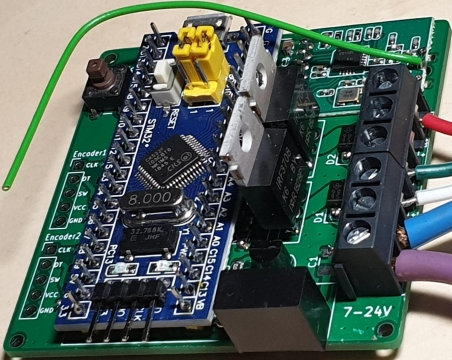

# HM-LC-DW-WM

2-Kanal PWM LED Dimmer für 7-24V mit Dreh-Encoder auf STM32 Basis.  
Der Aktor kann je nach Sketch im DualWhite, 1-Kanal oder 2-Kanal Modus betrieben werden. 
Die CCU stellt dann die jeweils passenden Schaltmöglichkeiten bereit.

Projekt Repository auf Github: 
[https://github.com/der-pw/hm_stm32_2ch_dimmer](https://github.com/der-pw/hm_stm32_2ch_dimmer)

:::tip
Es empfiehlt sich den USB-Bootloader auf den STM32 zu flashen bevor dieser verlötet wird.
:::

## Hardware

[Schaltplan](https://github.com/der-pw/hm_stm32_2ch_dimmer/blob/master/files/STM32_2CH_Dimmer.pdf), 
[Bauteilliste](https://github.com/der-pw/hm_stm32_2ch_dimmer/blob/master/STM32_2CH_Dimmer_Parts.csv) und 
[Platine](https://github.com/der-pw/hm_stm32_2ch_dimmer/tree/master/gerber) 
sind auf Github veröffentlicht.

## Software

### USB Bootloader flashen

Siehe [USB Bootloader flashen](/Grundlagen/STM32/01_flashen.html#usb-bootloader) 

### FreqTest flashen

Oft haben die CC1101 Funkmodule Frequenzabweichungen. Mit dem FreqTest Sketch kann man die 
für das Funkmodul beste Frequenz ermitteln und anschließend im Sketch hinterlegen. 

Siehe [STM32 FreqTest](/Grundlagen/STM32/10_weiteres.html#freqtest)

### Sketch

Der Dimmer kann in 3 Varianten Betrieben werden:

* **1 Kanal Modus: _HM-LC-Dim1PWM-CV_**  
  Der LED2 Anschluss bleibt unbestückt. In der CCU steht 1 Kanal zur Verfügung.  
  [HM-LC-Dim1PWM-CV.ino](https://github.com/pa-pa/AskSinPP/blob/master/examples/stm32/HM-LC-Dim1PWM-CV/HM-LC-Dim1PWM-CV.ino)
* **2 Kanal Modus: _HM-DW-WM_**  
  In der CCU können die beiden LED-Kanäle getrennt geregelt werden.  
  [HM-DW-WM.ino](https://github.com/pa-pa/AskSinPP/blob/master/examples/stm32/HM-DW-WM/HM-DW-WM.ino)
* **DualWhite Modus: _HM-LC-DW-WM_**  
  In wird CCU ein Kanal zur Einstellung der Helligkeit und ein weiterer zur Steuerung der Farbtemperatur dargestellt.  
  [HM-LC-DW-WM.ino](https://github.com/pa-pa/AskSinPP/blob/master/examples/stm32/HM-LC-DW-WM/HM-LC-DW-WM.ino)

Darstellung der CCU Kanäle im DualWhite Modus:

