# HM-RC-4

4-Tasten Fernbedienung

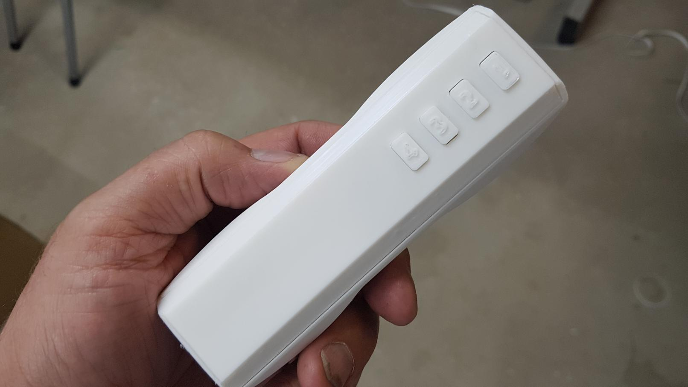

Achtung! Dies ist ein DIY Projekt! Dieses Gerät hat kein CE Zeichen und ist auch nicht getestet! Verwendung auf eigene Gefahr, der Designer übernimmt keine Haftung!

<iframe width="560" height="315" src="https://www.youtube.com/embed/ih9aKctOBqA" frameborder="0" allow="autoplay; encrypted-media" allowfullscreen></iframe>

## Material

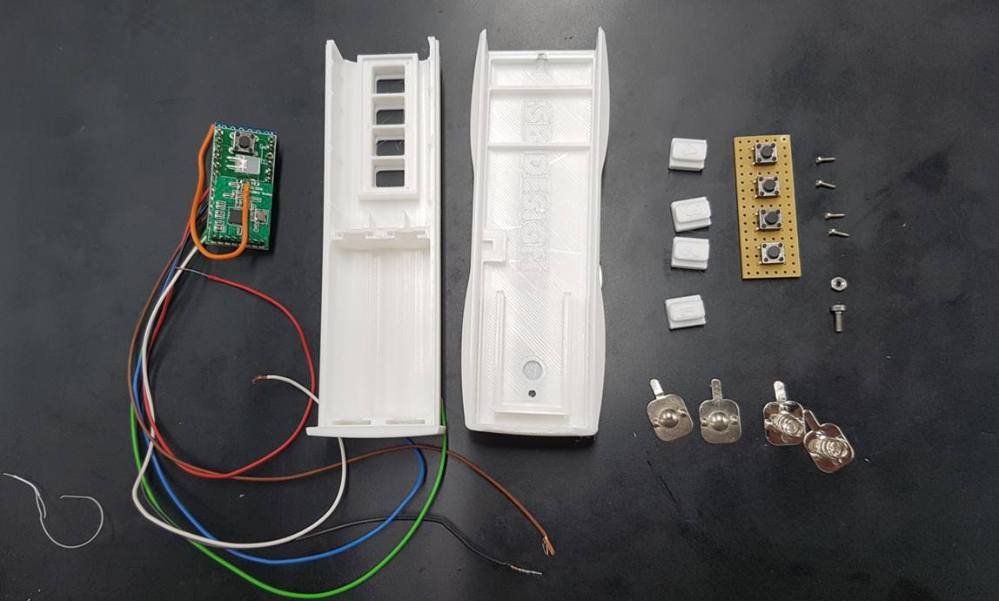

* 1 mal M2 Mutter
* 1 mal M2 Zylinderkopfschraube 2* 8 mm 
* 1 mal [Streifenlochraster Platine](https://www.ebay.de/itm/10x-Lochraster-Kupferplatine-verzinnt-2-54mm-Punkte/192927197041) 2,54 mm Rastermaß L/B = 43,2 * 15,7 mm 
* 4 mal [Sourcingmap® Metalle Batterie-Federplatte](https://www.amazon.de/gp/product/B00O9XV66Q) der AA-Batterien
* 4 [Microschrauben](https://www.ebay.de/itm/100x-Miniatur-Blechschrauben-Schraube-mini-Schrauben-Blechschraube-micro/362429856292) M1,2 *5 mm
* 1 mal [Platine Micro](https://github.com/ronnythomas/HB-Micro) von Ronny Thomas
* 1 mal [Arduino Pro Mini ATmega328P 3.3V/8MHz](https://de.aliexpress.com/item/32342672626.html)
* 1 mal [CC1101 Funkmodul 868 MHz](https://de.aliexpress.com/item/32852371777.html)
* 5 mal [Taster 6*6](https://www.ebay.de/itm/10X-MIKROSCHALTER-MICRO-TASTER-SCHALTER-MINI-SMD-MINIATUR-6X6X5MM-50MA/263833669383)
* 1 mal [LED Rechteckig 2x5x7mm](https://www.ebay.de/itm/LED-Rechteckig-Blau-Klar-2x5x7mm-1-10-25-50-Stuckzahl-wahlbar-2x5mm-C3649/292916276045) 
* 1 mal Widerstand 330 Ohm
* 1 mal [DC/DC Wandler BL8530](https://www.ebay.de/itm/10Pcs-BL8530-BL8531-0-8-3-3V-To-3-3V-DC-DC-Converter-Step-Up-Boost-Module/392313683179)
* [Stiftpolleiste RM 2.0](https://www.reichelt.de/10pol-stiftleiste-gerade-rm-2-00-sl-1x10g-2-00-p51693.html)
* Div. Litzendraht

## Software

Als Sketch kommt [HM-PBI-4-FM](https://github.com/jp112sdl/Beispiel_AskSinPP/blob/master/examples/HM-PBI-4-FM/HM-PBI-4-FM.ino) zum Einsatz.

Flashen nach der [allgemeinen Anleitung](/Grundlagen/).

## Gehäuse 3D Druck

Teile Ausdrucken, Vorlagen auf [Thingiverse](https://www.thingiverse.com/thing:3667980)

  - 1 mal No.1  Oberschale.lst / Support setzten!
  - 2 mal No. 2 Unterschale.lst
  - 1 mal Tasten 1-4.lst

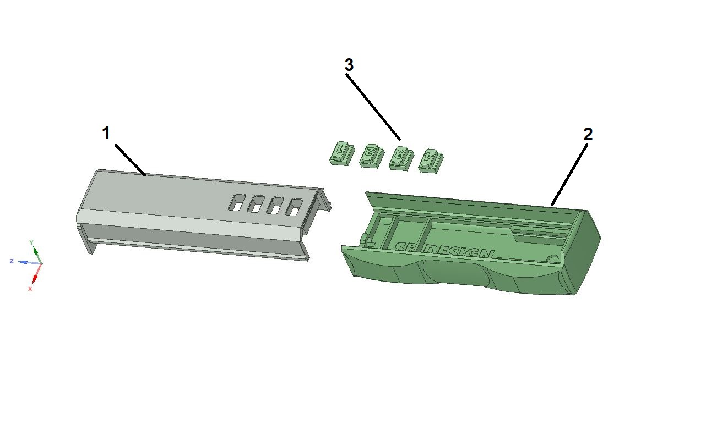

## Aufbau

1. Platine zusammen löten. Als Antenne kann man einfach einen „Klingeldraht“ benutzen (8,3 mm lang).  
   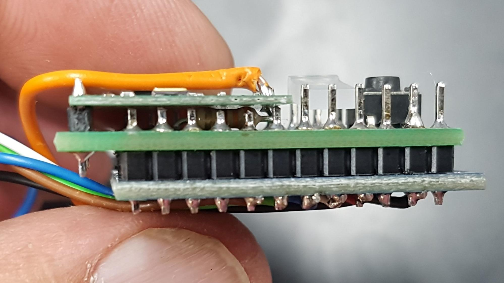

2. Wichtig! LED Rechteckig 2x5x7mm muss wie im Bild um 90 Grad umgebogen werden und so abgelötet werden.  
   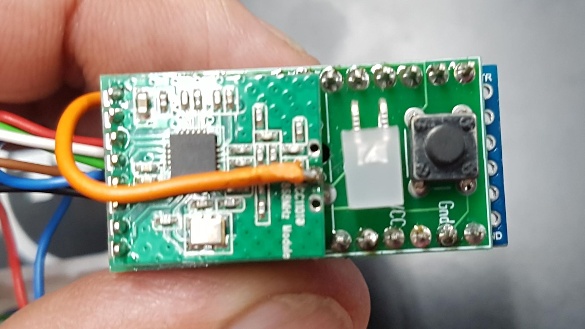

3. 6 Litzen (ca. 10 cm lang) am Arduino anlöten, Siehe Bezeichnung auf Platine.   
   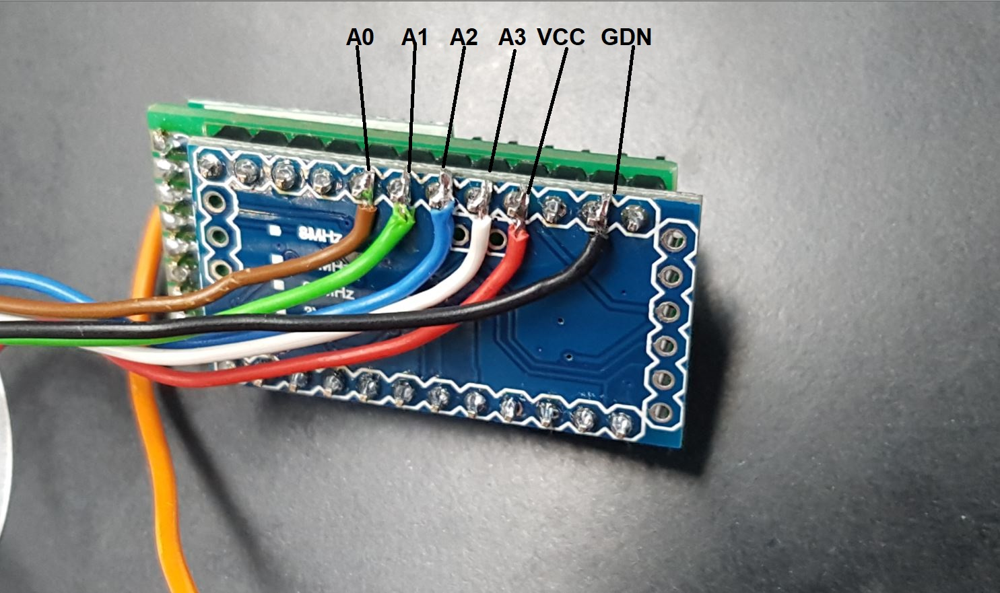

4. Lochraster Platine
  *  Lochraster hat die exakten Masse 42,2 * 15,7 mm, zur Orientierung die „Kupferfelder“ zählen und auf dieses Maß zu sägen
  * 4 Löcher mit 1,5 mm Bohrer wie im Bild aufbohren
  * Mircotaster wie abgebildet auf Lochraster positionieren und verlöten  
  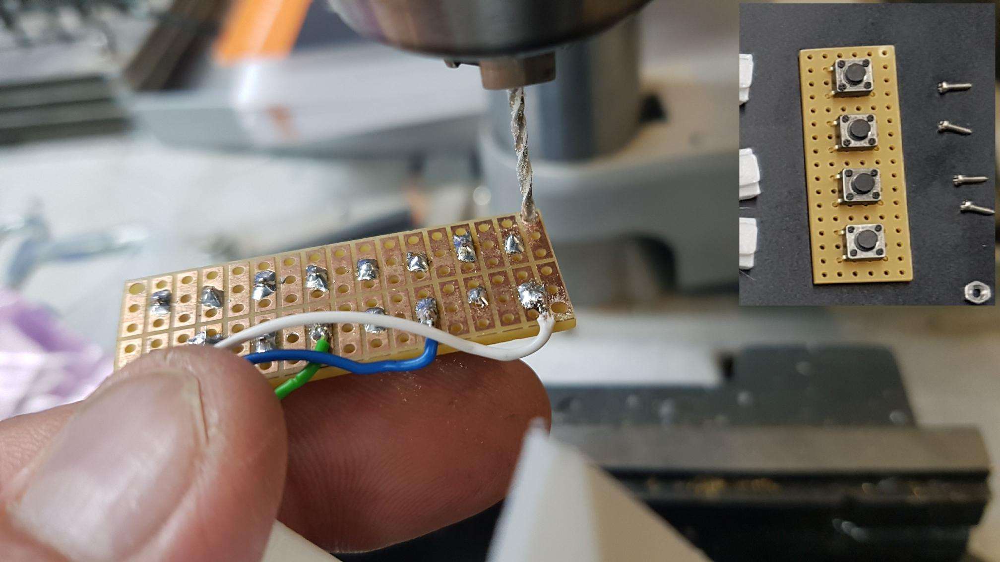
  
5. Tasten in die Oberschale einlegen, Lochraster mit Micotaster einbauen und festziehen  
  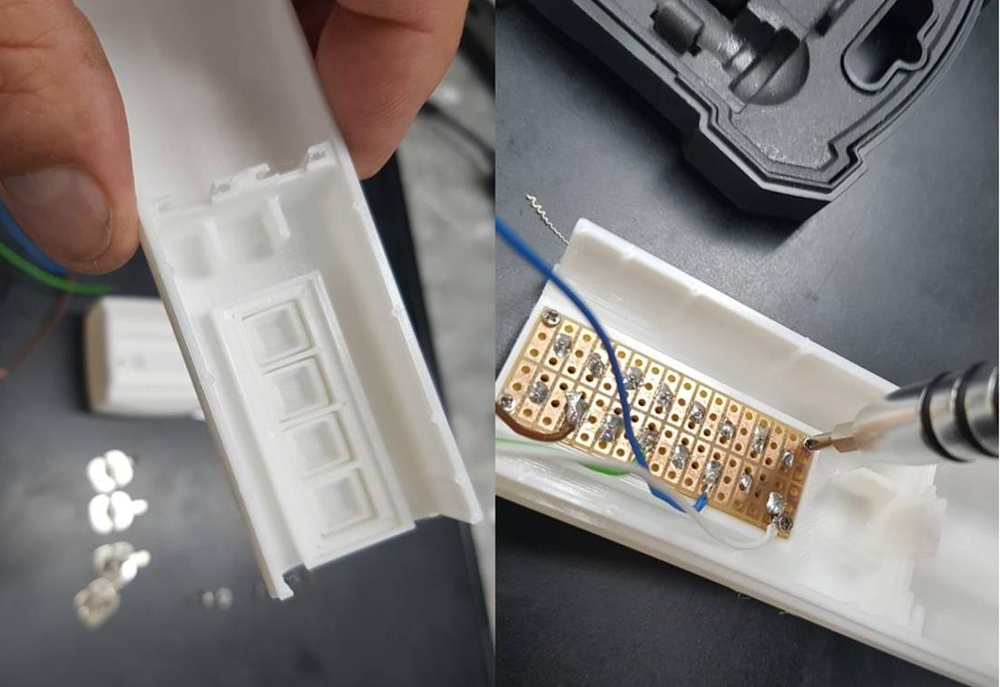
  
6. BL8580 DC/DC Step-Up und Batterie-Federplatte wie im Bild einsetzten und Litzendrähe anlöten.  
  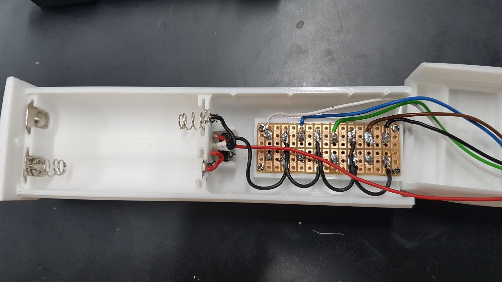

7. Arduino in die Oberschale einschieben. Antenne seitlich um den Pro Mini legen.  
  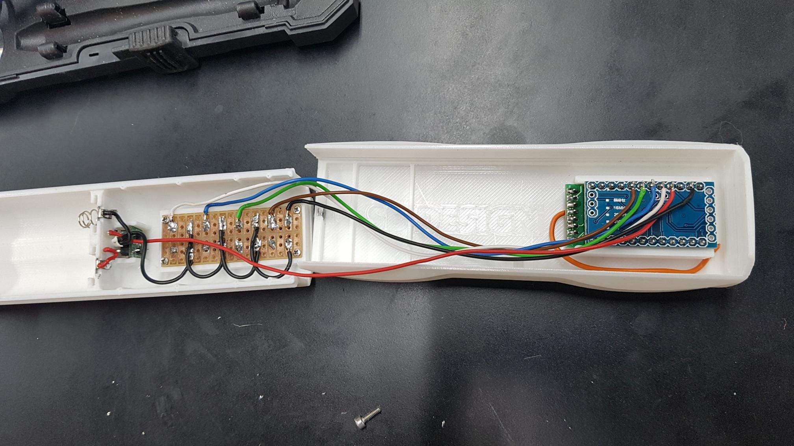

8. M2 Mutter in die Unterschale einkleben  
  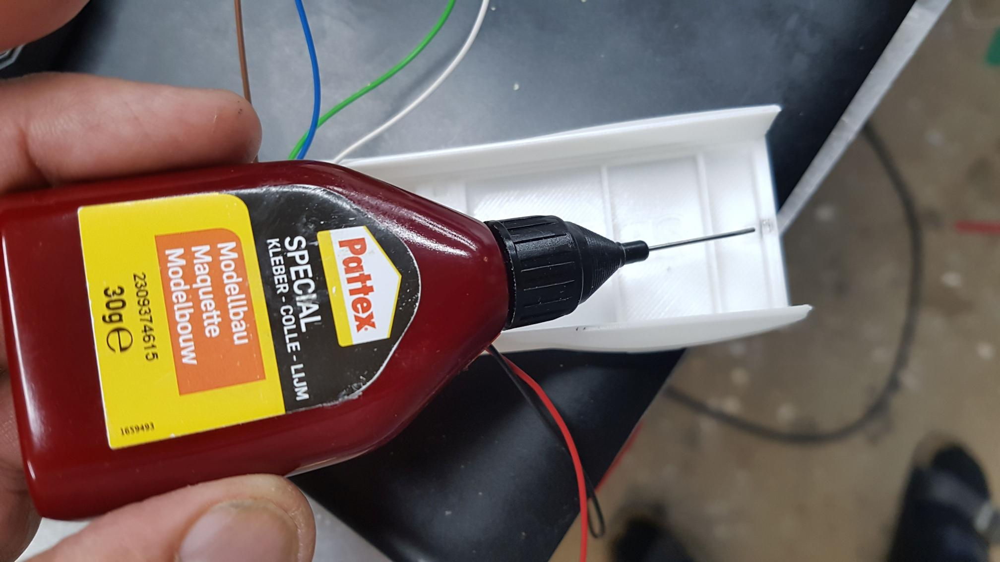
  
9. Arduino mit Isoband abkleben, das ist nötig da die Litzendrähte sich leicht an den Lötpins verhacken  
  

10. Ober- und Unterschale vorsichtig zusammen setzen und mit M2 Schraube sichern  
  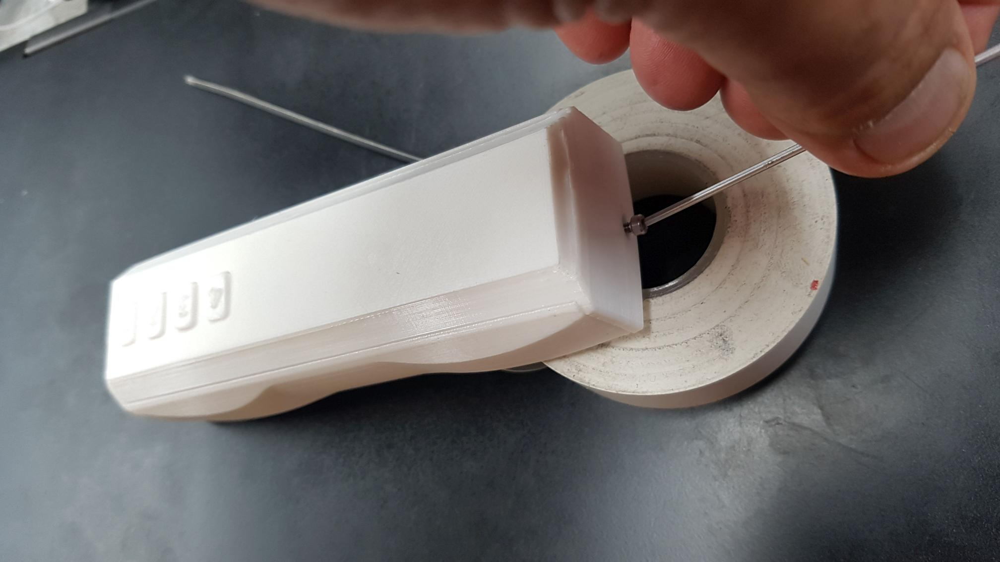

## Autor, Danksagung

Autor: [Jan Oerter](https://www.facebook.com/jan.oerter)

Vielen Dank an Jerome Pecht, Papa aus dem Homematicforum, Christoph Wichert und Ronny Thomas.  
Ohne Euch würde es keine Homematic Selbstbauprojekte geben.

