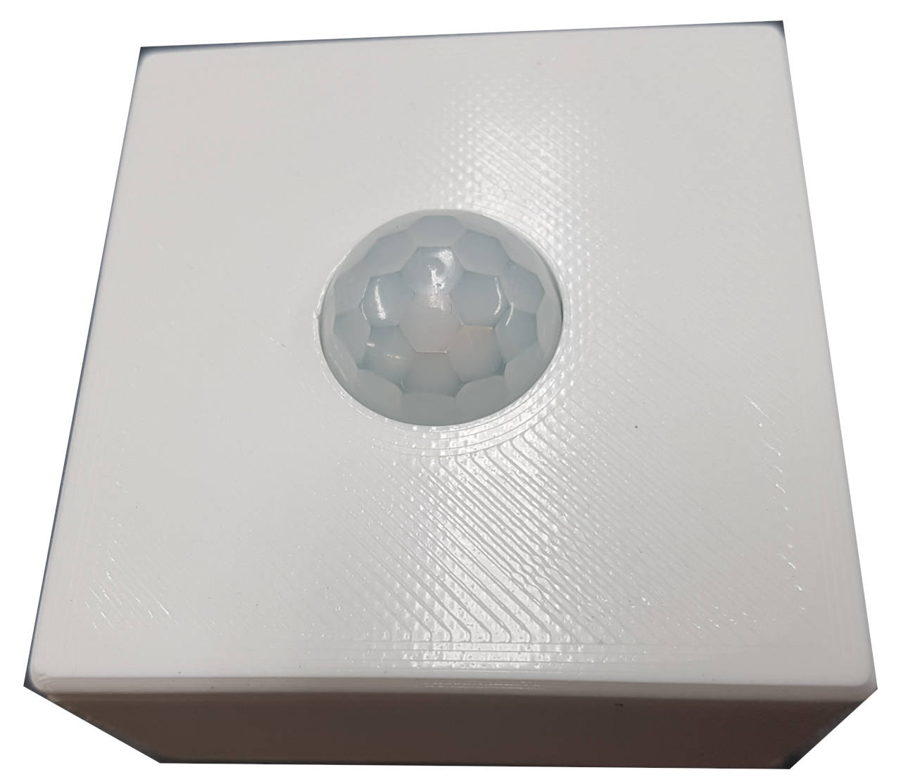
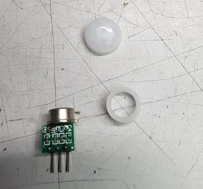
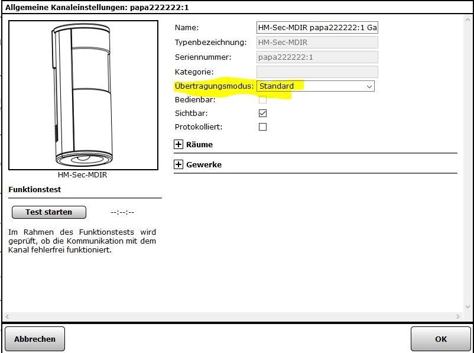

# HM-SEC-MDIR

Nachbau eines HM-Sec-MDIR Bewegungsmelder mit AM312 PIR und der Platine HB-UNI-Bat von Ronny.

Da der PIR nur mit 3 Leitungen verdrahtet wird eignen sich auch andere 
[Platinen](/Platinen/) für einen Aufbau.  
Alternativ können auch die Sensoren HC-SR501 und HC-SR505 verwendet werden allerdings sind hier weitere
Schritte nötig um die Betriebsspannung mit 3.3V zu ermöglichen und ggf. ein 220nF Kondensator um false-positives zu vermeiden.

* [Forum Thread](https://homematic-forum.de/forum/viewtopic.php?f=76&t=44118&p=458066&hilit=HM+SEC+MDIR)
* [Alternative](https://www.thingiverse.com/thing:3295975) mit UNI Platine von Ronny und HC-SR501 für Netzbetrieb

## Hardware

* Arduino Pro Mini 8Mhz 3.3V
* CC1101 Funkmodul
* Taster 6x6
* LED 5mm
* 100-330 Ohm Widerstand, je nach LED
* AM312
* 2x Batteriehalter AA
* 1 Gehäuse aus dem 3D Drucker, es gibt einen Deckel für HC-SR501 und einen für AM312 sowie 2 Wand Adapter und das Grundgehäuse  
* 2x M4 Schrauben und 2x M4 Muttern
* 0.6mm Klingeldraht oder Stiftleiste mit RM 2.0

## Platine

* [HB-UNI-Bat](https://github.com/ronnythomas/HB-UNI-Bat) von Ronny

## Schaltplan

## Aufbau

* Damit es bei abfallender Batteriespannung zu keinem Dauersender kommt wird die BOD über die Fuse-Bits des Arduino deaktiviert, siehe [Babbling Idiot](/Grundlagen/FAQ/babbling_idiot.html). Am besten setzt man die Fuses direkt nach dem einlöten der Stiftleiste da man diese zum Anschluss des IPS über Jumperwires nutzen kann.
* Die LEDs und den LDO des Arduino entfernen, siehe [Batteriebetrieb](/Grundlagen/01_hardware.html#batteriebetrieb)
* Auf der Platine zuerst die Widerstände und die LED sowie Taster einlöten, erst dann den Arduino einlöten.
* Bei Funkmodul passen keine normalen Platinen Pins mit 2,56mm, deshalb nehme ich einzelne CU Drähte 0,6 mm. Diesen Draht bekommt man im jedem Baumarkt einfach in der Elektroabteilung nach „Klingeldraht“ fragen. Alternativ nutzt kan eine Stiftleiste mit Rastermaß von 2.0mm.
* Generell sind alle Lötstellen auf „kalte Lötstellen“ zu prüfen, am besten geht das mit einer Lupe oder ein USB Mikroskop.

* Für die Antenne kann ebenfalls der 0.6 mm Klingeldraht verwendet werden. Die Länge des Drahtes für die Antenne sollte 8,3mm sein. Der Antennendraht kann durch ein Loch in der Platine auf die Rückseite der Platine „versteckt“ werden.
* Wichtig ist, dass die Platine + Batteriehalter nicht breiter als 64 mm ist da sie sonst nicht in das Gehäuse passen.

* Der AM 312 hat `VCC`, `GND` und `OUT` wobei `OUT` mit PIN `A0` auf der Platine verbunden wird.

## Gehäuse

Link zum STL Dateien auf [Thingiverse](https://www.thingiverse.com/thing:3227731)

Wird ein Wanderadapter verwendet muss zuerst die M4 Mutter auf der Rückseite eingepresst werden. Dann wird der Wandadapter an die Position an der Wand/Ecke angebracht.

Der AM312 Sensor kann für die Montage in den Deckel zerlegt werden und dann von Deckelinnenseite mit Heißkleber fixiert werden

Montage der Platine im Gehäuse. Bei Verwendung der Wandadapter muss das Gehäuse mit den zwei M4 Senkschrauben an den Adapter geschraubt werden, alternativ geht hier auch kleben. Das Gehäuse hat auf der linken Seite eine Verdeckte Kante in die wird die Platine schräg herein geschoben (Schwarzer Pfeil) und dann auf der rechten Seite nach unten gedrückt (Roter Pfeil).

## Sketch

Als Sketch kommt [HM-SEC-MDIR.ino](https://github.com/pa-pa/AskSinPP/blob/master/examples/HM-SEC-MDIR/HM-SEC-MDIR.ino) von pa-pa zum Einsatz. Wie immer dran denken die Serial und ID zu ändern.

## Anlernen an der CCU

Der Sensor wird über einen kurzen Tastendruck in den Anlernmodus gebracht.

::: warning
Wenn der Sensor angelernt ist, muss in der CCU der Übertragungsmodus auf **„Standard“** gesetzt werden. Sonst wird keine Bewegung erkannt. Siehe [Anlernen an die CCU](/Grundlagen/03_ccu.html#anlernen-an-die-ccu)
:::

> Solltest du Anmerkungen oder Probleme mit dem Nachbau haben, lasst es [uns](mailto:asppc@psi.cx) bitte wissen damit dieses Projekt verbessert werden kann.
