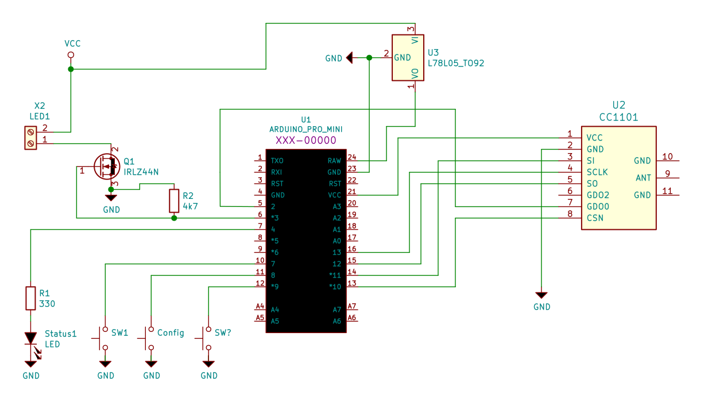

# HM-LC-Dim1PWM

1-Kanal PWM LED Dimmer für 7-24V

## Schaltplan

Zur Sicherheit kann noch ein Gate-Widerstand von ca 100Ω eingefügt werden.

## Hardware

### Bauteile

* Arduino Pro Mini ATmega328P (3.3V/8MHz)
* CC1101 Funkmodul (868 MHz)
* Festspannungsregler L78L05ACZ
* Taster 6x6
* Led 5mm
* Widerstände 1/4W 100Ω, 300Ω, 4,7kΩ
* MOSFET [IRLZ44N](http://www.irf.com/product-info/datasheets/data/irlz44n.pdf) (oder ggf. besser [IRF3708](http://www.irf.com/product-info/datasheets/data/irf3708.pdf), siehe [Forum-Beitrag](https://homematic-forum.de/forum/viewtopic.php?f=19&t=46999#p472462))
* AKL 057-03 Anschlussklemme, 3-pol, alternativ 1x WAGO 250-503 (Federklemmen sind zu bevorzugen)
* 2x AKL 057-02 Anschlussklemme, 2-pol, alternativ 1x WAGO 250-504

### Platine

Der Dim1PWM lässt sich ganz gut auf einer Streifenraster-Platine aufbaun.  
Eleganter geht is mit der Platine von Ronny.

Wer Bedarf an einer Platine hat kann [Ronny über Facebook kontaktieren](https://www.facebook.com/ronny.thomas.83)

Die Version 1.4 der Platine hat noch einen Fehler. Die Leiterbahn, markiert durch den roten Kreis, muss unterbrochen werden. 

### Aufbau

Mit einer dritten Hand und einer selbstklemmenden Pinzette ist der Dim1PWM im Handumrehene verlötet.  
Man fängt mit den niedrigen Bauteilen an. Die Widerstände werden unter dem Arduino platziert. Die Anode der Status-LED ist durch
den geraden Strich symbolisiert und zeigt Richtung _Gnd_.  

Ursprünglich wurden zwei Kondensatoren zur Entstörung und Glättung der Spannung vorgesehen. Diese blieben bislang
unbestückt da sich keine Probleme ergaben.

Nachdem alle Bauteile verlötet sind, muss bei Version 1.4 der Platine noch GND _repariert_ werden wozu
zwei Drahtbrücken auf der Unterseite gesetzt werden:
 

### Gehäuse

// TBD

## Software

Als Sketch kommt [HM-LC-Dim1PWM-CV](https://github.com/pa-pa/AskSinPP/blob/master/examples/HM-LC-Dim1PWM-CV/HM-LC-Dim1PWM-CV.ino)
aus dem Repository von pa-pa zum Einsatz. 

// TODO: `hal.activity.savePower<Idle<true> >(hal);` ???

::: warning
Stand 16.12.2018: Es musst zwingend der [Master-Branch](https://github.com/pa-pa/AskSinPP/archive/master.zip)
von AskSinPP verwendet werden da in V3 der
[Fehler in der pwmtable](https://github.com/pa-pa/AskSinPP/issues/80) noch nicht behoben ist was dazu führt,
dass die LEDs auch bei 0% noch sichtbar glimmen.
:::

Aus [Zeile 51](https://github.com/pa-pa/AskSinPP/blob/master/examples/HM-LC-Dim1PWM-CV/HM-LC-Dim1PWM-CV.ino#L51)
lässt sich die ablesen, dass der Aktor über 3 Kanäle verfügt wovon 2
[virtuelle Kanäle](https://www.elv.de/elektronikwissen/virtuelle-homematic-aktorkanaele-und-ihre-verknuepfungslogik.html) sind.
Will man nur einen Kanal, kann `typedef DimmerDevice<HalType,ChannelType,1,1,PWM8<> > DimmerType;` verwendet werden.

PS: Man denke daran die `Device ID` und `Device Serial` zu verändern da diese nur einmal pro Homematic Installation vorkommen dürfen.

## Betrieb

Da im Sketch ein `ConfigToggleButton` definiert ist wird durch:

* kurzen Tastedruck der Zustand verändert: LED an / aus
* langen Tastendruck (~3s) der Anlernmodus gestartet
* ganz langen Tastendruck (~7s) ein RESET des Aktors ausgeüfhrt

Das Anlernen kann auch über die Serial durchgeführt werden.

