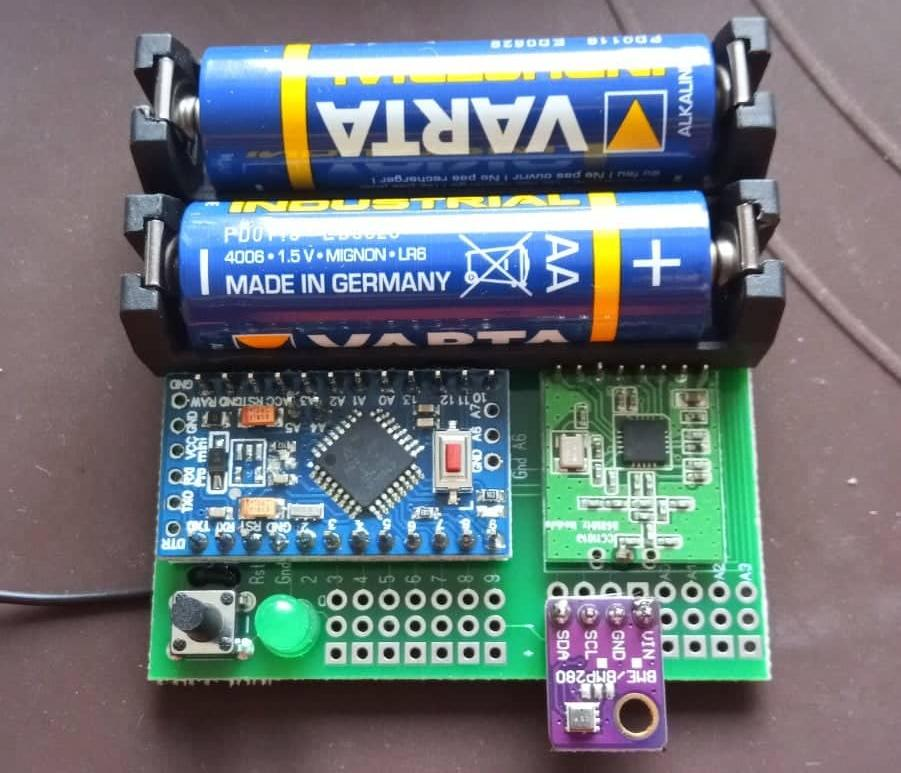
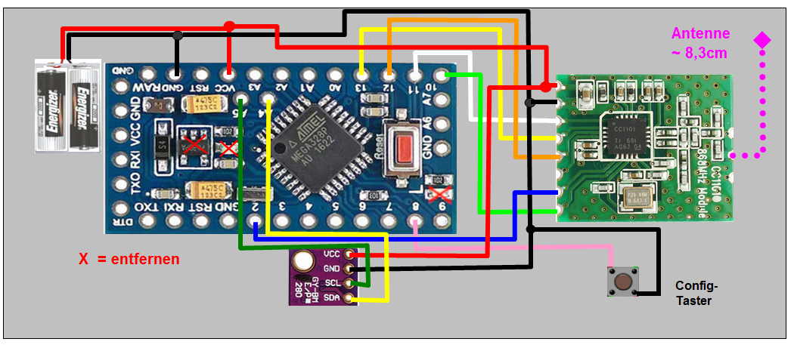

# HM-WDS40-TH-I-BME280

Temperatur-/Luftfeuchtesensor auf Basis des Bosch BME280.

Der BME280 unterstüzt eigentlich auch die Erfassung des Luftdrucks, allerdings müsste dafür ein DeviceAddon auf der CCU installiert werden
weshalb dies nicht Teil dieses Projekts ist. Der 
[HB-UNI-Sensor1](https://github.com/TomMajor/AskSinPP_Examples/tree/master/HB-UNI-Sensor1)
von Tom ist eine gutes Beispiel für einen universell einsetzbaren Sensor.

## Hardware

* Arduino Pro Mini 8Mhz 3.3V
* CC1101 Funkmodul
* Taster 6x6
* Led 5mm
* 100Ω Widerstand
* BME280 I2C Breakout Board (kein SPI)
* Batteriehalter

Es gibt BME280 Boards für 3.3V ohne LDO was etwas Arbeit spart.

### Platine

Je nach Zweck gibt es hier verschiedene Optionen:

* Keine :)
* [HB-UNI-SEN-BATT von Alex](https://github.com/alexreinert/PCB#hb-uni-sen-batt)
* [Sensor_PLHT von Tom](https://github.com/TomMajor/SmartHome/tree/master/PCB)
* [HB-UNI-Bat von Ronny](https://github.com/ronnythomas/HB-UNI-Bat)
* [HB-Micro von Ronny](https://github.com/ronnythomas/HB-Micro)

In diesem Beispiel wird die HB-UNI-Bat von Ronny verwendet.

### Babbling Idiot

Damit es bei abfallender Battriespannung zu keinem Dauersender kommt wird die BOD über die Fuse-Bits des Arduino deaktiviert,
siehe [Babbling Idiot](/Grundlagen/FAQ/babbling_idiot.html).
Am besten setzt man die Fuses direkt nach dem einlöten der Stiftleiste da man diese zum Anschluss des IPS über 
Jumperwires nutzen kann.

### Stromverbrauch optimieren

Der Ruhestrom kann drastisch gesenkt werden:

* LDO und LEDs vom Arduino entfernen, siehe [Batteriebetrieb](/Grundlagen/01_hardware.html#batteriebetrieb)
* LDO vom BME280 Board entfernen, siehe [Ruhestrom von Tom](https://github.com/TomMajor/AskSinPP_Examples/tree/master/Info/Ruhestrom). Dieser Punkt entfällt für die 3.3V Versionen des BME280 Boards.

  
Im Bild zu sehen: Der LDO ist entfernt und eine Lötbrücke ist am Level-Shifter gesetzt.

### Aufbau

Der Aufbau gestaltet sich simpel. Wie gewöhnlich wird der CC1101, die Status-LED und der Taster nach der [allgemein gültigen Verdrahtung](/Grundlagen/01_hardware.html#verdrahtung) angeschlossen bzw. anhand der gewählte Platine bestückt.

Die 4 Anschlüsse des BME280 Boards:
* `VIN`: 3V Betriebsspannung, kann von VCC PIN des Arduino genommen werden
* `GND`
* `SCL`: I2C Taktleitung, wird an PIN `A5` des Arduino angeschlossen
* `SDA`: I2C Datenleitung, wird an PIN `AA` des Arduino angeschlossen

Einige Platinen bieten entsprechende Lötpunkt an wodurch der BME280 direkt per Stiftleiste eingelötet werden kann. 

## Gehäuse

* [HM-WDS40-TH-I](https://www.thingiverse.com/thing:3184336) von Jan
* [HB-UNI-SENS-BATT-Case](https://www.thingiverse.com/thing:3028730) (Schiebedeckel) von Christoph S.
* [HB-UNI-SENS-BATT Platine](https://www.thingiverse.com/thing:3239446) (verschraubbarer Deckel) von Christoph S.

## Sketch

Als Sketch kommt [HM-WDS40-TH-I-BME280](https://github.com/jp112sdl/Beispiel_AskSinPP/blob/master/examples/HM-WDS40-TH-I-BME280/HM-WDS40-TH-I-BME280.ino)
von Jerome zum Einsatz. Wie immer dran denken die [Serial und ID zu ändern](/Grundlagen/02_software.html#sketch-anpassen-und-flashen).

Zusätzlich zu den üblichen Bibliotheken (AskSinPP, EnableInterrupt, Low-Power) benötigt man noch die 
[Lib für denBME280](https://github.com/finitespace/BME280). 
Allerdings hatte ich hier noch einen [Fehler beim kompilieren](https://github.com/finitespace/BME280/issues/17)
weshalb ich die `BME280Spi*.o` Dateien gelöscht habe.

## Betrieb

Im Sketch ist ein `ConfigButton` definiert weshalb der neue Aktor per kurzem Tastendruck in den Anlernmodus gebracht werden kann.

## Weiteres

* Der BME280 ist etwas träge, gib ihm ein paar (mehr) Minuten damit sich die Temperatur einpegelt.
* Das Projekt ist auch recht schön auf [technikkram.net](https://technikkram.net/2018/05/homematic-diy-projekt-thermometer-und-hydrometer-fertige-platine-im-eigenbau) beschrieben. Leider fehlt hier die Babbling Idiot Protection.
* Solltest du Anmerkungen oder Probleme mit dem Nachbau haben, lasst es [mich](mailto:asppc@psi.cx) bitte wissen damit dieses Projekt verbessert werden kann.
