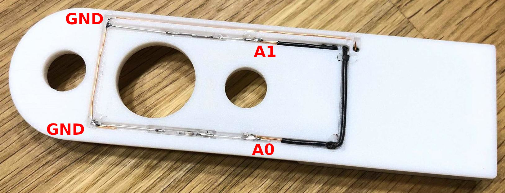

# HM-Sec-RHS

HB-Sec-RHS Funk-Fenster-Drehgriffkontakt auf Basis der HMSensor-CR2032.

Dieses Projekt ist in der FHEM-Community entstanden, siehe den original 
[FHEM-Wiki](https://wiki.fhem.de/wiki/HomeMatic_Fenster-Drehgriffkontakt_Community-Nachbau)
eintrag. Hier wird u.A. die Erstellung der OTA (Over The Air) Firmware behandelt
sofern man diese nutzen möchte. Hier wird der ProMini-Bootloader und das Flashen
über FTDI verwendet.

## Hardware

### Bauteile

* [HMSensor-CR2023](/Projekte/psi/HMSensor/#hmsensor-cr2032) ohne Quarz
* Reed-Kontakt 2x14mm [Aliexpress](https://de.aliexpress.com/item/10pcs-N-O-Reed-switch-Magnetic-Switch-2-14mm-Normally-Open-Magnetic-Induction-switch/32803902404.html)
* Neodym Magnet 4x2mm [Aliexpress](https://de.aliexpress.com/item/32946901529.html)

| Bezeichner | Anzahl | Teil            | Größe
|------------|--------|-----------------|-----------
|            | 2x     | Reed-Kontakt    | 2x14mm
|            | 1x     | Magnet          | 4x2mm
| IC1        | 1x     | ATMega328P-AU   | TQFP-32
| IC2        | 1x     | CC1101 SPI 868Mhz | 
| BT1        | 1x     | CR2023 Halter   | SMD Tab 20mm
| D1         | 1x     | LED rot         | 1206
| D2         | 1x     | LED grün        | 1206
| R1         | 1x     | 10kΩ Widerstand | 0805
| R2, R3     | 2x     | 1k5Ω Widerstand | 0805 
| C1, C2, C3 | 3x     | 100nF Kerko     | 0805
| C6         | 1x     | 10µF Kergo      | 0805
| SW1, SW2   | 2x     | Taster          | 3x6x2,5mm

### Gehäuse

* [Original von joschi2009](https://www.thingiverse.com/thing:2354704) für HMSensor-CR2032
* [Remake von wpatrick](https://www.thingiverse.com/thing:3885760) für HMSensor-CR2032
* [AA-Version von djtifosi](https://www.thingiverse.com/thing:3789071) für eine AA-Batterie und HMSensor-StepUp

### Aufbau

Def Aufbau ist anschaulich im [FHEM-Wiki](https://wiki.fhem.de/wiki/HomeMatic_Fenster-Drehgriffkontakt_Community-Nachbau#Einl.C3.B6ten_der_Reedkontakte_und_Anschluss_an_A0_.26_A1_.28Platine_v1.0.2F1.1.29)
erläutert. 

Wird der RHS am Fenster montiert, zeigt der Magnet nach unten was die Stellung "offen" signalisiert.
Dreht man den Fenstergriff nach oben schließt der linke Reedkontakt und der Sensor
meldet "gekippt". Die Verriegelt-Stellung wird entsprechend über den rechten Reedkontakt signalisiert.

Bei einem linken Fenster ist es gespiegelt und muss in den Geräteeinstellungen der CCU angepasst werden.

:::tip
Es empfiehlt sich zuerst den ATMega328P zu verlöten und anschließend den Bootloader und die Fuses zu
programmieren. Danach die restliche Platine aufbauen, außgenommen dem CR2032 Halter
da dieser über die GND Kontaktflächen rakt, er kommt ganz zum Schluss.

Auf die mittlere Kontaktfläche für die Knopfzelle sollte etwas Zinn aufgetragen werden damit die Erhöhung
einen besseren Kontakt zu ermöglicht.
:::

## Software

Zuerst werden die Fuses gesetzt und der Bootloader gebrannt, siehe [HMSensor Software](/Projekte/psi/HMSensor/#software).

Als Sketch wird [HM-SEC-RHS.ino](https://raw.githubusercontent.com/pa-pa/AskSinPP/master/examples/HM-SEC-RHS/HM-SEC-RHS.ino) verwendet und per FTDI geflasht.

Die per-default einkommentierten `#define` Settings passen zum Betrieb für die HMSensor-CR2032 sowie den ProMini-Bootloader. Device-ID und Serial wird, wie immer, pro Device eindeutig zu vergeben.

:::warning
Beim Anlernen an die CCU muss der **Übertragungsmodus** auf **Standard** gestellt werden.  
_Gesichert_ ist nur mit Verwendung eines AES Schlüssels möglich.
:::
