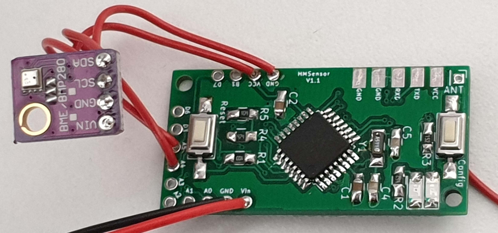
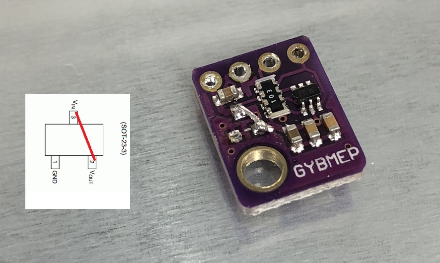

# HM-WDS40-TH-I-RTC-BME280

Temperatursensor _Bosch BME280_ an der HMSensor.

Die HMSensor Platine wird **mit 32kHz Oszillator** bestückt um entsprechend exakte Timings
zu erreichen womit eine Direktverknüpfung mit einem HM-CC-RT-DN Heizkörperthermostat möglich wird.



## Aufbau

### HMSensor

Auf der HMSensor Platine kann die grüne LED `D2` inkl. Vorwiderstand `R3` unbestückt bleiben da diese
keine Verwendung finden.

### Anschluss des BME280

Hier wird das I2C Breakout des BME280 verwendet. Um Strom zu sparen wird der LDO entfernt.



Anschluss:

| HMSensor | BME280 | |
|----------|--------|-|
| VCC      | VIN    | |
| GND      | GND    | |
| A5       | SCL    | I2C Takt |
| A4       | SDA    | I2C Daten |

## Sketch

Zuerst sollte man über 
[FreqTest](/Grundlagen/FAQ/Fehlerhafte_CC1101.html#ermittlung-der-cc1101-frequenz)
die optimale CC1101 Frequenz ermittelen.

Als Sketch kommt 
[HM-WDS40-TH-I.ino](https://raw.githubusercontent.com/pa-pa/AskSinPP/master/examples/HM-WDS40-TH-I/HM-WDS40-TH-I.ino)
zum Einsatz. Über verschiedene `#define` Direktiven können die entsprechenden Einstellungen gesetzt werden,
je nach Sensor-Typ und RTC. Ist ein 32kHz Quarz verbaut sowie der BME280 sind folgende Direktiven einzukommentieren:

```cpp
// === Choose one Temperture/Humidity sensor ===
#define SENSOR_BME280
//#define SENSOR_DHT22
//#define SENSOR_SHT10
//#define SENSOR_SHT31
//#define SENSOR_SI7021

// === Define the clock ===
// Remove comment if you have an external oscillator like a 32kHz crystal
// Necessary for exact timings if you want to pair with a HM-CC-RT-DN
#define USE_RTC

// === Battery measurement ===
#define BAT_VOLT_LOW        20
#define BAT_VOLT_CRITICAL   13
// Internal measuring: AVR voltage
//#define BAT_SENSOR BatterySensor
// External measuring: Potential devider on GPIO; required if a StepUp converter is used
// one can consider lower thresholds (low=20; cri=13) 
#define BAT_SENSOR BatterySensorUni<17,7,3000> // <SensPIN, ActivationPIN, RefVcc>
```


Wie immer dran denken die [Serial und ID zu ändern](/Grundlagen/02_software.html#sketch-anpassen-und-flashen).

Zusätzlich zu den üblichen Bibliotheken (AskSinPP, EnableInterrupt, Low-Power) benötigt man noch die 
[Lib für den BME280](https://github.com/finitespace/BME280). 
Allerdings hatte ich hier noch einen [Fehler beim kompilieren](https://github.com/finitespace/BME280/issues/17)
weshalb ich die `BME280Spi*.o` Dateien gelöscht habe.

::: tip
Will man wissen ob die Direktverknüpfung mit dem Heizkörperthermostat funktioniert
legt man den Sensor kurzerhand in den Kühlschrank. Die CCU sollte nach ein paar Minuten
die Temperatur vom WDS40 beim HM-CC-RT-DN anzeigen und das Ventil sollte öffnen.
::: 


Beispiel Debugausgabe wenn alles funktioniert hat: 
```bash
# Initialisierung
AskSin++ V4.1.1 (Nov 18 2019 16:52:06)
Address Space: 32 - 73
CC init1
CC Version: 04
 - ready
# CC1101 Frequenzanpassung, ermittelt durch FreqTest
Config Freq: 0x2165CA
# Spannungsmessung der Batterie in mV. (iVcc wäre eine interne Messung und unbrauchbar bei StepUp Wandlern)
eVcc: 1720
ID: 345679  Serial: papa111111
Measure...
T: 234  H: 35
<- 0C 01 84 70 345679 000000 80 EA 23  - 352
149.500 # Next send slot
Measure...
T: 234  H: 35
<- 0C 02 84 70 345679 000000 80 EA 23  - 413
135.0
Measure...
T: 232  H: 36
<- 0C 03 84 70 345679 000000 80 E8 24  - 475
120.500
Measure...
T: 231  H: 35
<- 0C 04 84 70 345679 000000 80 E7 23  - 534
170.0
```
