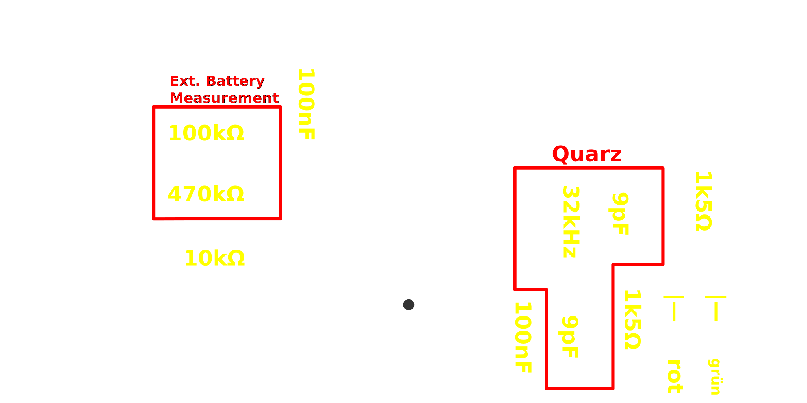
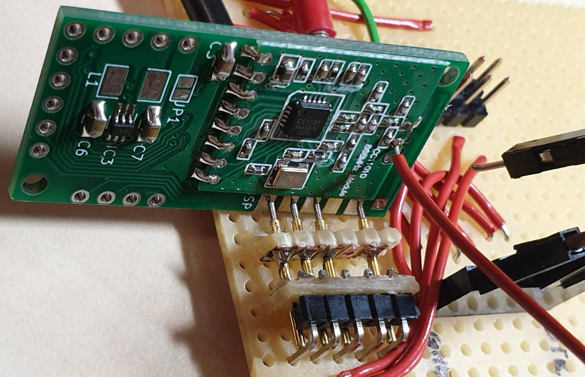

# HMSensor

Das [HMSensor Projekt](https://github.com/pa-pa/HMSensor/) stammt von pa-pa und versucht
eine universelle Hardware-Basis für AskSin++ Sensoren und Aktoren zu sein. Die Größe der Platine ist 
dabei nur 40x20mm und damit nur geringfügig größer als ein Pro-Mini.

Die Platine gibt es in der StepUp und CR2032 Variante. Die jeweiligen Bauteillisten sind 
auf Github hinterlegt.


## HMSensor-StepUp

Durch den StepUp Wandler erreicht man eine möglichst gute Ausnutzung der Batteriekapazität.
Zusätzlich ist eine externe Messung der Batteriespannung möglich.

Beide Varianten können mit einem 32kHz Quarz ausgestattet werden wenn man
genauere Timings benötigt. Zusätzlich kann er den Ruhestrom weiter senken, siehe 
[Ruhestrom Arduino Pro Mini](https://github.com/TomMajor/SmartHome/tree/master/Info/Ruhestrom)
von Tom Major.


Will man auf den externen Quarz verzichten, dann bleiben `C4`, `C5` und `Y1` unbestückt.



Benötigt man keinen StepUp Wandler kann der Jumper `J1` geschlossen werden.
Die Bauteile `L1`, `C6`, `C7` und `IC3` bleiben unbestückt. Zudem kann man ohne StepUp die
Batteriemessugn am AVR-VCC nutzen und benötigt den Spannungsteiler über `R4` und `R5` nicht.


## HMSensor-CR2032

Hat man keinen Platz für _große_ Batterien greift man auf eine CR2032-Zelle zurück.
Sie wird in einen Halter auf der Oberseite gesteckt, der ATmega328P sitzt bei dieser
Variante auf der Rückseite. Da Knopfzellen andere Entlade-Eigenschaften haben kann
hier auf einen StepUp Wandler verzichtet werden.


:::tip
Wird die Antenne am Lötauge `ANT` der HMSensor verbaut, beträgt die Länge nur noch 72mm.

Auf die mittlere Kontaktfläche für die Knopfzelle sollte etwas Zinn aufgetragen werden damit die Erhöhung
einen besseren Kontakt zu ermöglicht.
:::


## Addons

Für die HMSensor gibt es diverse [Addon-Platinen](https://github.com/pa-pa/HMSensor/tree/master/AddOns).


## Software

Beide Varianten führen die ISP sowie die UART Pins nach außen.




### Bootloader und Fuses

Da der ATmega328P ohne Bootloader kommt, wird dieser per ISP-Programmer aufgespielt.
Es empfiehlt sich die Verwendung des 
[Diamex](https://www.diamex.de/dxshop/USB-ISP-Programmer-fuer-Atmel-AVR-Rev2) Programmers,
da dieser auch auf dem SPI-Interface 3,3V liefert => DIP-Schalterstellung prüfen! 

:::warning
Bei Verwendung eins USBasp sollte das CC1101 Funkmodul noch **nicht** bestückt sein, da es keine 5V verträgt.
:::

Der Anschluss des ISP erfolgt nach Beschriftung.


Der [Arudino Bootloader](https://raw.githubusercontent.com/pa-pa/AskSinPP/master/bootloader/avr/ATmegaBOOT_168_atmega328_pro_8MHz.hex) dient zum späteren Flashen der Sketches per UART (FTDI)
Adapter. 

Es ist auch möglich einen OTA-Bootloader aufzuspielen, siehe dazu 
[OTA-Firmware](https://wiki.fhem.de/wiki/HomeMatic_Fenster-Drehgriffkontakt_Community-Nachbau#Firmware)
im FEHM Wiki. Der OTA-Bootloader benöigt etwas mehr Platz weshalb als High-Fuse `0xD0` verwendet wird.

Für den Arduino-Bootloader mit deaktiviertem BOD können folgende Fuses gesetzt werden.  
Siehe auch [Babbling Idiot](/Grundlagen/FAQ/babbling_idiot.html#dauersender-babbling-idiot).


```bash
# Fuses setzen
avrdude -p m328p -P /dev/ttyACM3 -c avrisp2 -B 10 -U lfuse:w:0xE2:m -U hfuse:w:0xD2:m -U efuse:w:0xFF:m -U lock:w:0xFF:m

# Upload des Arudino Bootloaders
avrdude -p m328p -P /dev/ttyACM3 -c avrisp2 -V -U flash:w:ATmegaBOOT_168_atmega328_pro_8MHz.hex

# Bootloader verifizieren
avrdude -p m328p -P /dev/ttyACM3 -c avrisp2 -U flash:v:ATmegaBOOT_168_atmega328_pro_8MHz.hex
```

Es ist darauf zu achten, dass die Memory-Operation (`-U`) keine Leerzeichen enthalten darf.
Die Parameter für den Port `-P` und den Programmer `-c` müssen an die jeweilige Umgebung angepasst werden.
Beispielsweise `-P usb -c usbasp` für den USBasp unter Windows.


### Sketche

Sketche werden wie gewohnt über den UART (FTDI) geflasht. 

**Anschluss:** 

| HMSensor | FTDI | |
|----------|------|-|
| VCC      | VCC  | 3.3V |
| GND      | GND  | |
| TX       | RX   | |
| RX       | TX   | |
| RESET    | DTR  | **100nF Kondensator in Reihe schalten!** | 

## Ruhestrom

Den Ruhestrom kann man mit den SleepTest Sketches von Tom überprüfen: 
[Infos zum Ruhestrom](https://github.com/TomMajor/SmartHome/tree/master/Info/Ruhestrom)

Es sind schon Fälle aufgetreten, bei denen der Ruhestrom bei ~15mA lag.
Schuld waren _"defekte"_ CC1101 Module.

## Links

* [Github Repo](https://github.com/pa-pa/HMSensor/)
* [FHEM Forum Thread](https://forum.fhem.de/index.php/topic,73954.0.html) 
