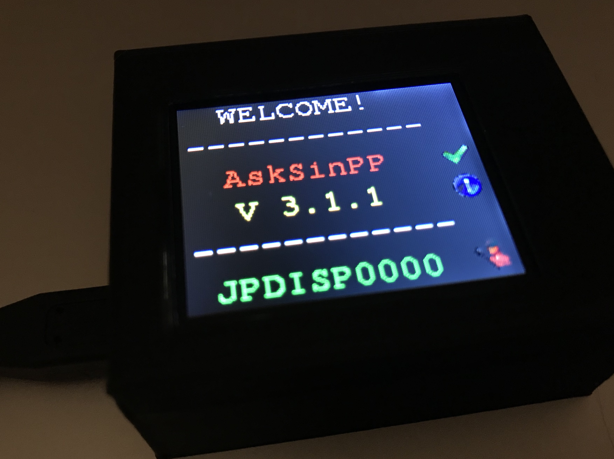

# AskSinPPCollection
Eine Übersicht rund um die Arduino [AskSinPP Lib](https://github.com/pa-pa/AskSinPP/tree/master/examples) sowie deren Verwendung und Projekte.

## Info / CCU Addon
- [(piv)CCU- / RaspberryMatic Addon](https://github.com/jp112sdl/JP-HB-Devices-addon), welches benötigt wird, um die Geräte `HB-UNI-...` und `HB-LC-...` verwenden zu können
- [HB-UNI-Sensor1 Addon](https://github.com/TomMajor/AskSinPP_Examples/tree/master/HB-UNI-Sensor1/CCU_RM) für die Unterstützung des [HB-UNI-Sensor1](https://github.com/TomMajor/AskSinPP_Examples/tree/master/HB-UNI-Sensor1) von Tom
- [Kurzbezeichnungen](https://wiki.fhem.de/wiki/HomeMatic_Namen_verstehen) (HM-...) der HomeMatic-Geräte verstehen
- [Übersicht](https://wiki.fhem.de/wiki/Homematic-Ger%C3%A4te%C3%BCbersicht) der HomeMatic Produkte

## Software / Sketche
- [pa-pa](https://github.com/pa-pa/AskSinPP)
  - [Sketch-Sammlung div. HM-Geräte von pa-pa (Bestandteil der AskSinPP Library)](https://github.com/pa-pa/AskSinPP/tree/master/examples) 
  
  | Bezeichnung        | Beschreibung           | Hinweise  |
  | ------------- |-------------|-----|
  | [HM-LC-Bl1-FM](https://github.com/pa-pa/AskSinPP/blob/master/examples/HM-LC-Bl1-FM/HM-LC-Bl1-FM.ino) | 1-Kanal Rollladenaktor | |
  | [HM-LC-Dim1PWM-CV](https://github.com/pa-pa/AskSinPP/blob/master/examples/HM-LC-Dim1PWM-CV/HM-LC-Dim1PWM-CV.ino) | 1-Kanal PWM Dimmer | |
  | [HM-LC-SW1-BA-PCB](https://github.com/pa-pa/AskSinPP/blob/master/examples/HM-LC-SW1-BA-PCB/HM-LC-SW1-BA-PCB.ino) | 1-Kanal Batterieaktor | |
  | [HM-LC-SWX-SM](https://github.com/pa-pa/AskSinPP/blob/master/examples/HM-LC-SWX-SM/HM-LC-SWX-SM.ino) | 1-/2-/4-Kanal Schaltaktor | X = Platzhalter für die Kanalzahl; wird im Sketch definiert |
  | [HM-RC-4](https://github.com/pa-pa/AskSinPP/blob/master/examples/HM-RC-4/HM-RC-4.ino) | 4-Kanal Fernbedienung | |
  | [HM-RC-8](https://github.com/pa-pa/AskSinPP/blob/master/examples/HM-RC-8/HM-RC-8.ino) | 8-Kanal Fernbedienung | |
  | [HM-RC-P1](https://github.com/pa-pa/AskSinPP/blob/master/examples/HM-RC-P1/HM-RC-P1.ino) | 1-Kanal Fernbedienung (Paniksender) | |
  | [HM-SEC-MDIR](https://github.com/pa-pa/AskSinPP/blob/master/examples/HM-SEC-MDIR/HM-SEC-MDIR.ino) | Bewegungsmelder | Helligkeitsmessung optional mittels TSL2561 |
  | [HM-SEC-RHS](https://github.com/pa-pa/AskSinPP/blob/master/examples/HM-SEC-RHS/HM-SEC-RHS.ino) | Fenster-Drehgriffkontakt | |
  | [HM-SEC-SD](https://github.com/pa-pa/AskSinPP/blob/master/examples/HM-SEC-SD/HM-SEC-SD.ino) | Rauchmelder | |
  | [HM-SEC-WDS](https://github.com/pa-pa/AskSinPP/blob/master/examples/HM-SEC-WDS/HM-SEC-WDS.ino) | Wassermelder | |
  | [HM-SEN-MDIR-WM55](https://github.com/pa-pa/AskSinPP/blob/master/examples/HM-SEN-MDIR-WM55/HM-SEN-MDIR-WM55.ino) | Bewegungsmelder mit Taster | Helligkeitsmessung optional mittels TSL2561 |
  | [HM-WDS10-TH-O](https://github.com/pa-pa/AskSinPP/blob/master/examples/HM-WDS10-TH-O/HM-WDS10-TH-O.ino) | Temperatur- / Feuchtesensor Außen | verschiedene Sensoren; RTC wird verwendet! |
  | [HM-WDS100-C6-O-2](https://github.com/pa-pa/AskSinPP/blob/master/examples/HM-WDS100-C6-O-2/HM-WDS100-C6-O-2.ino) | Funk-Kombisensor | nur Fake-Werte |

- Meine Nachbauten:
  - [Sketch-Sammlung div. HM-Geräte von mir](https://github.com/jp112sdl/Beispiel_AskSinPP/tree/master/examples)
  
  | Bezeichnung        | Beschreibung           | Hinweise  |
  | ------------- |-------------|-----|
  | [HM-LC-Bl1-FM-2](https://github.com/jp112sdl/HM-LC-Bl1-FM-2) | 2-Kanal-Rollladenaktor | wie HM-LC-Bl1-FM jedoch mit 2 Kanälen |
  
- Meine Eigentwicklungen ([Addon](https://github.com/jp112sdl/JP-HB-Devices-addon) erforderlich):

  | Bezeichnung | Beschreibung |
  | ------------- |-----|
  | [HB-UNI-Sen-CAP-MOIST](https://github.com/jp112sdl/HB-UNI-Sen-CAP-MOIST) | kapazitiver Bodenfeuchtesensor |
  | [HB-UNI-Sen-DIST-US](https://github.com/jp112sdl/HB-UNI-Sen-DIST-US) | Ultraschall Abstandsensor |
  | [HB-UNI-Sen-LEV-US](https://github.com/jp112sdl/HB-UNI-Sen-LEV-US) | Ultraschall Füllstandsensor |
  | [HB-UNI-Sen-PRESS](https://github.com/jp112sdl/HB-UNI-Sen-PRESS) | Drucksensor |
  | [HB-UNI-Sen-TEMP-DS18B20](https://github.com/jp112sdl/HB-UNI-Sen-TEMP-DS18B20) | 1..8fach DS18B20 Temperatursensor |
  | [HB-UNI-Sen-WEA](https://github.com/jp112sdl/HB-UNI-Sen-WEA) | Wetterstation |
  | [HB-UNI-SenAct-4-4](https://github.com/jp112sdl/HB-UNI-SenAct-4-4) | 4fach - Sender & - Aktor (Netzteil-/Batteriebetrieb) |
  | [HB-UNI-SenAct-8-8-RC](https://github.com/jp112sdl/HB-UNI-SenAct-8-8-RC) | 8fach - Sender & - Aktor (Netzteil-/Batteriebetrieb) |
  | [HB-UNI-RGB-LED-CTRL](https://github.com/jp112sdl/HB-UNI-RGB-LED-CTRL) | RGB Controller für WS28xx / Neopixel / etc. |
  | [HB-UNI-Sen-TEMP-IR](https://github.com/jp112sdl/HB-UNI-Sen-TEMP-IR) | MLX90614 Infrarot Temperatursensor |
  | [HB-UNI-Sen-DUMMY-BEACON](https://github.com/jp112sdl/HB-UNI-Sen-DUMMY-BEACON) | Dummy-Device zum Simulieren zyklischer Statusmeldungen sowie Ack-Nachrichten |
  | [HB-UNI-Sen-VOLT](https://github.com/jp112sdl/HB-UNI-Sen-VOLT) | universeller Spannungssensor (Template) |
  | [HB-LC-Sw1PBU-FM](https://github.com/jp112sdl/Beispiel_AskSinPP/tree/master/examples/HB-LC-Sw1PBU-FM) | alternative Firmware für den HM-LC-Sw1PBU-FM (getrennte Taster-/Relais-Kanäle) |
  | [HB-LC-Sw2PBU-FM](https://github.com/jp112sdl/Beispiel_AskSinPP/tree/master/examples/HB-LC-Sw2PBU-FM) | alternative Firmware für den HM-LC-Sw2PBU-FM (getrennte Taster-/Relais-Kanäle) |
  | [HB-LC-Bl1PBU-FM](https://github.com/jp112sdl/Beispiel_AskSinPP/tree/master/examples/HB-LC-Bl1PBU-FM) | alternative Firmware für den HM-LC-Bl1PBU-FM (getrennte Taster-/Relais-Kanäle) |
  | [HB-UNI-DMX-Master](https://github.com/jp112sdl/HB-UNI-DMX-Master) | einfacher DMX Master Controller _(coming soon)_ |

- [Marco](https://github.com/stan23)

  | Bezeichnung        | Beschreibung           | Hinweise  |
  | ------------- |-------------|-----|
  | [HB-LC-Sw2-FM](https://github.com/stan23/HB-LC-Sw2-FM) | alternative Firmware für den HB-LC-Sw2-FM (getrennte Taster-/Relais-Kanäle) | wird auf den originalen HM-LC-Sw2-FM geflasht|
  
- [Toms Sketchsammlung](https://github.com/TomMajor/AskSinPP_Examples) (Hinweis: für den HB-UNI-Sensor1 wird ein separates [CCU Addon](https://github.com/TomMajor/AskSinPP_Examples/tree/master/HB-UNI-Sensor1/CCU_RM) benötigt!)

## Hardware / Platinen
- Platine(n) von [pa-pa](https://github.com/pa-pa)
  - [HMSensor-Platine](https://github.com/pa-pa/HMSensor)

- Platine(n) von [Alex](https://github.com/alexreinert)
  - [HB-UNI-644 (Rev. 2)](https://github.com/alexreinert/PCB#hb-uni-644-rev-2) 
  - [HB-UNI-SEN-BATT](https://github.com/alexreinert/PCB#hb-uni-sen-batt) 
  - [HB-UNI-SEN-PCB](https://github.com/alexreinert/PCB#hb-uni-sen-pcb) 
  - [HB-UNI-SEN-WEA](https://github.com/alexreinert/PCB#hb-uni-sen-wea) (Platine für die [Wetterstation](https://github.com/jp112sdl/HB-UNI-Sen-WEA/tree/master))

- Platine(n) von [Tom](https://github.com/TomMajor)
  - [PLHT Sensor](https://github.com/TomMajor/AskSinPP_Examples/tree/master/PCB/Sensor_PLHT)

- Platine(n) von [Marco](https://github.com/stan23)
  - [Gosund SP1 Controllerplatine zum Umbau auf HM-ES-PMSw1-Pl](https://github.com/stan23/HM-ES-PMSw1-Pl_GosundSP1)
  - [HM-LC-Bl1-FM Rollladenaktor für Gleichstrommotoren](https://github.com/stan23/HM-LC-Bl1-FM-DC)
  - [OBI WiFi Zwischenstecker Controllerplatine zum Umbau auf HM-LC-Sw1-Pl-DN-R1](https://github.com/stan23/HM-LC-Sw1-Pl-DN-R1_OBI)
  
- Platine(n) von [Ronny](https://github.com/ronnythomas)
  - [HB-Micro](https://github.com/ronnythomas/HB-Micro)
  - [HB-Mini](https://github.com/ronnythomas/HB-Mini)
  - [HM-MOD-Re-8](https://github.com/ronnythomas/HM-MOD-Re-8)
  - [HB-UNI](https://github.com/ronnythomas/HB-UNI)
  - [HB-UNI-Bat](https://github.com/ronnythomas/HB-UNI-Bat)
  - [HB-UNI-SenAct-4-4](https://github.com/ronnythomas/HB-UNI-SenAct-4-4)
  - [HM-LC-Sw1-PCB-12V](https://github.com/ronnythomas/HM-LC-Sw1-PCB-12V)
  - [HM-LC-Sw1-PCB-230V](https://github.com/ronnythomas/HM-LC-Sw1-PCB-230V)
  - [HM-LC-Sw1-PCB-230V-TR](https://github.com/ronnythomas/HM-LC-Sw1-PCB-230V-TR)
  
## Gehäuse / 3D Druck
- Gehäuse von [Jan](https://www.thingiverse.com/Schmelzerboy)
  - [HM-WDS40-TH-I](https://www.thingiverse.com/thing:3184336)
  - [Platinenhalter](https://www.thingiverse.com/thing:3158997)
- Gehäuse von [Christoph S.](https://www.thingiverse.com/ChristophStr)
  - [HB-UNI-SENS-BATT-Case](https://www.thingiverse.com/thing:3028730)
- Gehäuse von [Hermi](https://www.thingiverse.com/hermi_le)
  - [optionale Teile für HB-UNI-Sen-WEA](https://www.thingiverse.com/thing:3173141)
  - [Homematic Lichtsensor HM-SEN-LI-O](https://www.thingiverse.com/thing:3196116)
  
## FAQ / häufige Fehler
  
## Diese Liste lebt von euren Zuarbeiten. Wer sich hier vermisst, oder noch was gefunden hat, das fehlt - immer her damit. Entweder per PullRequest oder Issue. 

# DANKE!
