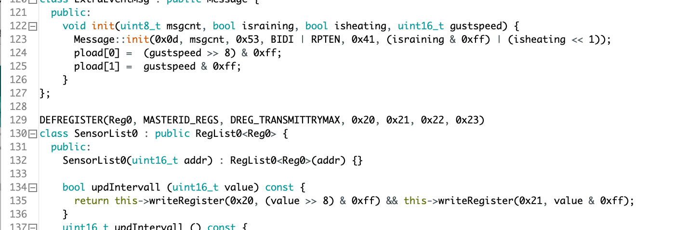

# Software / Sketche

::: warning
`HB-` Sketche stehen für **HomeBrew** und werden nicht nativ von der CCU verstanden.  
Die Installation eines entsprechenden **DeviceAddons** ist erforderlich!
:::

## [pa-pa](https://github.com/pa-pa/AskSinPP)
  
  | Bezeichnung | Beschreibung | Hinweise |
  | ------------- |-------------|-----|
  | [HM-LC-Bl1-FM](https://github.com/pa-pa/AskSinPP/blob/master/examples/HM-LC-Bl1-FM/HM-LC-Bl1-FM.ino) | 1-Kanal Rollladenaktor | |
  | [HM-LC-Dim1PWM-CV](https://github.com/pa-pa/AskSinPP/blob/master/examples/HM-LC-Dim1PWM-CV/HM-LC-Dim1PWM-CV.ino) | 1-Kanal PWM Dimmer | |
  | [HM-DW-WM](https://github.com/pa-pa/AskSinPP/blob/master/examples/HM-DW-WM/HM-DW-WM.ino) | 2-Kanal PWM Dimmer | |
  | [HM-LC-DW-WM](https://github.com/pa-pa/AskSinPP/blob/master/examples/HM-LC-DW-WM/HM-LC-DW-WM.ino) | DualWhite PWM Dimmer | |
  | [HM-LC-SW1-BA-PCB](https://github.com/pa-pa/AskSinPP/blob/master/examples/HM-LC-SW1-BA-PCB/HM-LC-SW1-BA-PCB.ino) | 1-Kanal Batterieaktor | |
  | [HM-LC-SWX-SM](https://github.com/pa-pa/AskSinPP/blob/master/examples/HM-LC-SWX-SM/HM-LC-SWX-SM.ino) | 1-/2-/4-Kanal Schaltaktor | X = Platzhalter für die Kanalzahl; wird im Sketch definiert |
  | [HM-RC-4](https://github.com/pa-pa/AskSinPP/blob/master/examples/HM-RC-4/HM-RC-4.ino) | 4-Kanal Fernbedienung | |
  | [HM-RC-8](https://github.com/pa-pa/AskSinPP/blob/master/examples/HM-RC-8/HM-RC-8.ino) | 8-Kanal Fernbedienung | |
  | [HM-RC-P1](https://github.com/pa-pa/AskSinPP/blob/master/examples/HM-RC-P1/HM-RC-P1.ino) | 1-Kanal Fernbedienung (Paniksender) | |
  | [HM-SEC-MDIR](https://github.com/pa-pa/AskSinPP/blob/master/examples/HM-SEC-MDIR/HM-SEC-MDIR.ino) | Bewegungsmelder | Helligkeitsmessung optional mittels TSL2561 |
  | [HM-SEC-RHS](https://github.com/pa-pa/AskSinPP/blob/master/examples/HM-SEC-RHS/HM-SEC-RHS.ino) | Fenster-Drehgriffkontakt | |
  | [HM-SEC-SD](https://github.com/pa-pa/AskSinPP/blob/master/examples/HM-SEC-SD/HM-SEC-SD.ino) | Rauchmelder | |
  | [HM-SEC-WDS](https://github.com/pa-pa/AskSinPP/blob/master/examples/HM-SEC-WDS/HM-SEC-WDS.ino) | Wassermelder | |
  | [HM-SEN-MDIR-WM55](https://github.com/pa-pa/AskSinPP/blob/master/examples/HM-SEN-MDIR-WM55/HM-SEN-MDIR-WM55.ino) | Bewegungsmelder mit Taster | Helligkeitsmessung optional mittels TSL2561 |
  | [HM-WDS10-TH-O](https://github.com/pa-pa/AskSinPP/blob/master/examples/HM-WDS10-TH-O/HM-WDS10-TH-O.ino) | Temperatur- / Feuchtesensor Außen | verschiedene Sensoren; RTC wird verwendet! |
  | [HM-WDS100-C6-O-2](https://github.com/pa-pa/AskSinPP/blob/master/examples/HM-WDS100-C6-O-2/HM-WDS100-C6-O-2.ino) | Funk-Kombisensor | nur Fake-Werte |

## [Jérôme](https://github.com/jp112sdl) 

### Nachbauten
  
  | Bezeichnung | Beschreibung | Hinweise |
  | ------------- |-------------|-----|
  | [HM-CC-SCD](https://github.com/jp112sdl/Beispiel_AskSinPP/blob/master/examples/HM-CC-SCD/HM-CC-SCD.ino) | CO2-Sensor | nur Sketch Sensor muss pot.-frei angeschlossen werden |
  | [HM-Dis-TD-T](https://github.com/jp112sdl/Beispiel_AskSinPP/blob/master/examples/HM-Dis-TD-T/HM-Dis-TD-T.ino) | Statusanzeige mit Batteriebetrieb |  |
  | [HM-Dis-WM55](https://github.com/jp112sdl/Beispiel_AskSinPP/tree/master/examples/HM-Dis-WM55) | Statusanzeige mit TFT Color Screen | erfordert Mega2560 siehe auch [Thread](https://homematic-forum.de/forum/viewtopic.php?f=76&t=45443) im HM-Forum |
  | [HM-ES-PMSw1-Pl](https://github.com/jp112sdl/Beispiel_AskSinPP/tree/master/examples/HM-ES-PMSw1-Pl) | Zwischenstecker mit Leistungsmessung | Umbau Sonoff POW |
  | [HM-ES-PMSw1-Pl_GosundSP1](https://github.com/jp112sdl/Beispiel_AskSinPP/tree/master/examples/HM-ES-PMSw1-Pl_GosundSP1) | Zwischenstecker mit Leistungsmessung | Umbau Blitzwolf / Gosund SP1  |
  | [HM-ES-TX-WM_CCU](https://github.com/jp112sdl/Beispiel_AskSinPP/blob/master/examples/HM-ES-TX-WM_CCU/HM-ES-TX-WM_CCU.ino) | Energiezähler |  |
  | [HM-LC-SW1-FM_Shelly1](https://github.com/jp112sdl/Beispiel_AskSinPP/tree/master/examples/HM-LC-SW1-FM_Shelly1) | 1-Kanal Zwischenstecker  | Umbau Shelly1 |
  | [HM-LC-Sw1-Pl-CT-R1](https://github.com/jp112sdl/Beispiel_AskSinPP/blob/master/examples/HM-LC-Sw1-Pl-CT-R1/HM-LC-Sw1-Pl-CT-R1.ino) | 1-Kanal Zwischenstecker mit Klemmanschluss |  |
  | [HM-LC-Sw1-Pl-DN-R1](https://github.com/jp112sdl/Beispiel_AskSinPP/blob/master/examples/HM-LC-Sw1-Pl-DN-R1/HM-LC-Sw1-Pl-DN-R1.ino) | 1-Kanal Zwischenstecker |  |
  | [HM-LC-Sw1-Pl-DN-R1_OBI](https://github.com/jp112sdl/Beispiel_AskSinPP/tree/master/examples/HM-LC-Sw1-Pl-DN-R1_OBI) | 1-Kanal Zwischenstecker | Anpassungen zum Einsatz im OBI WiFi Zwischenstecker |
  | [HM-LC-Sw2-FM](https://github.com/jp112sdl/Beispiel_AskSinPP/blob/master/examples/HM-LC-Sw2-FM/HM-LC-Sw2-FM.ino) | Funk-Schaltaktor 2fach, Unterputzmontage |  |
  | [HM-MOD-Re-8](https://github.com/jp112sdl/Beispiel_AskSinPP/blob/master/examples/HM-MOD-Re-8/HM-MOD-Re-8.ino) | 8-Kanal-Empfangsmodul |  |
  | [HM-PB-2-FM](https://github.com/jp112sdl/Beispiel_AskSinPP/blob/master/examples/HM-PB-2-FM/HM-PB-2-FM.ino) | Funk-Wandtaster 2-fach für Markenschalter, Unterputzmontage |  |
  | [HM-PB-2-WM55](https://github.com/jp112sdl/Beispiel_AskSinPP/blob/master/examples/HM-PB-2-WM55/HM-PB-2-WM55.ino) |  2fach-Funk-Wandsender |  |
  | [HM-PB-6-WM55](https://github.com/jp112sdl/Beispiel_AskSinPP/blob/master/examples/HM-PB-6-WM55/HM-PB-6-WM55.ino) |  Funk-Wandtaster 6-fach |  |
  | [HM-PB-MP-WM](https://github.com/jp112sdl/Beispiel_AskSinPP/tree/master/examples/HM-PB-MP-WM) | 2-/4-fach Wandtaster mit Doppelklickfunktion | Eigentwicklung, funktioniert ohne Addon |
  | [HM-PBI-4-FM](https://github.com/jp112sdl/Beispiel_AskSinPP/blob/master/examples/HM-PBI-4-FM/HM-PBI-4-FM.ino) | Funktaster-Schnittstelle 4-fach |  |
  | [HM-RC-2-PBU-FM](https://github.com/jp112sdl/Beispiel_AskSinPP/blob/master/examples/HM-RC-2-PBU-FM/HM-RC-2-PBU-FM.ino) | Funk-Sender 2-fach für Markenschalter |  |
  | [HM-SCI-3-FM](https://github.com/jp112sdl/Beispiel_AskSinPP/blob/master/examples/HM-SCI-3-FM/HM-SCI-3-FM.ino) | Kontakt-Interface für Öffner und Schließerkontake | bis zu 7 Kanäle möglich |
  | [HM-SEC-SC](https://github.com/jp112sdl/Beispiel_AskSinPP/blob/master/examples/HM-SEC-SC/HM-SEC-SC.ino) | Tür-/Fensterkontakt |  |
  | [HM-SEC-SCO](https://github.com/jp112sdl/Beispiel_AskSinPP/blob/master/examples/HM-SEC-SCO/HM-SEC-SCO.ino) | Tür-/Fensterkontakt (optisch) |  |
  | [HM-Sec-TiS](https://github.com/jp112sdl/Beispiel_AskSinPP/blob/master/examples/HM-Sec-TiS/HM-Sec-TiS.ino) | Neigungssensor |  |
  | [HM-Sen-DB-PCB](https://github.com/jp112sdl/Beispiel_AskSinPP/blob/master/examples/HM-Sen-DB-PCB/HM-Sen-DB-PCB.ino) | Klingelsignalsensor |  |
  | [HM-Sen-LI-O](https://github.com/jp112sdl/Beispiel_AskSinPP/blob/master/examples/HM-Sen-LI-O/HM-Sen-LI-O.ino) | Lichtsensor Außen |  |
  | [HM-Sen-WA-OD](https://github.com/jp112sdl/Beispiel_AskSinPP/blob/master/examples/HM-Sen-WA-OD/HM-Sen-WA-OD.ino) | Füllstandsmesser |  |
  | [HM-WDS30-OT2-DS18B20](https://github.com/jp112sdl/Beispiel_AskSinPP/blob/master/examples/HM-WDS30-OT2-DS18B20/HM-WDS30-OT2-DS18B20.ino) | Differenz-Temperatur-Sensor | für DS18B20 Sensor |
  | [HM-WDS30-OT2-NTC](https://github.com/jp112sdl/Beispiel_AskSinPP/blob/master/examples/HM-WDS30-OT2-NTC/HM-WDS30-OT2-NTC.ino) | Differenz-Temperatur-Sensor | für NTC Sensor |
  | [HM-WDS30-T-O-NTC](https://github.com/jp112sdl/Beispiel_AskSinPP/blob/master/examples/HM-WDS30-T-O-NTC/HM-WDS30-T-O-NTC.ino) | Temperatur-Sensor Außen | für NTC Sensor  |
  | [HM-WDS40-TH-I-BME280](https://github.com/jp112sdl/Beispiel_AskSinPP/blob/master/examples/HM-WDS40-TH-I-BME280/HM-WDS40-TH-I-BME280.ino) | Temperatur-/Feuchtesensor Innen | für BME280 Sensor |
  | [HM-WDS40-TH-I-DHT22](https://github.com/jp112sdl/Beispiel_AskSinPP/blob/master/examples/HM-WDS40-TH-I-DHT22/HM-WDS40-TH-I-DHT22.ino) | Temperatur-/Feuchtesensor Innen | für DHT22 Sensor |
  | [HM-WDS40-TH-I-DS18B20](https://github.com/jp112sdl/Beispiel_AskSinPP/blob/master/examples/HM-WDS40-TH-I-DS18B20/HM-WDS40-TH-I-DS18B20.ino) | Temperatur-/Feuchtesensor Innen | für DS18B20 Sensor |
  | [HM-WDS40-TH-I-SHT10](https://github.com/jp112sdl/Beispiel_AskSinPP/blob/master/examples/HM-WDS40-TH-I-SHT10/HM-WDS40-TH-I-SHT10.ino) | Temperatur-/Feuchtesensor Innen | für SHT10 Sensor |
  | [HM-WDS40-TH-I-SHT31](https://github.com/jp112sdl/Beispiel_AskSinPP/blob/master/examples/HM-WDS40-TH-I-SHT31/HM-WDS40-TH-I-SHT31.ino) | Temperatur-/Feuchtesensor Innen | für SHT31 Sensor |
  | [HM-WDS40-TH-I-SI7021](https://github.com/jp112sdl/Beispiel_AskSinPP/blob/master/examples/HM-WDS40-TH-I-SI7021/HM-WDS40-TH-I-SI7021.ino) | Temperatur-/Feuchtesensor Innen | für SI7021 Sensor |
  | [HM-LC-Bl1-FM-2](https://github.com/jp112sdl/HM-LC-Bl1-FM-2) | 2-Kanal-Rollladenaktor | wie HM-LC-Bl1-FM jedoch mit 2 Kanälen |

### Eigentwicklungen 

**Es ist die Installation des [JP-HB-Device-Addon](https://github.com/jp112sdl/JP-HB-Devices-addon) auf der CCU nötig.**

  | Bezeichnung | Beschreibung |
  | ------------- |-----|
  | [HB-UNI-Sen-CAP-MOIST](https://github.com/jp112sdl/HB-UNI-Sen-CAP-MOIST) | kapazitiver Bodenfeuchtesensor |
  | [HB-UNI-Sen-DIST-US](https://github.com/jp112sdl/HB-UNI-Sen-DIST-US) | Ultraschall Abstandsensor |
  | [HB-UNI-Sen-LEV-US](https://github.com/jp112sdl/HB-UNI-Sen-LEV-US) | Ultraschall Füllstandsensor |
  | [HB-UNI-Sen-PRESS](https://github.com/jp112sdl/HB-UNI-Sen-PRESS) | Drucksensor |
  | [HB-UNI-Sen-TEMP-DS18B20](https://github.com/jp112sdl/HB-UNI-Sen-TEMP-DS18B20) | 1..8fach DS18B20 Temperatursensor |
  | [HB-UNI-Sen-WEA](https://github.com/jp112sdl/HB-UNI-Sen-WEA) | Wetterstation |
  | [HB-UNI-SenAct-4-4](https://github.com/jp112sdl/HB-UNI-SenAct-4-4) | 4fach - Sender & - Aktor (Netzteil-/Batteriebetrieb) |
  | [HB-UNI-SenAct-8-8](https://github.com/jp112sdl/HB-UNI-SenAct-8-8) | 8fach - Sender & - Aktor (Netzteil-/Batteriebetrieb) |
  | [HB-UNI-RGB-LED-CTRL](https://github.com/jp112sdl/HB-UNI-RGB-LED-CTRL) | RGB Controller für WS28xx / Neopixel / etc. |
  | [HB-UNI-Sen-TEMP-IR](https://github.com/jp112sdl/HB-UNI-Sen-TEMP-IR) | MLX90614 Infrarot Temperatursensor |
  | [HB-UNI-Sen-DUMMY-BEACON](https://github.com/jp112sdl/HB-UNI-Sen-DUMMY-BEACON) | Dummy-Device zum Simulieren zyklischer Statusmeldungen sowie Ack-Nachrichten |
  | [HB-UNI-Sen-VOLT](https://github.com/jp112sdl/HB-UNI-Sen-VOLT) | universeller Spannungssensor (Template) |
  | [HB-LC-Sw1PBU-FM](https://github.com/jp112sdl/Beispiel_AskSinPP/tree/master/examples/HB-LC-Sw1PBU-FM) | alternative Firmware für den HM-LC-Sw1PBU-FM (getrennte Taster-/Relais-Kanäle) |
  | [HB-LC-Sw2PBU-FM](https://github.com/jp112sdl/Beispiel_AskSinPP/tree/master/examples/HB-LC-Sw2PBU-FM) | alternative Firmware für den HM-LC-Sw2PBU-FM (getrennte Taster-/Relais-Kanäle) |
  | [HB-LC-Bl1PBU-FM](https://github.com/jp112sdl/Beispiel_AskSinPP/tree/master/examples/HB-LC-Bl1PBU-FM) | alternative Firmware für den HM-LC-Bl1PBU-FM (getrennte Taster-/Relais-Kanäle) |
  | [HB-UNI-DMX-Master](https://github.com/jp112sdl/HB-UNI-DMX-Master) | einfacher DMX Master Controller _(coming soon)_ |

## [Marco](https://github.com/stan23)

  | Bezeichnung | Beschreibung | Hinweise |
  | ------------- |-------------|-----|
  | [HB-LC-Sw2-FM](https://github.com/stan23/HB-LC-Sw2-FM) | alternative Firmware für den HB-LC-Sw2-FM (getrennte Taster-/Relais-Kanäle) | wird auf den originalen HM-LC-Sw2-FM geflasht |
  
## [Tom](https://github.com/TomMajor/)

  | Bezeichnung | Beschreibung | Hinweise |
  | ------------- |-------------|-----|
  | [HB-UNI-Sensor1](https://github.com/TomMajor/AskSinPP_Examples/tree/master/HB-UNI-Sensor1) | Universalsensor (Druck-, Helligkeit-, Feuchte-, Temperatursensor) | es wird ein separates [CCU Addon](https://github.com/TomMajor/AskSinPP_Examples/tree/master/HB-UNI-Sensor1/CCU_RM) benötigt! |
  | [HB-SEN-LJet](https://github.com/TomMajor/AskSinPP_Examples/tree/master/HB-SEN-LJet) | Füllstandsanzeige für LevelJet | Anpassung an beliebige Tankformen durch Einsatz einer Peiltabelle möglich   [CCU Addon](https://github.com/TomMajor/AskSinPP_Examples/tree/master/HB-SEN-LJet/CCU_RM)|
  | [HB-UNI-Sensor-Heizung](https://github.com/TomMajor/SmartHome/tree/master/HB-UNI-Sensor-Heizung) | Schwellwertschalter, der bei Unter- und Überschreitung eines bestimmten Sensorwertes möglichst zeitnah ein Telegramm an die Zentrale sendet | vom HB-UNI-Sensor1 abgeleitet, benutzt das gleiche [CCU Addon](https://github.com/TomMajor/AskSinPP_Examples/tree/master/HB-UNI-Sensor1/CCU_RM) |
  | [HB-ES-S0-CNT6](https://github.com/TomMajor/SmartHome/tree/master/HB-ES-S0-CNT6) | 6fach S0-Stromzähler | Anbindung an Zentrale über Ethernet |
  | [HB-SEC-WDS-2](https://github.com/TomMajor/AskSinPP_Examples/tree/master/HB-SEC-WDS-2) | Wassermelder | Wassermelder mit Leitfähigkeitsmessung |
  | [HB-SCI-3-FM](https://github.com/TomMajor/AskSinPP_Examples/tree/master/HB-SCI-3-FM) | 3fach Schließerkontakt | ist eigentlich ein HM-SCI-3-FM und kommt daher ohne zusätzliches Addon aus |
  | [HB-CC1101-Testbench](https://github.com/TomMajor/SmartHome/tree/master/HB-CC1101-Testbench) | Testbench für CC1101 Frequenztests und für weitere Anwendungen | - |

Du hast noch einen Sketch gefunden oder selbst entwickelt? 
[Sag Bescheid](https://github.com/AskSinPP/asksinpp.de/issues), wir nehmen ihn gerne auf.
