# RF-Types

Liste der Device-IDs die von der CCU nativ verstanden werden.

 Bild | ID | Name | DeviceID | Datei 
------|----|------|----------|-------
&nbsp; | 263 130 | radio-controlled switch actuator 1-channel (flush-mount) Schueco | `0x008B` | [s](./rf_s.xml), [s_le_v2_3](./rf_s_le_v2_3.xml) 
&nbsp; | 263 131 | radio-controlled switch actuator 1-channel (flush-mount) Schueco | `0x008C` | [s_1conf_644](./rf_s_1conf_644.xml), [s_1conf_644_le_v2_1](./rf_s_1conf_644_le_v2_1.xml), [s_1conf_644_le_v2_3](./rf_s_1conf_644_le_v2_3.xml) 
&nbsp; | 263 132 | 1 channel dimmer L (ceiling voids) Schueco | `0x0088` | [d](./rf_d.xml) 
&nbsp; | 263 133 | 1 channel dimmer TPBU (flush mount) Schueco | `0x008a` | [dim_1tconf_644_le_v2_4](./rf_dim_1tconf_644_le_v2_4.xml) 
&nbsp; | 263 134 | 1 channel dimmer T (ceiling voids) Schueco | `0x0089` | [dim_t](./rf_dim_t.xml) 
&nbsp; | 263 135 | HM Push Button 2 Schueco | `0x008D` | [pb-2-wm55_ge_v1_4](./rf_pb-2-wm55_ge_v1_4.xml), [pb-2-wm55_le_v1_3](./rf_pb-2-wm55_le_v1_3.xml) 
&nbsp; | 263 144 | HM Switch Interface 3 switches Schueco | `0x0092` | [swi](./rf_swi.xml) 
&nbsp; | 263 145 | HM Push Button Interface Schueco | `0x008F` | [pbi](./rf_pbi.xml) 
&nbsp; | 263 146 | radio-controlled blind actuator 1-channel (flush-mount) Schueco | `0x0086` | [bl](./rf_bl.xml), [bl_le_v2_3](./rf_bl_le_v2_3.xml) 
&nbsp; | 263 147 | radio-controlled blind actuator 1-channel (flush-mount) Schueco | `0x0087` | [bl_conf_644](./rf_bl_conf_644.xml), [bl_conf_644_e_v2_0](./rf_bl_conf_644_e_v2_0.xml), [bl_conf_644_e_v2_1](./rf_bl_conf_644_e_v2_1.xml) 
&nbsp; | 263 155 | HM Remote Display 4 buttons Schueco | `0x008E` | [4dis](./rf_4dis.xml) 
&nbsp; | 263 157 | HM-WDS40-TH-I Schueco | `0x0094` | [ash550](./rf_ash550.xml) 
&nbsp; | 263 158 | HM-WDS10-TH-O Schueco | `0x0093` | [ash550](./rf_ash550.xml) 
&nbsp; | 263 160 | HM SENSOR_FOR_CARBON_DIOXIDE Schueco | `0x0084` | [scd_v1_0](./rf_scd_v1_0.xml) 
&nbsp; | 263 162 | HM radio-controlled motion detector Schueco | `0x0090` | [sec_mdir](./rf_sec_mdir.xml), [sec_mdir_v1_5](./rf_sec_mdir_v1_5.xml) 
&nbsp; | 263 167 | HM Smoke Detector Schueco | `0x0091` | [sec_sd_schueco](./rf_sec_sd_schueco.xml) 
&nbsp; | 263_149_/_263_150 | Schüco WCS-TipTronic-Platine | `0x009B` | [resc_win_pcb_sc](./rf_resc_win_pcb_sc.xml) 
&nbsp; | ASH550 | ASH550 | `0x000d` | [ash550](./rf_ash550.xml) 
&nbsp; | ASH550I | ASH550I | `0x000e` | [ash550](./rf_ash550.xml) 
 | BRC-H | Funk- Handsender DORMA, 4-Kanal | `0x0065` | [rc_single_on](./rf_rc_single_on.xml) 
 | CMM | CMM | `0x0018` | [cmm](./rf_cmm.xml) 
 | HM-CC-RT-DN | Funk-Heizkörperthermostat | `0x0095` | [cc_rt_dn](./rf_cc_rt_dn.xml) 
&nbsp; | HM-CC-RT-DN-BoM | ClimateControl-RadiatorThermostat | `0x00bd` | [cc_rt_dn_bom](./rf_cc_rt_dn_bom.xml) 
 | HM-CC-SCD | Funk-Kohlendioxid-Sensor | `0x0056` | [scd_v1_0](./rf_scd_v1_0.xml) 
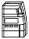 | HM-CC-TC | Funk-Wandthermostat | `0x0039` | [cc_tc](./rf_cc_tc.xml), [cc_tc_le_v1_9](./rf_cc_tc_le_v1_9.xml) 
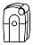 | HM-CC-VD | Funk-Stellantrieb | `0x003A` | [cc_vd](./rf_cc_vd.xml) 
&nbsp; | HM-DW-WM | Funk-Dimmaktor 2-fach PWM LED | `0x0109` | [dim_2pwm](./rf_dim_2pwm.xml) 
 | HM-Dis-EP-WM55 | Display-Statusanzeige mit E-Paper-Display | `0x00FB` | [dis_ep_wm55](./rf_dis_ep_wm55.xml), [dis_ep_wm55_le_v1_0](./rf_dis_ep_wm55_le_v1_0.xml) 
 | HM-Dis-TD-T | Funk-Statusanzeige | `0x0078` | [fs_ba](./rf_fs_ba.xml) 
 | HM-Dis-WM55 | Display-Statusanzeige | `0x00D3` | [dis_wm55](./rf_dis_wm55.xml) 
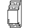 | HM-ES-PMSw1-DR | Funk-Schaltaktor mit Leistungsmessung, Hutschienenmontage | `0x00ea` | [es_pmsw](./rf_es_pmsw.xml) 
 | HM-ES-PMSw1-Pl | Funk-Schaltaktor mit Leistungsmessung | `0x00ac` | [es_pmsw](./rf_es_pmsw.xml), [es_pmsw_le_v2_4](./rf_es_pmsw_le_v2_4.xml) 
&nbsp; | HM-ES-PMSw1-Pl-DN-R1 | Funk-Schaltaktor mit Leistungsmessung | `0x00d7` | [es_pmsw](./rf_es_pmsw.xml) 
&nbsp; | HM-ES-PMSw1-Pl-DN-R2 | Funk-Schaltaktor mit Leistungsmessung | `0x00e2` | [es_pmsw](./rf_es_pmsw.xml) 
&nbsp; | HM-ES-PMSw1-Pl-DN-R3 | Funk-Schaltaktor mit Leistungsmessung | `0x00e3` | [es_pmsw](./rf_es_pmsw.xml) 
&nbsp; | HM-ES-PMSw1-Pl-DN-R4 | Funk-Schaltaktor mit Leistungsmessung | `0x00e4` | [es_pmsw](./rf_es_pmsw.xml) 
&nbsp; | HM-ES-PMSw1-Pl-DN-R5 | Funk-Schaltaktor mit Leistungsmessung | `0x00e5` | [es_pmsw](./rf_es_pmsw.xml) 
 | HM-ES-PMSw1-SM | Funk-Schaltaktor mit Leistungsmessung | `0x00f6` | [es_pmsw](./rf_es_pmsw.xml) 
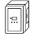 | HM-ES-TX-WM | Funk-Sender für Energiezähler-Sensor | `0x00de` | [es_tx_wm](./rf_es_tx_wm.xml), [es_tx_wm_le_v1_0](./rf_es_tx_wm_le_v1_0.xml) 
 | HM-LC-AO-SM | Funk 0-10V Aktor | `0x0104` | [ao](./rf_ao.xml) 
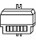 | HM-LC-Bl1-FM | Funk-Rollladenaktor 1-fach, Unterputzmontage | `0x0005` | [bl](./rf_bl.xml), [bl_le_v2_3](./rf_bl_le_v2_3.xml) 
&nbsp; | HM-LC-Bl1-FM-2 | radio-controlled blind actuator 1-channel (flush-mount) | `0x00D2` | [bl_644](./rf_bl_644.xml) 
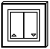 | HM-LC-Bl1-PB-FM | Funk-Rollladenaktor 1-fach, Unterputzmontage mit Tasteraufsatz | `0x0053` | [bl](./rf_bl.xml), [bl_le_v2_3](./rf_bl_le_v2_3.xml) 
 | HM-LC-Bl1-SM | Funk-Rollladenaktor 1-fach, Aufputzmontage | `0x0006` | [bl](./rf_bl.xml), [bl_le_v2_3](./rf_bl_le_v2_3.xml) 
&nbsp; | HM-LC-Bl1-SM-2 | radio-controlled blind actuator 1-channel (surface-mount) | `0x00D1` | [bl_644](./rf_bl_644.xml) 
&nbsp; | HM-LC-Bl1PBU-FM | Funk-Rollladenaktor 1-fach für Markenschalter, Unterputz | `0x006A` | [bl_conf_644](./rf_bl_conf_644.xml), [bl_conf_644_e_v2_0](./rf_bl_conf_644_e_v2_0.xml), [bl_conf_644_e_v2_1](./rf_bl_conf_644_e_v2_1.xml) 
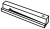 | HM-LC-DDC1-PCB | Funk-Empfänger 1-Kanal | `0x004E` | [ddc](./rf_ddc.xml) 
 | HM-LC-DW-WM | Funk-Controller für Dual-White-LEDs | `0x0108` | [dw](./rf_dw.xml) 
 | HM-LC-Dim1L-CV | Funk-Dimmaktor 1-fach, Phasenanschnitt, Zwischendeckenmontage | `0x0012` | [d](./rf_d.xml), [d_le_v1_7](./rf_d_le_v1_7.xml), [d_le_v1_9](./rf_d_le_v1_9.xml), [dim_1l_644](./rf_dim_1l_644.xml), [dim_1l_644_le_v2_4](./rf_dim_1l_644_le_v2_4.xml) 
&nbsp; | HM-LC-Dim1L-CV-2 | 1 channel dimmer L (ceiling voids) | `0x00B7` | [dim_1l_644](./rf_dim_1l_644.xml) 
&nbsp; | HM-LC-Dim1L-Pl | Funk-Zwischenstecker-Dimmaktor 1-fach, Phasenanschnitt | `0x0013` | [d](./rf_d.xml), [d_le_v1_7](./rf_d_le_v1_7.xml), [d_le_v1_9](./rf_d_le_v1_9.xml), [dim_1l_644](./rf_dim_1l_644.xml), [dim_1l_644_le_v2_4](./rf_dim_1l_644_le_v2_4.xml) 
&nbsp; | HM-LC-Dim1L-Pl-2 | Funk-Zwischenstecker-Dimmaktor 1-fach, Phasenanschnitt | `0x00A3` | [d](./rf_d.xml) 
&nbsp; | HM-LC-Dim1L-Pl-3 | Funk-Zwischenstecker-Dimmaktor 1-fach, Phasenanschnitt | `0x00B3` | [dim_1l_644](./rf_dim_1l_644.xml) 
&nbsp; | HM-LC-Dim1PWM-CV | Funk-Dimmaktor 1-fach PWM LED, Zwischendeckenmontage | `0x0067` | [dim_1pwm_644](./rf_dim_1pwm_644.xml), [dim_1pwm_644_le_v2_4](./rf_dim_1pwm_644_le_v2_4.xml) 
&nbsp; | HM-LC-Dim1PWM-CV-2 | 1 channel dimmer PWM (ceiling voids) | `0x00B5` | [dim_1pwm_644](./rf_dim_1pwm_644.xml) 
 | HM-LC-Dim1T-CV | Funk-Dimmaktor 1-fach, Phasenabschnitt, Zwischendeckenmontage | `0x0072` | [dim_1t_644](./rf_dim_1t_644.xml), [dim_1t_644_le_v2_4](./rf_dim_1t_644_le_v2_4.xml), [dim_t](./rf_dim_t.xml), [dim_t_le_v1_9](./rf_dim_t_le_v1_9.xml) 
&nbsp; | HM-LC-Dim1T-CV-2 | 1 channel dimmer T (ceiling voids) | `0x00B9` | [dim_1t_644](./rf_dim_1t_644.xml) 
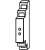 | HM-LC-Dim1T-DR | Funk-Dimmaktor 1-fach, Phasenabschnitt, Hutschienenmontage | `0x0105` | [dim_1t_dr](./rf_dim_1t_dr.xml) 
 | HM-LC-Dim1T-FM | Funk-Dimmaktor 1-fach, Phasenabschnitt, Unterputzmontage | `0x0073` | [dim_1t_644](./rf_dim_1t_644.xml), [dim_1t_644_le_v2_4](./rf_dim_1t_644_le_v2_4.xml), [dim_t](./rf_dim_t.xml), [dim_t_le_v1_9](./rf_dim_t_le_v1_9.xml) 
&nbsp; | HM-LC-Dim1T-FM-2 | 1 channel dimmer T (flush mount) | `0x00BA` | [dim_1t_644](./rf_dim_1t_644.xml) 
 | HM-LC-Dim1T-FM-LF | 1 channel dimmer T (Lichtforum) | `0x00F5` | [dim_1t_fm_lf](./rf_dim_1t_fm_lf.xml) 
&nbsp; | HM-LC-Dim1T-Pl | Funk-Dimmaktor 1-fach, Zwischenstecker, Phasenabschnitt | `0x0071` | [dim_1t_644](./rf_dim_1t_644.xml), [dim_1t_644_le_v2_4](./rf_dim_1t_644_le_v2_4.xml), [dim_t](./rf_dim_t.xml), [dim_t_le_v1_9](./rf_dim_t_le_v1_9.xml) 
&nbsp; | HM-LC-Dim1T-Pl-2 | Funk-Dimmaktor 1-fach, Zwischenstecker, Phasenabschnitt | `0x00A4` | [dim_t](./rf_dim_t.xml) 
&nbsp; | HM-LC-Dim1T-Pl-3 | Funk-Dimmaktor 1-fach, Zwischenstecker, Phasenabschnitt | `0x00B4` | [dim_1t_644](./rf_dim_1t_644.xml) 
&nbsp; | HM-LC-Dim1TPBU-FM | Funk-Dimmaktor 1-fach für Markenschalter, Phasenabschnitt, Unterputzmontage | `0x0068` | [dim_1tconf_644](./rf_dim_1tconf_644.xml), [dim_1tconf_644_le_v2_4](./rf_dim_1tconf_644_le_v2_4.xml) 
&nbsp; | HM-LC-Dim1TPBU-FM-2 | Funk-Dimmaktor 1-fach für Markenschalter, Phasenabschnitt, Unterputzmontage | `0x00B6` | [dim_1tconf_644](./rf_dim_1tconf_644.xml) 
&nbsp; | HM-LC-Dim2L-CV | 2 channel dimmer L (ceiling voids) | `0x0016` | [d](./rf_d.xml), [d_le_v1_7](./rf_d_le_v1_7.xml), [d_le_v1_9](./rf_d_le_v1_9.xml) 
 | HM-LC-Dim2L-SM | Funk-Dimmaktor 2-fach, Phasenanschnitt, Aufputzmontage | `0x002e` | [d](./rf_d.xml), [d_le_v1_7](./rf_d_le_v1_7.xml), [d_le_v1_9](./rf_d_le_v1_9.xml), [dim_2l_644](./rf_dim_2l_644.xml), [dim_2l_644_le_v2_4](./rf_dim_2l_644_le_v2_4.xml) 
&nbsp; | HM-LC-Dim2L-SM-2 | 2 channel dimmer L (surface mount) | `0x00B8` | [dim_2l_644](./rf_dim_2l_644.xml) 
&nbsp; | HM-LC-Dim2T-SM | Funk-Dimmaktor 2-fach, Phasenabschnitt, Aufputzmontage | `0x0074` | [dim_2t_644](./rf_dim_2t_644.xml), [dim_2t_644_le_v2_4](./rf_dim_2t_644_le_v2_4.xml), [dim_t](./rf_dim_t.xml), [dim_t_le_v1_9](./rf_dim_t_le_v1_9.xml) 
&nbsp; | HM-LC-Dim2T-SM-2 | 2 channel dimmer T (surface mount) | `0x00BB` | [dim_2t_644](./rf_dim_2t_644.xml) 
&nbsp; | HM-LC-Ja1PBU-FM | Funk-Jalousieaktor 1-fach für Markenschalter, Unterputz | `0x0107` | [ja_conf_644](./rf_ja_conf_644.xml) 
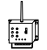 | HM-LC-RGBW-WM | Wireless RGBW Controller for wall mounting | `0x00F4` | [rgbw](./rf_rgbw.xml) 
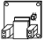 | HM-LC-Sw1-Ba-PCB | Funk-Schaltaktor 1-fach, Platine Batterie | `0x006C` | [s_ba](./rf_s_ba.xml) 
&nbsp; | HM-LC-Sw1-DR | Funk-Schaltaktor 1-fach, Hutschienenmontage | `0x00F0` | [s_644](./rf_s_644.xml) 
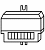 | HM-LC-Sw1-FM | Funk-Schaltaktor 1-fach, Unterputzmontage | `0x0004` | [s](./rf_s.xml), [s_le_v1_5](./rf_s_le_v1_5.xml), [s_le_v2_3](./rf_s_le_v2_3.xml) 
&nbsp; | HM-LC-Sw1-FM-2 | radio-controlled switch actuator 1-channel (flush-mount) | `0x00CA` | [s_644](./rf_s_644.xml) 
&nbsp; | HM-LC-Sw1-PB-FM | Funk-Schaltaktor 1-fach, Unterputzmontage | `0x0051` | [s](./rf_s.xml), [s_le_v2_3](./rf_s_le_v2_3.xml) 
 | HM-LC-Sw1-PCB | Funk-Schaltaktor 1-fach, Platine | `0x0103` | [s_644](./rf_s_644.xml) 
 | HM-LC-Sw1-Pl | Funk-Schaltaktor 1-fach, Zwischenstecker | `0x0011` | [s](./rf_s.xml), [s_le_v1_5](./rf_s_le_v1_5.xml), [s_le_v2_3](./rf_s_le_v2_3.xml) 
&nbsp; | HM-LC-Sw1-Pl-2 | radio-controlled socket adapter switch actuator 1-channel | `0x00A1` | [s](./rf_s.xml), [s_le_v2_3](./rf_s_le_v2_3.xml) 
&nbsp; | HM-LC-Sw1-Pl-3 | Funk-Schaltaktor 1-fach, Zwischenstecker | `0x00C8` | [s_644](./rf_s_644.xml) 
&nbsp; | HM-LC-Sw1-Pl-CT-R1 | Funk-Schaltaktor 1-fach mit Klemmanschluss | `0x00EB` | [s_644](./rf_s_644.xml) 
&nbsp; | HM-LC-Sw1-Pl-CT-R2 | Wireless Switch Actuator 1-channel with clamp terminal,  plug adapter | `0x00EC` | [s_644](./rf_s_644.xml) 
&nbsp; | HM-LC-Sw1-Pl-CT-R3 | Wireless Switch Actuator 1-channel with clamp terminal,  plug adapter | `0x00ED` | [s_644](./rf_s_644.xml) 
&nbsp; | HM-LC-Sw1-Pl-CT-R4 | Wireless Switch Actuator 1-channel with clamp terminal,  plug adapter | `0x00EE` | [s_644](./rf_s_644.xml) 
&nbsp; | HM-LC-Sw1-Pl-CT-R5 | Wireless Switch Actuator 1-channel with clamp terminal,  plug adapter | `0x00EF` | [s_644](./rf_s_644.xml) 
&nbsp; | HM-LC-Sw1-Pl-DN-R1 | Funk-Schaltaktor 1-fach, Zwischenstecker | `0x00D8` | [s_644](./rf_s_644.xml) 
&nbsp; | HM-LC-Sw1-Pl-DN-R2 | Funk-Schaltaktor 1-fach, Zwischenstecker | `0x00E6` | [s_644](./rf_s_644.xml) 
&nbsp; | HM-LC-Sw1-Pl-DN-R3 | Funk-Schaltaktor 1-fach, Zwischenstecker | `0x00E7` | [s_644](./rf_s_644.xml) 
&nbsp; | HM-LC-Sw1-Pl-DN-R4 | Funk-Schaltaktor 1-fach, Zwischenstecker | `0x00E8` | [s_644](./rf_s_644.xml) 
&nbsp; | HM-LC-Sw1-Pl-DN-R5 | Funk-Schaltaktor 1-fach, Zwischenstecker | `0x00E9` | [s_644](./rf_s_644.xml) 
&nbsp; | HM-LC-Sw1-Pl-OM54 | Funk-Schalter, 1-Kanal | `0x0001` | [s_mega168](./rf_s_mega168.xml) 
 | HM-LC-Sw1-SM | Funk-Schaltaktor 1-fach, Aufputzmontage | `0x0002` | [s](./rf_s.xml), [s_le_v1_5](./rf_s_le_v1_5.xml), [s_le_v2_3](./rf_s_le_v2_3.xml) 
&nbsp; | HM-LC-Sw1-SM-2 | radio-controlled switch actuator 1-channel (surface-mount) | `0x00C9` | [s_644](./rf_s_644.xml) 
&nbsp; | HM-LC-Sw1-SM-ATmega168 | Funk-Schaltaktor 1-fach, Aufputzmontage | `0x0014` | [s_mega168](./rf_s_mega168.xml) 
&nbsp; | HM-LC-Sw1PBU-FM | Funk-Schaltaktor 1-fach für Markenschalter, Unterputzmontage | `0x0069` | [s_1conf_644](./rf_s_1conf_644.xml), [s_1conf_644_le_v2_1](./rf_s_1conf_644_le_v2_1.xml), [s_1conf_644_le_v2_3](./rf_s_1conf_644_le_v2_3.xml) 
 | HM-LC-Sw2-DR | Funk-Schaltaktor 2-fach, Hutschienenmontage | `0x0062` | [s](./rf_s.xml), [s_le_v2_3](./rf_s_le_v2_3.xml) 
&nbsp; | HM-LC-Sw2-DR-2 | radio-controlled switch actuator 2-channel (DIN rails) | `0x00CC` | [s_644](./rf_s_644.xml) 
 | HM-LC-Sw2-FM | Funk-Schaltaktor 2-fach, Unterputzmontage | `0x0009` | [s](./rf_s.xml), [s_le_v1_5](./rf_s_le_v1_5.xml), [s_le_v2_3](./rf_s_le_v2_3.xml) 
&nbsp; | HM-LC-Sw2-FM-2 | radio-controlled switch actuator 2-channel (flush-mount) | `0x00CB` | [s_644](./rf_s_644.xml) 
&nbsp; | HM-LC-Sw2-PB-FM | Funk-Schaltaktor 2-fach, Unterputzmontage | `0x0052` | [s](./rf_s.xml), [s_le_v2_3](./rf_s_le_v2_3.xml) 
&nbsp; | HM-LC-Sw2-SM | radio-controlled switch actuator 2-channel (surface-mount) | `0x000A` | [s](./rf_s.xml), [s_le_v1_5](./rf_s_le_v1_5.xml), [s_le_v2_3](./rf_s_le_v2_3.xml) 
&nbsp; | HM-LC-Sw2PBU-FM | Funk-Schaltaktor 2-fach, Unterputzmontage | `0x0101` | [s_2conf_644](./rf_s_2conf_644.xml) 
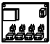 | HM-LC-Sw4-Ba-PCB | Funk- Schaltaktor 4fach Platine Batterie | `0x00AB` | [s_4_ba](./rf_s_4_ba.xml) 
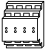 | HM-LC-Sw4-DR | Funk-Schaltaktor 4-fach, Hutschienenmontage | `0x0061` | [s](./rf_s.xml), [s_le_v2_3](./rf_s_le_v2_3.xml) 
&nbsp; | HM-LC-Sw4-DR-2 | radio-controlled switch actuator 4-channel (DIN rails) | `0x00D0` | [s_644](./rf_s_644.xml) 
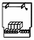 | HM-LC-Sw4-PCB | Funk-Schaltaktor 4-fach, Platine | `0x002D` | [s](./rf_s.xml), [s_le_v1_5](./rf_s_le_v1_5.xml), [s_le_v2_3](./rf_s_le_v2_3.xml) 
&nbsp; | HM-LC-Sw4-PCB-2 | radio-controlled switch actuator 4-channel (PCB) | `0x00CE` | [s_644](./rf_s_644.xml) 
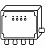 | HM-LC-Sw4-SM | Funk-Schaltaktor 4-fach, Aufputzmontage | `0x0003` | [s](./rf_s.xml), [s_644](./rf_s_644.xml), [s_le_v1_5](./rf_s_le_v1_5.xml), [s_le_v2_3](./rf_s_le_v2_3.xml) 
&nbsp; | HM-LC-Sw4-SM-2 | radio-controlled switch actuator 4-channel (surface-mount) | `0x00CD` | [s_644](./rf_s_644.xml) 
&nbsp; | HM-LC-Sw4-SM-ATmega168 | Funk-Schaltaktor 4-fach, Aufputzmontage | `0x0015` | [s_mega168](./rf_s_mega168.xml) 
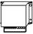 | HM-LC-Sw4-WM | Funk-Schaltaktor 4-fach, Wandmontage | `0x0066` | [s](./rf_s.xml), [s_le_v2_3](./rf_s_le_v2_3.xml) 
&nbsp; | HM-LC-Sw4-WM-2 | radio-controlled switch actuator 4-channel (wall-mount) | `0x00CF` | [s_644](./rf_s_644.xml) 
 | HM-MOD-EM-8 | Funk-Sendemodul 8-Kanal, Platine Batterie | `0x00D9` | [em_8](./rf_em_8.xml) 
 | HM-MOD-EM-8Bit | Funk-Sendemodul, 8-Bit | `0x0106` | [em_8_bit](./rf_em_8_bit.xml) 
 | HM-MOD-Re-8 | Funk-Schaltaktor 8-fach, Platine Batterie | `0x00BE` | [s_8_ba](./rf_s_8_ba.xml) 
 | HM-OU-CF-Pl | Funk-Türgong mit Signalleuchte | `0x005C` | [cf](./rf_cf.xml) 
&nbsp; | HM-OU-CFM-Pl | MP3 Funk-Gong mit Signalleuchte | `0x0075` | [cfm](./rf_cfm.xml) 
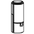 | HM-OU-CFM-TW | MP3 Funk-Gong mit Signalleuchte für Batteriebetrieb | `0x00FA` | [cfm_tw](./rf_cfm_tw.xml) 
 | HM-OU-CM-PCB | Funk-Gongmodul MP3 mit Speicher | `0x00af` | [cm](./rf_cm.xml) 
 | HM-OU-LED16 | Funk-Statusanzeige LED 16 | `0x006D` | [ou_led16_ge_v1_1](./rf_ou_led16_ge_v1_1.xml), [ou_led16_le_v1_0](./rf_ou_led16_le_v1_0.xml) 
&nbsp; | HM-PB-2-FM | Funk-Wandtaster 2-fach | `0x00BF` | [pb-2](./rf_pb-2.xml) 
 | HM-PB-2-WM | Funk-Wandtaster 2-fach | `0x0036` | [rc](./rf_rc.xml) 
 | HM-PB-2-WM55 | Funk-Wandtaster 2-fach im 55er Rahmen | `0x006B` | [pb-2-wm55_ge_v1_4](./rf_pb-2-wm55_ge_v1_4.xml), [pb-2-wm55_le_v1_3](./rf_pb-2-wm55_le_v1_3.xml) 
&nbsp; | HM-PB-2-WM55-2 | HM Push Button 2 | `0x00C2` | [pb-2-wm55_ge_v1_4](./rf_pb-2-wm55_ge_v1_4.xml) 
&nbsp; | HM-PB-4-WM | Funk-Wandtaster 4-fach | `0x0035` | [rc](./rf_rc.xml) 
 | HM-PB-4Dis-WM | Funk-Display-Wandtaster 2-fach, Aufputzmontage | `0x0060` | [4dis](./rf_4dis.xml) 
&nbsp; | HM-PB-4Dis-WM-2 | Funk-Display-Wandtaster 2-fach, Aufputzmontage | `0x00DD` | [4dis](./rf_4dis.xml) 
 | HM-PB-6-WM55 | HM Push Button 6 | `0x00A9` | [rc-4-2](./rf_rc-4-2.xml) 
 | HM-PBI-4-FM | Funk-Tasterschnittstelle 4-fach, Unterputzmontage | `0x0034` | [pbi](./rf_pbi.xml) 
 | HM-RC-12 | Funk-Fernbedienung 12 Tasten | `0x0029` | [rc_12](./rf_rc_12.xml) 
&nbsp; | HM-RC-12-B | Funk-Fernbedienung 12 Tasten, schwarz | `0x002A` | [rc_12](./rf_rc_12.xml) 
&nbsp; | HM-RC-12-SW | HM Remote 12 buttons (softtouch white) | `0x004C` | [rc_12](./rf_rc_12.xml) 
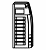 | HM-RC-19 | Funk-Fernbedienung 19 Tasten | `0x0037` | [rc_19](./rf_rc_19.xml) 
&nbsp; | HM-RC-19-B | Funk-Fernbedienung 19 Tasten | `0x0038` | [rc_19](./rf_rc_19.xml) 
&nbsp; | HM-RC-19-SW | Funk-Fernbedienung 19 Tasten | `0x004D` | [rc_19](./rf_rc_19.xml) 
&nbsp; | HM-RC-2-PBU-FM | Funk-Sender 2-fach für Markenschalter, Unterputzmontage | `0x00E0` | [rc_2_fm](./rf_rc_2_fm.xml) 
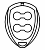 | HM-RC-4 | Funk-Handsender 4 Tasten | `0x0008` | [rc](./rf_rc.xml) 
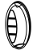 | HM-RC-4-2 | HM Remote 4-2 | `0x00A0` | [rc-4-2](./rf_rc-4-2.xml) 
&nbsp; | HM-RC-4-3 | HM Remote 4-3 | `0x00D4` | [rc-4-2](./rf_rc-4-2.xml) 
&nbsp; | HM-RC-4-3-D | HM Remote 4-3 single buttons | `0x000F8` | [rc-4-3_single_on](./rf_rc-4-3_single_on.xml) 
&nbsp; | HM-RC-4-B | Funk-Handsender 4 Tasten | `0x003B` | [rc](./rf_rc.xml) 
 | HM-RC-8 | Funk-Handsender 8 Tasten | `0x00DA` | [rc-4-2](./rf_rc-4-2.xml) 
 | HM-RC-Dis-H-x-EU | Funk-Fernbedienung mit Display | `0x00E1` | [rc_dis](./rf_rc_dis.xml) 
 | HM-RC-Key3 | Funk-Handsender für KeyMatic | `0x001D` | [rc](./rf_rc.xml) 
 | HM-RC-Key3-B | Funk-Handsender für KeyMatic | `0x001E` | [rc](./rf_rc.xml) 
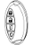 | HM-RC-Key4-2 | HM Remote KeyMatic 4-2 | `0x00A6` | [rc-key4-2](./rf_rc-key4-2.xml) 
&nbsp; | HM-RC-Key4-3 | HM Remote KeyMatic 4-3 | `0x00D6` | [rc-key4-2](./rf_rc-key4-2.xml) 
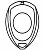 | HM-RC-P1 | Funk-Panikhandsender | `0x001A` | [rc](./rf_rc.xml) 
 | HM-RC-Sec3 | Funk-Handsender für Alarmzentrale | `0x001B` | [rc](./rf_rc.xml) 
 | HM-RC-Sec3-B | Funk-Handsender für Alarmzentrale | `0x001C` | [rc](./rf_rc.xml) 
 | HM-RC-Sec4-2 | HM Remote Security 4-2 | `0x00A5` | [rc-sec4-2](./rf_rc-sec4-2.xml) 
&nbsp; | HM-RC-Sec4-3 | HM Remote Security 4-3 | `0x00D5` | [rc-sec4-2](./rf_rc-sec4-2.xml) 
 | HM-SCI-3-FM | Funk-Schließerkontaktschnittstelle 3-fach, Unterputzmontage | `0x005F` | [sci_3](./rf_sci_3.xml) 
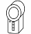 | HM-Sec-Key | KeyMatic | `0x0019` | [keymatic](./rf_keymatic.xml) 
&nbsp; | HM-Sec-Key-O | KeyMatic | `0x0027` | [keymatic](./rf_keymatic.xml) 
&nbsp; | HM-Sec-Key-S | KeyMatic | `0x0026` | [keymatic](./rf_keymatic.xml) 
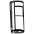 | HM-Sec-MDIR | Funk-Bewegungsmelder innen | `0x004A` | [sec_mdir](./rf_sec_mdir.xml), [sec_mdir_v1_5](./rf_sec_mdir_v1_5.xml) 
&nbsp; | HM-Sec-MDIR-2 | HM radio-controlled motion detector | `0x00C0` | [sec_mdir](./rf_sec_mdir.xml) 
&nbsp; | HM-Sec-MDIR-3 | HM radio-controlled motion detector | `0x00F7` | [sec_mdir](./rf_sec_mdir.xml) 
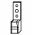 | HM-Sec-RHS | Funk-Fenster-/ Drehgriffkontakt | `0x0030` | [rhs](./rf_rhs.xml), [rhs_e_v1_7](./rf_rhs_e_v1_7.xml), [rhs_le_v1_6](./rf_rhs_le_v1_6.xml) 
&nbsp; | HM-Sec-RHS-2 | HM Rotary Handle Sensor | `0x00C3` | [rhs](./rf_rhs.xml) 
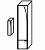 | HM-Sec-SC | Funk-Tür-/ Fensterkontakt | `0x002F` | [sc](./rf_sc.xml), [sc_e_v1_7](./rf_sc_e_v1_7.xml), [sc_le_v1_6](./rf_sc_le_v1_6.xml) 
&nbsp; | HM-Sec-SC-2 | Funk-Tür-/ Fensterkontakt | `0x00B1` | [sc](./rf_sc.xml) 
 | HM-Sec-SCo | Funk- Tür-/Fensterkontakt optisch | `0x00C7` | [sec_sco](./rf_sec_sco.xml) 
 | HM-Sec-SD | Funk-Rauchmelder | `0x0042` | [sec_sd](./rf_sec_sd.xml) 
 | HM-Sec-SD-2 | HM Smoke Detector 2 | `0x00AA` | [sec_sd_2](./rf_sec_sd_2.xml) 
 | HM-Sec-SFA-SM | Funk-Sirenen-/Blitzansteuerung | `0x0050` | [sec_sfa](./rf_sec_sfa.xml) 
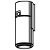 | HM-Sec-Sir-WM | Funk-Innensirene | `0x00F9` | [sec_sir_wm](./rf_sec_sir_wm.xml) 
 | HM-Sec-TiS | Funk-Neigungssensor | `0x0043` | [tis](./rf_tis.xml), [tis_le_v1_0](./rf_tis_le_v1_0.xml) 
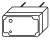 | HM-Sec-WDS | Funk-Wassermelder | `0x0045` | [wds_v1_0](./rf_wds_v1_0.xml), [wds_v1_1](./rf_wds_v1_1.xml) 
&nbsp; | HM-Sec-WDS-2 | Funk-Wassermelder | `0x00B2` | [wds_v1_1](./rf_wds_v1_1.xml) 
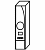 | HM-Sec-Win | WinMatic | `0x0028` | [winmatic](./rf_winmatic.xml) 
 | HM-Sen-DB-PCB | Funk-Klingelsignalsensor | `0x00DC` | [sen_db](./rf_sen_db.xml) 
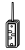 | HM-Sen-EP | Funk-Sensor für elektrische Impulse | `0x0044` | [sen_ep](./rf_sen_ep.xml) 
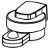 | HM-Sen-LI-O | Funk-Helligkeitsensor für Außenmontage | `0x00FD` | [sen_li](./rf_sen_li.xml) 
 | HM-Sen-MDIR-O | Funk-Bewegungsmelder außen | `0x005D` | [sen_mdir](./rf_sen_mdir.xml), [sen_mdir_v1_5](./rf_sen_mdir_v1_5.xml) 
&nbsp; | HM-Sen-MDIR-O-2 | HM radio-controlled motion detector outdoor | `0x00C1` | [sen_mdir](./rf_sen_mdir.xml) 
&nbsp; | HM-Sen-MDIR-O-3 | HM radio-controlled motion detector outdoor | `0x010A` | [sen_mdir](./rf_sen_mdir.xml) 
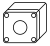 | HM-Sen-MDIR-SM | Funk-Bewegungsmelder | `0x004F` | [sen_mdir](./rf_sen_mdir.xml), [sen_mdir_v1_5](./rf_sen_mdir_v1_5.xml) 
 | HM-Sen-MDIR-WM55 | Funk-Bewegungsmelder mit Tastenpaar | `0x00DB` | [sen_mdir_wm55](./rf_sen_mdir_wm55.xml) 
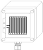 | HM-Sen-RD-O | Regensensor | `0x00a7` | [rd](./rf_rd.xml), [rd_le_v1_3](./rf_rd_le_v1_3.xml) 
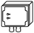 | HM-Sen-Wa-Od | Kapazitiver Füllstandsmesser | `0x009f` | [sen_wa_od](./rf_sen_wa_od.xml) 
 | HM-SwI-3-FM | Funk-Schalterschnittstelle 3-fach, Unterputzmontage | `0x0046` | [swi](./rf_swi.xml) 
&nbsp; | HM-Sys-sRP-Pl | Funk-Zwischenstecker Repeater | `0x0076` | [rep](./rf_rep.xml) 
 | HM-TC-IT-WM-W-EU | Funk-Wandthermostat | `0x00ad` | [tc_it_wm-w-eu](./rf_tc_it_wm-w-eu.xml) 
&nbsp; | HM-WDC7000 | Funk-Wetterstation WDC 7000 | `0x0041` | [ws550](./rf_ws550.xml) 
&nbsp; | HM-WDS10-TH-O | Funk-Temperatur-/ Feuchtesensor außen | `0x003D` | [ash550](./rf_ash550.xml) 
&nbsp; | HM-WDS100-C6-O | Funk-Kombisensor (OC3) | `0x0040` | [ks550](./rf_ks550.xml) 
&nbsp; | HM-WDS100-C6-O-2 | HM-WDS100-C6-O-2 | `0x00ae` | [hm-wds100-c6-o-2](./rf_hm-wds100-c6-o-2.xml) 
&nbsp; | HM-WDS20-TH-O | HM-WDS20-TH-O | `0x003C` | [ash550](./rf_ash550.xml) 
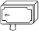 | HM-WDS30-OT2-SM | Funk-Temperaturdifferenz-Sensor | `0x00A8` | [wds30_ot2](./rf_wds30_ot2.xml) 
 | HM-WDS30-OT2-SM-2 | HM-WDS30-OT2-SM-2 | `0x0102` | [wds30_ot2](./rf_wds30_ot2.xml) 
&nbsp; | HM-WDS30-T-O | Funk-Temperatursensor außen | `0x003E` | [s550ia](./rf_s550ia.xml) 
&nbsp; | HM-WDS40-TH-I | Funk-Temperatursensor innen | `0x003F` | [ash550](./rf_ash550.xml) 
&nbsp; | HM-WDS40-TH-I-2 | HM-WDS40-TH-I-2 | `0x00bc` | [wds40_th_i_2](./rf_wds40_th_i_2.xml) 
&nbsp; | IS-WDS-TH-OD-S-R3 | IS-WDS-TH-OD-S-R3 | `0x0048` | [ash550](./rf_ash550.xml) 
&nbsp; | KS550 | Funk-Kombisensor 550 | `0x0007` | [ks550](./rf_ks550.xml) 
&nbsp; | KS550LC | KS550LC | `0x0033` | [ks550](./rf_ks550.xml) 
&nbsp; | KS550Tech | KS550Tech | `0x002C` | [ks550](./rf_ks550.xml) 
&nbsp; | KS888 | KS888 | `0x001F` | [ks550](./rf_ks550.xml) 
&nbsp; | OLIGO.smart.iq.HM | Funk-Dimmaktor | `0x00FC` | [oligo_smart_iq](./rf_oligo_smart_iq.xml) 
 | RC-H | DORMA Remote 4 buttons | `0x0054` | [rc](./rf_rc.xml) 
&nbsp; | S550IA | S550IA | `0x000F` | [s550ia](./rf_s550ia.xml) 
&nbsp; | ST6-SH | SensoTimer ST 6 Smart Home | `0x00F3` | [st_6_sh](./rf_st_6_sh.xml) 
&nbsp; | WDF solar | ROTO WDF solar | `0x0096` | [roto_wdf_solar](./rf_roto_wdf_solar.xml) 
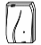 | WS550 | WS550 | `0x000B` | [ws550](./rf_ws550.xml) 
&nbsp; | WS550LCB | WS550LCB | `0x0031` | [ws550](./rf_ws550.xml) 
&nbsp; | WS550LCW | WS550LCW | `0x0032` | [ws550](./rf_ws550.xml) 
&nbsp; | WS550Tech | WS550Tech | `0x002B` | [ws550](./rf_ws550.xml) 
&nbsp; | WS888 | Funk-Wetterstation | `0x0022` | [ws550](./rf_ws550.xml) 
&nbsp; | ZEL STG RM DWT 10 | HM Remote Display 4 buttons Roto | `0x007E` | [4dis](./rf_4dis.xml) 
&nbsp; | ZEL STG RM FDK | HM Rotary Handle Sensor Roto | `0x0081` | [rhs](./rf_rhs.xml) 
&nbsp; | ZEL STG RM FEP 230V | radio-controlled blind actuator 1-channel (flush-mount) Roto | `0x007B` | [bl](./rf_bl.xml), [bl_le_v2_3](./rf_bl_le_v2_3.xml) 
&nbsp; | ZEL STG RM FFK | HM Shutter Contact Roto | `0x0082` | [sc](./rf_sc.xml) 
&nbsp; | ZEL STG RM FSA | ClimateControle-ValveDrive Roto | `0x007A` | [cc_vd](./rf_cc_vd.xml) 
&nbsp; | ZEL STG RM FSS UP3 | HM Switch Interface 3 switches Roto | `0x0083` | [swi](./rf_swi.xml) 
&nbsp; | ZEL STG RM FST UP4 | HM Push Button Interface Roto | `0x007F` | [pbi](./rf_pbi.xml) 
&nbsp; | ZEL STG RM FWT | ClimateControl-ThermoControl Roto | `0x0079` | [cc_tc](./rf_cc_tc.xml) 
&nbsp; | ZEL STG RM FZS | radio-controlled socket adapter switch actuator 1-channel Roto | `0x007C` | [s](./rf_s.xml), [s_le_v2_3](./rf_s_le_v2_3.xml) 
&nbsp; | ZEL STG RM FZS-2 | radio-controlled socket adapter switch actuator 1-channel Roto | `0x00A2` | [s](./rf_s.xml), [s_le_v2_3](./rf_s_le_v2_3.xml) 
&nbsp; | ZEL STG RM HS 4 | HM Remote 4 buttons Roto | `0x0080` | [rc](./rf_rc.xml) 
&nbsp; | ZEL STG RM WT 2 | HM Push Button 2 Roto | `0x007D` | [pb-2-wm55_ge_v1_4](./rf_pb-2-wm55_ge_v1_4.xml), [pb-2-wm55_le_v1_3](./rf_pb-2-wm55_le_v1_3.xml) 
 | atent | Funk-Handsender DORMA | `0x0064` | [rc](./rf_rc.xml) 
